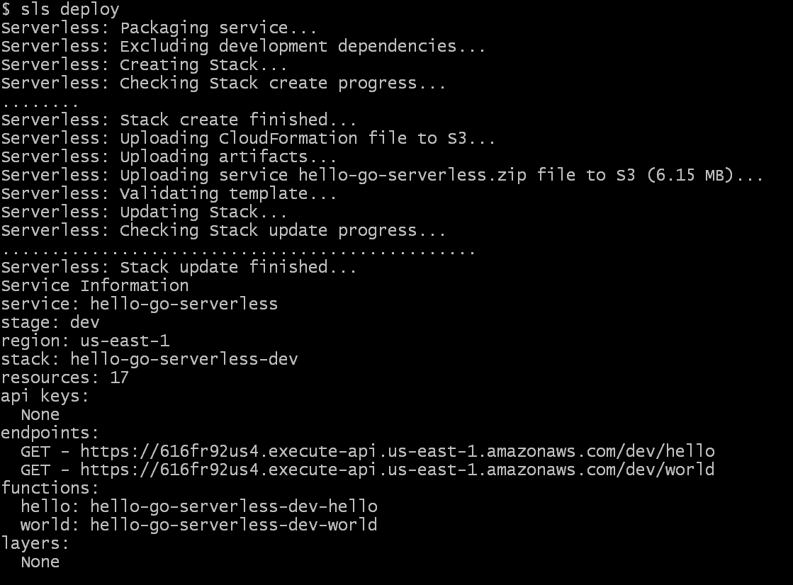

In this tutorial, we are going to create a golang serverless application and deploy it to the AWS cloud.

**Table of Content**

- [Prerequisites](#prerequisites)
- [Getting Started](#getting-started)
    - [Open hello/main.go](#open-hellomaingo)
    - [Open serverless.yml](#open-serverlessyml)
- [Build the application](#build-the-application)
  - [Build](#build)
- [Deploy](#deploy)
- [Test the application](#test-the-application)
- [Conclusion](#conclusion)

# Prerequisites

- Serverless Installed
- AWS account
- Connect AWS account to serverless

All these are covered in detail in [the last tutorial](https://schadokar.dev/posts/create-your-first-serverless-application/).

# Getting Started

Create a new directory `hello-go-serverless`.  
Open the terminal inside the project.

Run the below command to initiate the serverless application using `aws-go-mod` template.  
This will create a basic scaffolding of the serverless project.

```js
serverless create --template aws-go-mod
```


This template has created 2 application `hello` and `world`, and `serverless.yml` where serverless deployment configuration is defined. It also created a couple of deployment scripts.

### Open hello/main.go

```go
package main

import (
    "bytes"
    "context"
    "encoding/json"

    "github.com/aws/aws-lambda-go/events"
    "github.com/aws/aws-lambda-go/lambda"
)

// Response is of type APIGatewayProxyResponse since we're leveraging the
// AWS Lambda Proxy Request functionality (default behavior)
//
// https://serverless.com/framework/docs/providers/aws/events/apigateway/#lambda-proxy-integration
type Response events.APIGatewayProxyResponse

// Handler is our lambda handler invoked by the `lambda.Start` function call
func Handler(ctx context.Context) (Response, error) {
    var buf bytes.Buffer

    body, err := json.Marshal(map[string]interface{}{
        "message": "Go Serverless v1.0! Your function executed successfully!",
    })
    if err != nil {
        return Response{StatusCode: 404}, err
    }
    json.HTMLEscape(&buf, body)

    resp := Response{
        StatusCode:      200,
        IsBase64Encoded: false,
        Body:            buf.String(),
        Headers: map[string]string{
            "Content-Type":           "application/json",
            "X-MyCompany-Func-Reply": "hello-handler",
        },
    }

    return resp, nil
}

func main() {
    lambda.Start(Handler)
}
```

This function is creating a JSON object using `json.Marshal` and then sent as a response.  
The `lambda` package is initiating the `Handler` function and `events` package is used to create aws `APIGatewayProxyResponse` object.

This function is exposed as an API using the AWS APIGateway service. These APIs are configured in the `serverless.yml` file.

> Check this to learn more about [JSON in golang](https://schadokar.dev/posts/how-to-use-json-in-golang/).

### Open serverless.yml

In the provider section, the provider is `aws`, the runtime is `go1.x`, by default its region is `us-east-1` and stage is `dev`. Using the staging option, you can deploy the project in different environments like dev, prod or test.

Update the provider section.

```yml
provider:
  name: aws
  runtime: go1.x
  stage: dev
  region: us-east-1
```

> You don't have to if you're okay with the defaults. It is just good practice.

In the package section, it is configuring what to include and exclude in the lambda function deployment.  
It is excluding all the files except `bin` folder. After building the application, the function binary will save in the `bin` folder.

```yml
package:
  exclude:
    - ./**
  include:
    - ./bin/**
```

In the functions, `bin/hello` is the entry point of hello function. The function can be triggered using the `hello` route. After deployment, it will create a new route in the AWS API gateway and link it to the AWS lambda function in which `hello` function will deploy.

```yml
functions:
  hello:
    handler: bin/hello
    events:
      - http:
          path: hello
          method: get
```

`world` function is the same as `hello`.

> You can use the `Makefile` for the below steps. It is a deployment script, which will run all the below steps for you.

# Build the application

Open the terminal in the project and execute the `gomod.sh` file.

**Windows User**

```sh
sh gomod.sh
```

**Linux User or other UNIX based OS users**
First, make it executable and then run it.

```sh
chmod u+x gomod.sh
./gomod.sh
```

This will initiate go modules `go.mod` in the project and add all the project dependencies in it. It is similar to the `package.json` in the node.js.

## Build

Create binaries of `hello` and `world` application for **Linux** OS.

```go
export GO111MODULE=on
env GOOS=linux go build -ldflags="-s -w" -o bin/hello hello/main.go
env GOOS=linux go build -ldflags="-s -w" -o bin/world world/main.go
```

It will generate binaries of the application and save them in the bin folder.

# Deploy

I am assuming that you have an AWS account and it is connected to the Serverless.  
If you not [check this to setup](https://schadokar.dev/posts/create-your-first-serverless-application/).

Run the below command to deploy it to the AWS lambda.

```sh
serverless deploy
```

> You can use `sls` for `serverless`. It is a shorthand notation.



# Test the application

Copy the endpoint from the deployment output and either try it on a browser or use the curl command to check.

```curl
$ curl https://616fr92us4.execute-api.us-east-1.amazonaws.com/dev/hello
```

Output

```
  % Total    % Received % Xferd  Average Speed   Time    Time     Time  Current
                                 Dload  Upload   Total   Spent    Left  Speed
100    70  100    70    0     0     63      0  0:00:01  0:00:01 --:--:--    63
{"message":"Go Serverless v1.0! Your function executed successfully!"}
```

World

```curl
$ curl https://616fr92us4.execute-api.us-east-1.amazonaws.com/dev/world
```

Output

```
  % Total    % Received % Xferd  Average Speed   Time    Time     Time  Current
                                 Dload  Upload   Total   Spent    Left  Speed
100    69  100    69    0     0     76      0 --:--:-- --:--:-- --:--:--    76
{"message":"Okay so your other function also executed successfully!"}

```

# Conclusion

Serverless is the perfect companion for the golang. In the upcoming tutorials, we will integrate multiple services in serverless like DB, SNS etc.

Thanks for reading.

> Cover is designed in [Canva](https://canva.7eqqol.net/KD6B9)

---
