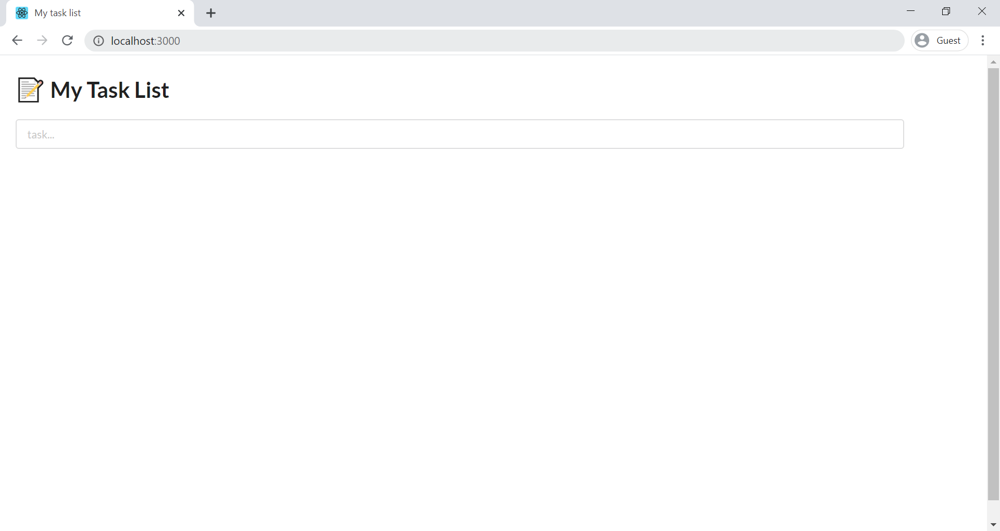
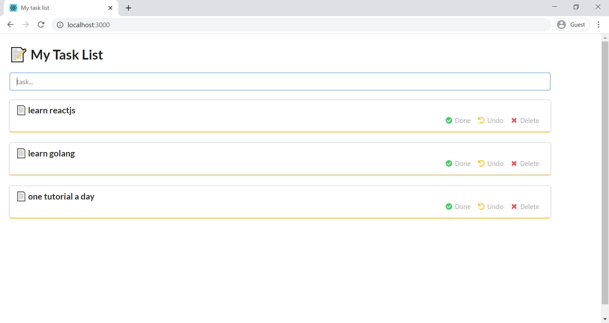
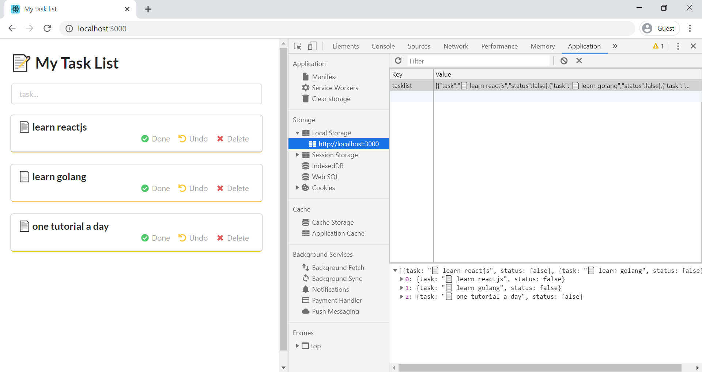
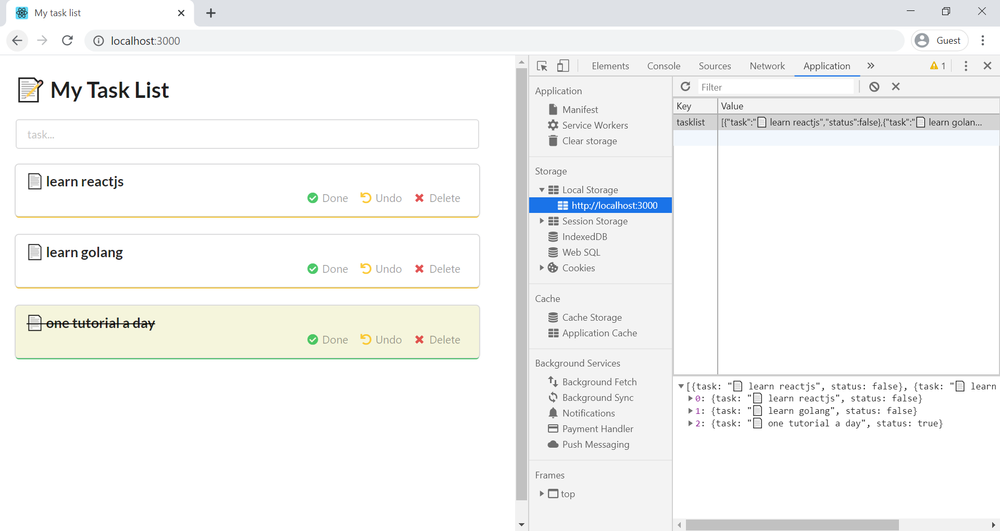
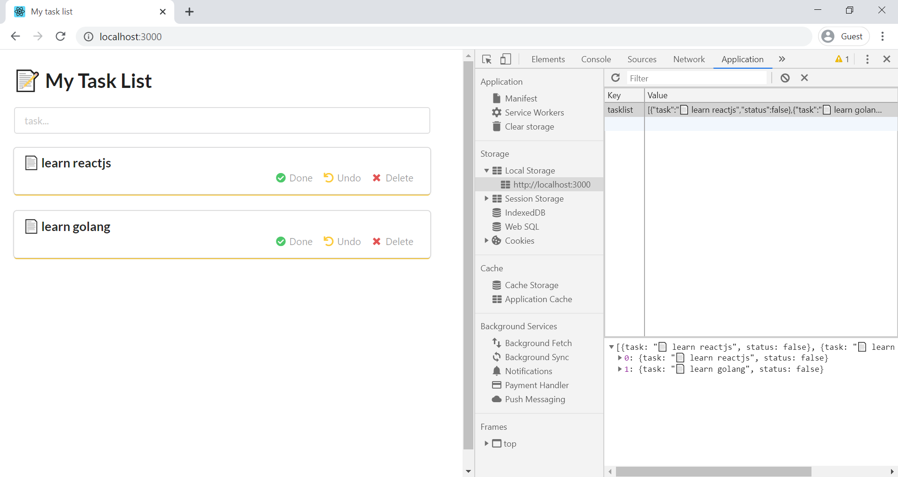
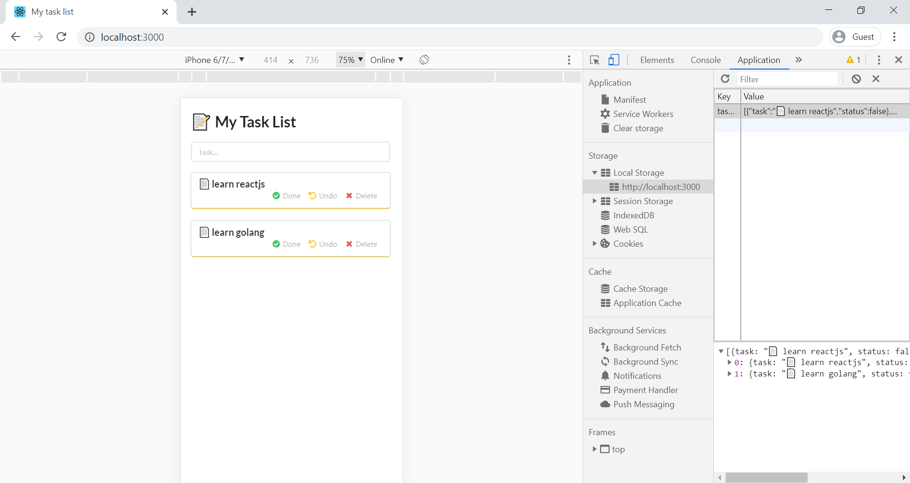

In this tutorial, we will create a to-do list app in reactjs. We will use browser local storage to save the tasks, which will keep the tasks even after we close the browser. In the end, we will host this application on Github pages. 

## Pre-requisites

1. [Nodejs](https://nodejs.org/en/)
2. Code editor (I am using VS Code)
3. Github Account

---

## React Application

We are going to use `create-react-app` as our base application.

```sh
npx create-react-app my-task-list
cd my-task-list
```

> If you've previously installed `create-react-app` globally via `npm install -g create-react-app`, we recommend you uninstall the package using `npm uninstall -g create-react-app` to ensure that `npx` always uses the latest version.

### Install semantic-ui-react

For this project, we are using `semantic-ui` css. Using the only css is a bit headache where you have to configure each element in the web page. To make this quick and less hassle, we have `semantic-ui-react` library. Semantic UI React provides the react component which has already configured semantic-ui css. In short, you don't have to align a component or adjust the margin.

> [Semantic UI React](https://react.semantic-ui.com/) is the official React integration for Semantic UI. 

Open the terminal inside the `my-task-list` project and run the below command.
```sh
npm install semantic-ui-react
```

### index.html

Open the `index.html` from the public folder and update the title.
```html
<title>My task list</title>
```

We also have to add the cdn of `semantic-ui` here. Paste the cdn in the `head` tag.
```html
 <link
      rel="stylesheet"
      href="//cdn.jsdelivr.net/npm/semantic-ui@2.4.2/dist/semantic.min.css"
    />
```
You should always use the latest cdn. You can check the latest version [here](https://react.semantic-ui.com/usage#theme).

## My-Task-List component

Create a new folder `component` inside the `src`. Inside the `component`, create a new folder `My-Task-List`. Create 3 files inside it, `My-Task-List.jsx`, `my-task-list.css` and `index.js`.

#### Directory Structure

```sh
|- src
    |- component
        |- My-Task-List
            |- My-Task-List.jsx
            |- my-task-list.css
            |- index.js
```

### My-Task-List.jsx 

In this file, we are going to define our my-task-list component. 
For storage, we are using the browser's local storage.

#### Browser Local Storage

This local storage stores a key-value pair. The key and value both are strings.
While saving we have to convert the object into a string and while working on it we have to convert the string into an object.

To access the local storage we will use the `localStorage` object.
`localStorage` has given to 2 methods to set and get the item.

- **setItem**: To save the `key-value` in the local storage.
```js
localStorage.setItem(key, value);
```
- **getItem**: Get the `value` by its `key` from the local storage.
```js
localStorage.getItem(key)
```

Open the `My-Task-List.jsx` paste the below code.

```js
import React, { Component } from "react";
import { Card, Header, Form, Input, Icon } from "semantic-ui-react";
import "./my-task-list.css";

class MyTaskList extends Component {
  constructor(props) {
    super(props);

    this.state = {
      task: "",
      tasklist: []
    };
  }

  // on load get the task list
  componentDidMount = () => {
    this.getTasks();
  };

  onChange = event => {
    this.setState({
      [event.target.name]: event.target.value
    });
  };

  // add task to the list
  onSubmit = () => {
    // check is task is empty string
    if (this.state.task) {
      // get the task list from the local storage
      let tasklist = JSON.parse(localStorage.getItem("tasklist"));

      // task list is null means empty
      // create an empty list
      if (tasklist == null) {
        tasklist = [];
      }

      // create task object
      // default status is false
      let task = {
        task: `📄 ${this.state.task}`,
        status: false
      };

      // add the task to the task list
      tasklist.push(task);

      // save the task list in the local storage
      localStorage.setItem("tasklist", JSON.stringify(tasklist));

      // clear the form
      this.setState({ task: "" });

      // refresh the tasks
      this.getTasks();
    }
  };

  // get all the tasks
  getTasks = () => {
    // get the task list from the local storage
    let tasklist = JSON.parse(localStorage.getItem("tasklist"));

    // check if task list is empty
    if (tasklist) {
      // sort all the tasks on the basis of status
      // completed task will move down
      tasklist = tasklist.sort((a, b) => {
        if (a.status) {
          return 1;
        } else if (b.status) {
          return -1;
        }
        return 0;
      });

      // save the task list in the local storage
      localStorage.setItem("tasklist", JSON.stringify(tasklist));

      // set the tasklist to the state
      this.setState({
        // default color
        // Incomplete: yellow
        // complete: green
        tasklist: tasklist.map((item, index) => {
          let color = "yellow";
          let cardBackground = { background: "white" };
          let taskComplete = { textDecoration: "none" };

          if (item.status) {
            color = "green";
            cardBackground.background = "beige";
            taskComplete["textDecoration"] = "line-through";
          }
          return (
            <Card key={index} color={color} fluid style={cardBackground}>
              <Card.Content>
                <Card.Header textAlign="left" style={taskComplete}>
                  <div style={{ wordWrap: "break-word" }}>{item.task}</div>
                </Card.Header>

                <Card.Meta textAlign="right">
                  <Icon
                    link
                    name="check circle"
                    color="green"
                    onClick={() => this.updateTask(index)}
                  />
                  <span style={{ paddingRight: 10 }}>Done</span>
                  <Icon
                    link
                    name="undo"
                    color="yellow"
                    onClick={() => this.undoTask(index)}
                  />
                  <span style={{ paddingRight: 10 }}>Undo</span>
                  <Icon
                    link
                    name="delete"
                    color="red"
                    onClick={() => this.deleteTask(index)}
                  />
                  <span style={{ paddingRight: 10 }}>Delete</span>
                </Card.Meta>
              </Card.Content>
            </Card>
          );
        })
      });
    }
  };

  // update the task status to true
  updateTask = index => {
    // get the task list from the local storage
    let tasklist = JSON.parse(localStorage.getItem("tasklist"));
    // change status to true
    tasklist[index].status = true;
    // save the updated task list
    localStorage.setItem("tasklist", JSON.stringify(tasklist));
    // refresh the task list
    this.getTasks();
  };

  // undone the task status from true to false
  undoTask = index => {
    // get the task list from the local storage
    let tasklist = JSON.parse(localStorage.getItem("tasklist"));
    // change status to false
    tasklist[index].status = false;
    // save the updated task list
    localStorage.setItem("tasklist", JSON.stringify(tasklist));
    // refresh the task list
    this.getTasks();
  };

  // delete the task from the task list
  deleteTask = index => {
    // get the task list from the local storage
    let tasklist = JSON.parse(localStorage.getItem("tasklist"));
    // remove the task from the task list
    tasklist.splice(index, 1);
    // save the updated task list
    localStorage.setItem("tasklist", JSON.stringify(tasklist));
    // refresh the task list
    this.getTasks();
  };

  render() {
    return (
      <div>
        <div>
          <Header as="h1">
            <div className="app-header">📝 My Task List</div>{" "}
          </Header>
        </div>
        <div className="app-form">
          <Form onSubmit={this.onSubmit}>
            <Input
              type="text"
              name="task"
              onChange={this.onChange}
              value={this.state.task}
              fluid
              placeholder="task..."
            />
          </Form>
        </div>
        <div>
          <Card.Group>{this.state.tasklist}</Card.Group>
        </div>
      </div>
    );
  }
}

export default MyTaskList;

```

The key to the tasks is `tasklist`.

A quick explanation of the code. 

- For view we are using [Card](https://react.semantic-ui.com/views/card/), [Header](https://react.semantic-ui.com/elements/header/), [Form](https://react.semantic-ui.com/collections/form/), [Input](https://react.semantic-ui.com/elements/input/), [Icon](https://react.semantic-ui.com/elements/input/) react components from the `semantic-ui-react`. Go to the links to learn more.
- **getTasks**: This function will get the tasks from the local storage and create the task list using Card component. Each task has 3 actions, **Done**, **Undo**, and **Delete**.
- **onSubmit**: This function will save the task in the local storage.
- **updateTask**: This function will turn the task status to **true** in the local storage. It means the task is complete. This function will trigger on click of `Done`.
- **undoTask**: This function will turn the task status to **false** in the local storage. It means the task is incomplete. This function will trigger on click of `Undo`.
- **deleteTask**: This function will delete/remove the task from the local storage. This function will trigger on click of `Delete`.

### my-task-list.css

Open the `my-task-list.css` and paste the below code. Even though we are using the `semantic-ui` css, we can still make the custom changes.

```css
.app-header {
  margin-bottom: 20px;
  margin-top: 30px;
}

.app-form {
  margin-bottom: 20px;
}
```

### index.js
This `index.js` will export the `MyTaskList` component.

```js
import MyTaskList from "./My-Task-List";

export default MyTaskList;
```

The `MyTaskList` component is complete. Let's render it in `App.js`.

---

### App.js

Open the `App.js` and update the code.

```js
import React from "react";
import "./App.css";
import MyTaskList from "./components/My-Task-List";

function App() {
  return (
    <div>
      <MyTaskList></MyTaskList>
    </div>
  );
}

export default App;
```

### App.css
Update the `App.css`.

```css
body {
  width: 90%;
  margin-left: 20px;
}
```
---

## Playtime 🎮 

Open the terminal in the project directory and start the application.
```sh
npm run start
```

Open the browser and go to `http://localhost:3000/`. 



### Create multiple tasks ✏️

- learn reactjs
- learn golang
- one tutorial a day



#### Check the local storage

On the Chrome Browser:
1. Open Inspect. `Ctrl + Shift + I`
2. Click on **Application** tab
3. On the left side, under the **Storage** section, click on **Local Storage > http://localhost:3000**

All the tasks are saved.



### Complete a task ✔️ 

Click on `Done` Icon of any task. The completed task will move down.

In the local storage, you can notice that task status is changed.



### Undo a task ↩️ 

Click on `Undo` Icon of the done task. 


### Delete a task ❌

Click on `Delete` Icon of any task. The task will delete/remove from the task list.



### Mobile View

The application is responsive. So, you can use it on mobile.



---

## Host the application on the Github Pages

Github Pages is a static site hosting service. You can host your site on GitHub's `github.io` domain or your custom domain. [Learn more](https://help.github.com/en/github/working-with-github-pages/about-github-pages).

### Add GitHub repository to the project

Log in to your GitHub account.

Create a new repository `my-task-list`. 
> Don't initiate anything like readme or license. Create an empty repository, because we will push the existing project.

Open the terminal in the project directory and run the below command.
```sh
git remote add origin <Repository URL>

// For Example:
git remote add origin https://github.com/schadokar/my-task-list.git
```

#### Install the Github Package as dev-dependency

Open the terminal in the project.

```sh
npm install gh-pages --save-dev
```  

#### Update the package.json

Open the `package.json` and update it.

- **Add the homepage**: Add the URL where your application is going to host.

Github Host your site on `https://<YourUserName>.github.io/<Repo-Name>`.

```json
"homepage": "https://<YourUserName>.github.io/my-task-list"

// for example
"homepage": "https://schadokar.github.io/my-task-list"
```

- **Add deploy and predeploy scripts**: In the `scripts` add `deploy` and `predeploy` scripts. 

```json
"predeploy": "npm run build",
"deploy": "gh-pages -d build"
```

The `package.json` will look like this.

```json
{
  "homepage": "https://schadokar.github.io/my-task-list",
  "name": "my-task-list",
  "version": "0.1.0",
  "private": true,
  "dependencies": {
    "@testing-library/jest-dom": "^4.2.4",
    "@testing-library/react": "^9.4.1",
    "@testing-library/user-event": "^7.2.1",
    "react": "^16.13.0",
    "react-dom": "^16.13.0",
    "react-scripts": "3.4.0"
  },
  "scripts": {
    "predeploy": "npm run build",
    "deploy": "gh-pages -d build",
    "start": "react-scripts start",
    "build": "react-scripts build",
    "test": "react-scripts test",
    "eject": "react-scripts eject"
  },
  "eslintConfig": {
    "extends": "react-app"
  },
  "browserslist": {
    "production": [
      ">0.2%",
      "not dead",
      "not op_mini all"
    ],
    "development": [
      "last 1 chrome version",
      "last 1 firefox version",
      "last 1 safari version"
    ]
  },
  "devDependencies": {
    "gh-pages": "^2.2.0"
  }
}
```

#### Run the deploy

It will create a new branch on `gh-pages` and push it to the repository. By default, GitHub uses `gh-pages` branch to host.
```sh
npm run deploy
```

### Commit the changes 🔐 

Open the terminal in the project. Add, Commit and push the project to the github repository.

```sh
git add .

git commit -m "My task list project completed"

git push origin master
```

### Hosting 

Now, go to your GitHub `my-task-list` repository.

Click on `Settings` and scroll down to `Github Pages`.

In the `Source`, check if it is using `gh-pages branch`.
If it is not using it, change it to `gh-pages` branch.  

Now, on Github Pages section you can see a success message.
```sh
 Your site is published at https://<YourUserName>.github.io/my-task-list/
```


Your site is now in action 🎬.  
Go to `https://<YourUserName>.github.io/my-task-list/` and start managing your tasks.

---

## Conclusion
Congratulations! 🎊 🎉  
You successfully created your task list application which is now hosted on Github Pages. Now, you can use this task list on your mobile also.  
Make the changes using `semantic-ui-react` or using your css. Add new features and make it serve you.  
Share with your friends and push those lazy fellows to quit procrastination. 😉 

The complete GitHub code is available [here](https://github.com/schadokar/my-task-list).

---

> Originally Published at [codesource.io](https://codesource.io/building-an-offline-to-do-app-with-react/)

--- 
