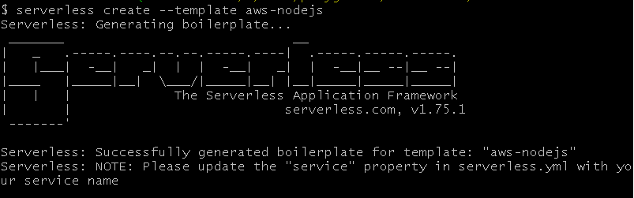
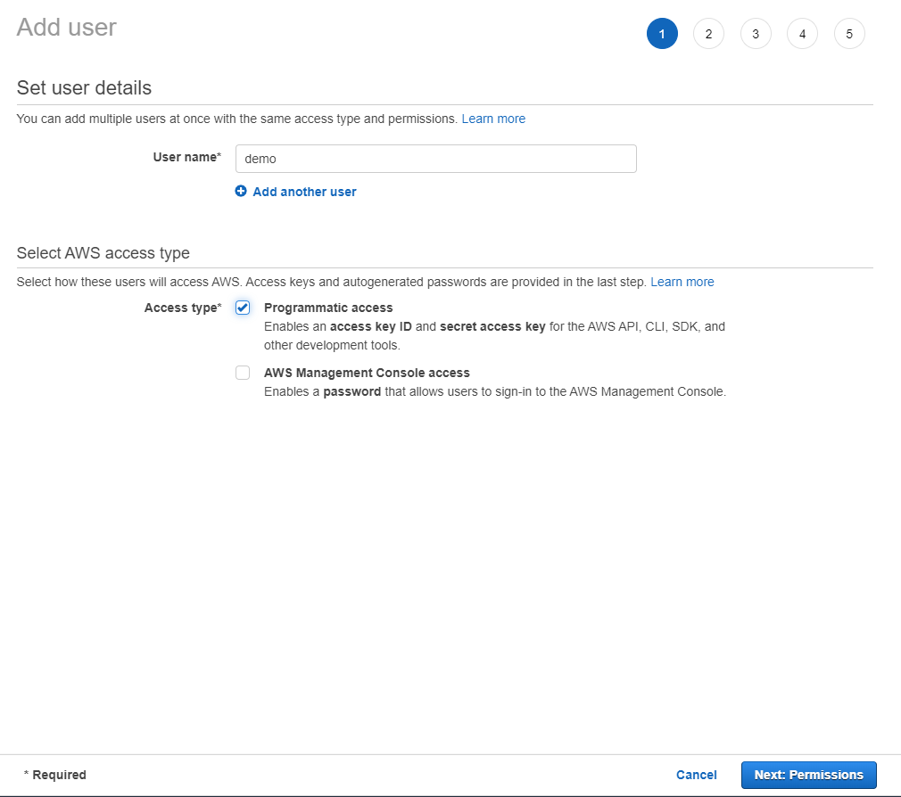
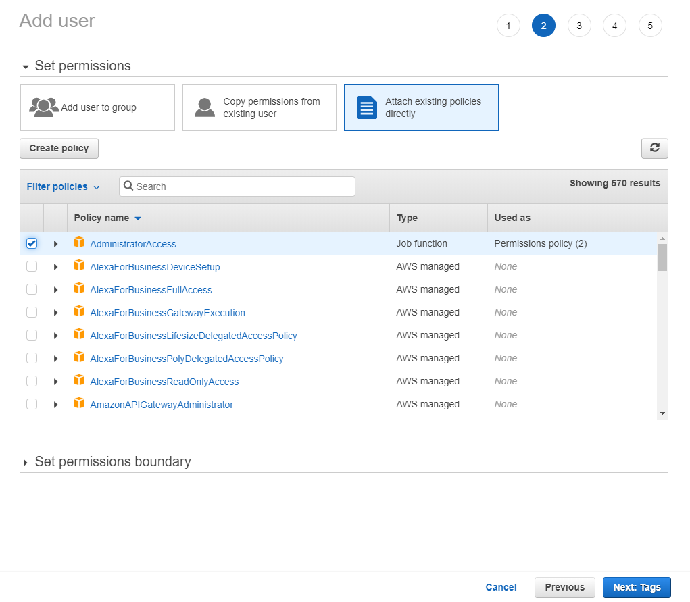
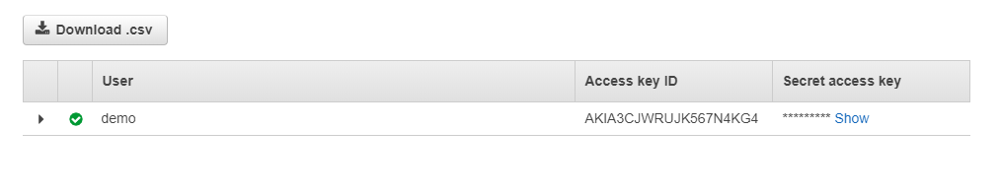
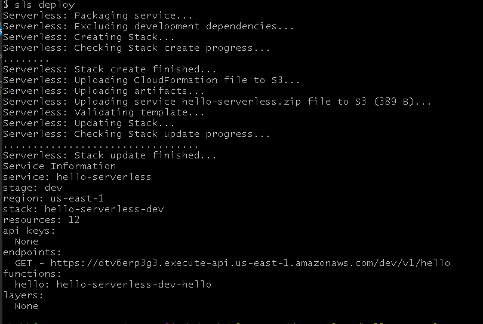
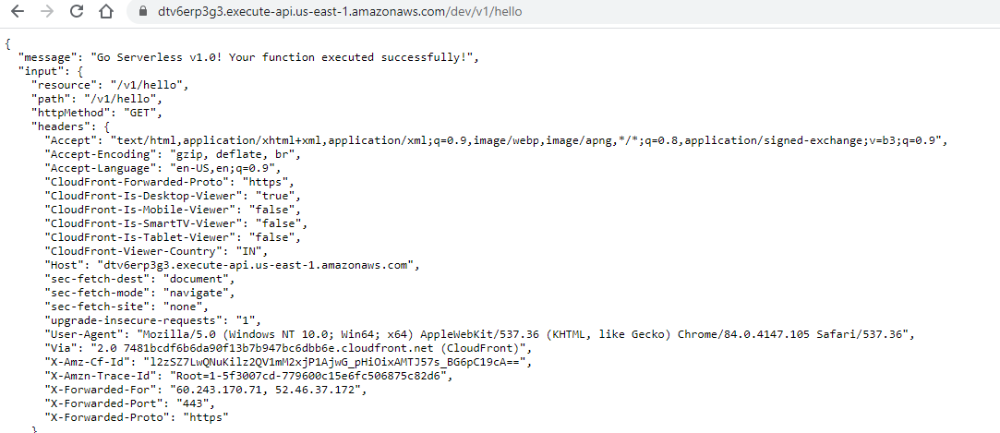

Serverless computing is a cloud computing execution model in which the cloud provider runs the server, and dynamically manages the allocation of machine resources. Pricing is based on the actual amount of resources consumed by an application, rather than on pre-purchased units of capacity. - [Wikipedia](https://en.wikipedia.org/wiki/Serverless_computing)

In simple language, serverless means pay only for what you use. You might think there is already a Pay-as-you-go model provided by the cloud providers.  
Let me rephrase it, serverless means pay only for what you execute. Serverless doesn't mean that there will be no server, it means that you don't have to worry about the server and its setup. Focus on the application logic or in our programming terminology only focus on writing the code or functions.  
You can deploy these individual functions to the cloud and whenever this function will execute, only for that execution you will be charged.  
Isn't it great? 😃

Serverless computing concept was first introduced in 2010. AWS Lambda, introduced by Amazon in 2014, was the first public cloud infrastructure vendor with an abstract serverless computing offering.

With the popularity of microservice architecture, serverless is the best option in terms of economics and reliability.

# Serverless Framework

[Serverless](https://serverless.com) is an open-source project, introduced in 2015. Serverless provides features to deploy the function to almost every cloud. For ex. AWS, Azure, GCP. Using serverless you can access and manage other cloud services like storage, API gateway, DB etc.

> Don't get confused. Serverless computing or serverless is a concept, while there is a framework or tool also name as serverless.

# Getting Started

To install the `serverless`, first install the `nodejs` in the machine.

Go to [nodejs](https://nodejs.org/en/download/).

## Install serverless

Run the below `npm` command.

```js
npm install --global serverless
```

# Create a nodejs application and deploy on AWS

Create a new directory `hello-serverless`.  
Open the terminal in the directory and run the below command.

```js
serverless create --template aws-nodejs
```



This template has created 2 files, `handler.js` where the function is defined and `serverless.yml` where serverless deployment configuration is defined.

Open `handler.js`.

This is a simple function which will return a message.

```js
module.exports.hello = async (event) => {
  return {
    statusCode: 200,
    body: JSON.stringify(
      {
        message: "Go Serverless v1.0! Your function executed successfully!",
        input: event,
      },
      null,
      2
    ),
  };
};
```

## Create an API endpoint for hello function

Open `serverless.yml`.

In the provider section, it is `aws` and by default, its region is `us-east-1`. It also provides a staging option, you can deploy the project in a different environment like dev, prod or test.

Update the provider section:

```yaml
provider:
  name: aws
  runtime: nodejs12.x
  stage: dev
  region: us-east-1
```

In the functions, create a new route for the hello function. It will create a new route in the AWS API gateway and link it to the AWS lambda function in which `hello` function will deploy.

Update the function section:

```yaml
functions:
  hello:
    handler: handler.hello
    events:
      - http:
          path: v1/hello
          method: get
```

We have created a `http` event of `GET` request type and `v1/hello` route.

The function is ready and configured.

For deploying it, we need to connect AWS account with the serverless.

## Create an AWS account

Create an account in AWS cloud if you don't have.  
Open the AWS account and go to **IAM**.  
Create a new user with **Administrator Access**. Using this user, the serverless can create the lambda function and other required resources on the AWS cloud.

### Create a new User

Enter the user name and select the **Programmatic access**.



Click Next.

### Permissions

Select the **AdministratorAccess**.  
This is only for the education purpose, in production configure the access according to the requirement.



Now, Click Next till review tab and Create the User.



Download the credentials. If you misplace this, then you have to recreate it again. Save it properly. Keep it handy, we need it in the next step.

## Deploy to AWS

Open terminal in the project directory.  
Run the below command to connect serverless CLI to AWS account.

```js
serverless config credentials --provider aws --key <ACCESS KEY> --secret <Secret Access key>
```

> ❗ Don't use the shorthand `-s` for secret, it is reserved keyword and will throw a serverless error `Invalid stage name`.

Use the below command to deploy the function to the AWS.

```js
serverless deploy
```

> You can use `sls` for `serverless`. It is a shorthand notation.

Once, it deployed successfully, you will get output similar to this.



## Test the function

Copy the endpoint from the deploy output.
`https://dtv6erp3g3.execute-api.us-east-1.amazonaws.com/dev/v1/hello`

Try it in browser.


# Conclusion

Serverless computing is economical and reliable but we have should not follow it blindly. All the technologies work best up to a certain limit if we try it beyond that instead of helping it will increase your workload.

We should use it according to the use case and requirement.

The serverless tool is great. Even for a beginner, the learning curve is smooth. In the upcoming tutorials, you will get more projects to play with serverless.

Thanks for reading. 😃

> Cover is designed in [Canva](https://canva.7eqqol.net/KD6B9)

---
