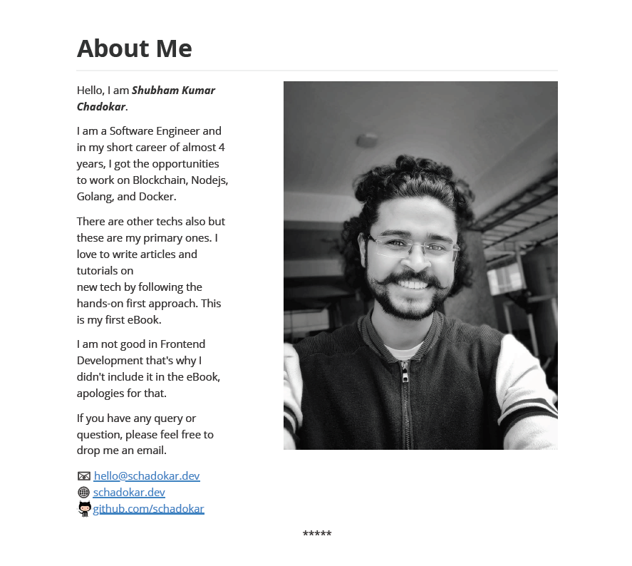
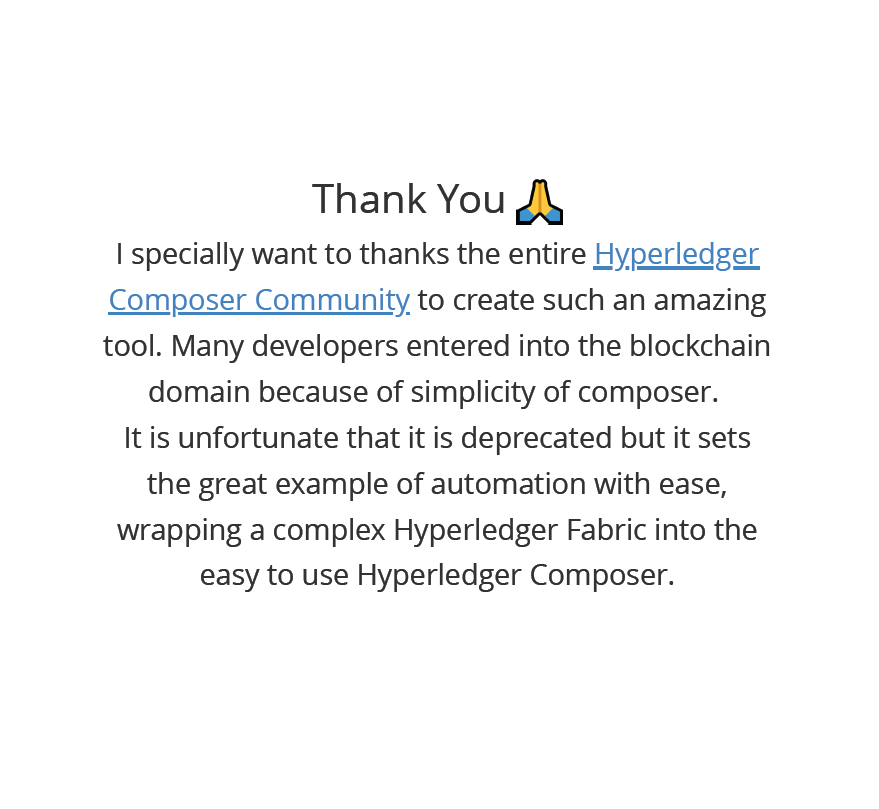
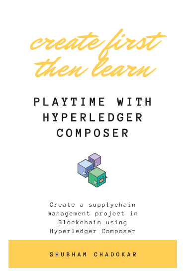
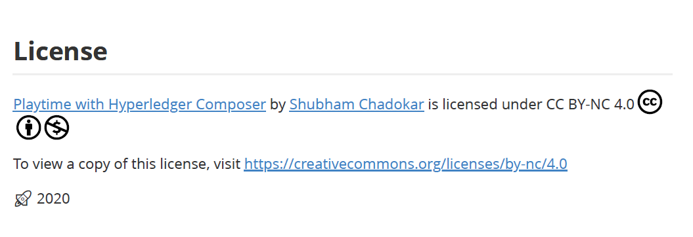

Recently, I wrote my first eBook. Yes, I finally wrote it. 🎉   
It was on my list for a long time and when it finally completed, I love to share the experience with everyone.

I wrote the eBook on Hyperledger Composer Blockchain tool.

# Motivation 🚀

I am writing articles and tutorials since late 2018. By now I am quite comfortable on how to write an article or a tutorial. What tools should I use or the approach.
But when it comes to the book writing, the arena is quite different. My motivation was the curiosity, how authors write books? What is their thought process? What tools they use? And of course how it feels to write a book. 😄

I am a Software Engineer and I am working on Blockchain since 2018. I learnt different blockchains like Ethereum and Hyperledger Fabric. I used many tools like [truffle](https://www.trufflesuite.com/), [remix](https://remix.ethereum.org/) and [hyperledger composer](https://hyperledger.github.io/composer/).
I had a few options to write on like **Ethereum** or **Hyperledger Fabric**. Since, it was my first eBook, these topics were not ideal for me. Because, these topics requires a lot of time and efforts. So, I picked the simple one, Hyperledger Composer.

# First Hurdle

Which tool or editor should I use to write the book?  
Should I write in MS Word, Google Docs or use something else?  

I read lots of articles on **What are good tools available for book writing?**. I tried many tools but I wasn't happy with any of them. I wasted a lot of time on finding the perfect tool.  
In the end, I realize that editors ease your writing and managing the book but what matter is the content. So, I stopped searching for a perfect editor and went to basic.

## Basic
In the end, I used my favorite code editor. Yes, **VS Code** 🥰.  
After, spending days of finding on Internet, not a single article suggested that *we don't require any specific tool or editor to write a technical book, VS Code or Atom is more than enough.*  

I wrote the complete eBook on **VS Code** in my favorite markdown format. To ease my writing, I used a couple of markdown plugins like **Markdown All in One** and **Markdown Preview Enhanced**.  
The first plugin help you writing markdown while the second helps in preview and how the markdown will look and behave after converting into HTML or other format. The **Markdown All in One** also has a preview but **Markdown Preview Enhanced** has multiple themes and options to export the markdown file in HTML, PDF and other reading formats like ePub or mobi. The other formats requires the **Pandoc** installed in the machine.  

> I am a Windows User. For Mac Users I found there are many great editors available [bear](https://bear.app/), [ulysses](https://ulysses.app/) and many other.

Recently, I found there are many markdown editors available on **Windows** and **MacOS** which you can use for book writing. Like [Notion](https://www.notion.so/), [Typora](https://typora.io/), [iA Writer](https://ia.net/writer), [SimpleNote](https://simplenote.com/).  

Bottom line **Don't waste too much time on finding the perfect editor**, start writing on your familiar editor. With time you'll find it.

# Second Hurdle
From where should I start writing?  
How should I write?  
How should I approach it?  
In short, how well should I write it, so that the reader will get most of it?

These questions really made me scratch my head a lot. In the beginning, I changed my approach 4-5 times.  
At this point, I suggest spent some time to ponder about the approach. Because once the book is in the middle, it is not going to be an easy task to change it.  

### Ask the questions
I asked these questions to myself about the book and noted it down.

1. Who are my targeted audience?
2. How should I maintain the sequence of the book?
3. How should I name the files or chapters? So, that if I have to refer any particular topic, it should be easy.
4. How should I track the progress?
5. How should I maintain the versions of the chapters and drafts of the book? There will be no. of occasion when you will think that last edit was much better than this.

These are a few basic questions which I asked and they were helpful.  

## My approach
I followed the below points as my approach:

### Create a to-do list
I created a to-do list. In this list, I note down all the points, topics, sub-topics, references, preface, cover, title etc.  
I almost added all the thoughts which came into my mind for the book.  

I would suggest to create 2 to-do list, one on paper and same as a soft copy.  
First, note down all the points on paper. Once you note down everything, read it 2-3 times. Then what ever new ideas are popping in your head note down them too. Like, how you're going to explain this topic. Note it down. It will ease your work. When you will start writing that topic, you can refer to these notes.  

Once you have a **to-do** list on paper, it doesn't have to be complete. Create a soft copy and save all the points in a chronological order.   
This is my **to-do** list use to look like.

```
# Tasks

- [x] Index
- [x] Cover
- [x] Title
- [x] Subtitle
- [x] Preface
- [x] What is Blockchain and Hyperledger Fabric?
- [x] Introduction to Hyperledger Composer
- [x] Environment Requirement and Setup
  - [x] Azure
  - [x] AWS
  - [x] GCP
- [x] Project Objective
- [x] Project Setup in Composer
- [x] Model File
  - [x] Definition
  - [x] Modeling Language
  - [x] project code
- [x] Script File
  - [x] Definition
  - [x] syntax
  - [x] project code
- [x] Query File
  - [x] Definition
  - [x] Query Language
  - [x] project code
- [x] ACL File
  - [x] Definition
  - [x] syntax
  - [x] project code
- [x] Deployment in Composer Playground
- [x] Testing in Composer Playground
- [x] Export the .bna
- [x] Composer Rest Server
- [x] Frontend
- [x] Conclusion
- [x] References
- [x] About Me
- [x] Grammar Check 1
- [x] Grammar Check 2
- [x] Read the draft
- [x] Read the final draft
- [x] PDF format
- [x] Add page no. to PDF
- [x] New chapter starts from the new page
- [x] Thank You Note
- [x] License
- [x] End cover
```
I used the markdown format for my **to-do** list. You can use any of your choice.  

## Start Small but Start
You should keep this in mind, that it is not necessary that you write in order. There can be many topics which are dependents on previous topics. You don't have to write the complete topic at once either. Whatever topics you are feeling comfortable start writing on that.

Your goal should be to start the book. Aim to write 10-20% of your book within a couple of week. Once you'll start, it will keep reminding you that you have to complete the book. In time you'll realize that this turns into a great motivator.

If there is a topic which you're not good at, don't worry. Don't hesitate to get help from Internet. Read how other people explained it. Take inspiration and then write in your own way. If you're taking any content from other people's work, then make sure you inform them and least mention them in the references.
> Consider this as a professional courtesy. -- John Wick 😉

## Chronological Order

It took me a while to understand the importance of file naming convention. First I started following *Chapter 1*, *Chapter 2* naming convention for the topics. It was a terrible idea. The problem with this naming is that you have maintain a separate file in which you brief of what is in the file. Or you have to open each file to get it.  
The another problem is, if you are adding a new chapter in between then you have to rename all the following chapters.  

These are 2 conventions I found helpful, but each have its own disadvantages:
1. **chapternumber-topic**: Name the file as chapter number followed by the topic of the chapter. Like this **10-Introduction-of-Blockchain**. Name the chapter number in 2 digits. It will help you to add sub-section of same chapter in different files. Like this **11-History-of-Blockchain**. Another benefit of this naming convention is it will show all the files in the order of your book chapters.  

**Disadvantage:** Adding new chapter in between will require to rename all the following chapters.

2. **filename as topic**: Name all the files as topic name. It will give you freedom to write topics in random order. And you can maintain the order of the book in the to do list.  

**Disadvantage:** All the files will arrange in alphabetical order. After 10-15 files it will be difficult to track all the files and also while creating the draft.

I followed the second method. Actually, by then I didn't figured out the first one. 😅   

For creating a draft, I created a script. In this script, I entered all the topics in an array. Then I draft file and appended all the topics in it. Of course by reading them first 😜. A few perks of being a Software Engineer 🤭.  

This script was a savior while doing the editing. Many times I updated the topics or pics in them. Grammatical mistakes. Here Grammarly saved my ass from grammar nazis 😜. But not completely as I am using the free version. 😅

## Chronicle of book journey
No thoughts or writing is a waste. Sometimes it just doesn't fit with others.
Writing a book is not a sprint, it is a marathon. Always save your work when you complete a topic or done for the day. Next day, you might get a new idea for the topic which you already completed. You spent an hour on this and may be it doesn't good like the previous one. The UNDO is great but it also has limitation and its limit varies from editor to editor. ***Don't Test its limit***.  

Instead of relying on editor or making duplicate copies, I used **git** for version management. Don't limit **git** as it can only be used for code management. It is a tool and its application is completely on your imagination.  

For the readers who don't know about **git**.
> Git is a distributed version-control system for tracking changes in source code during software development. It is designed for coordinating work among programmers, but it can be used to track changes in any set of files. --[Wikipedia](https://en.wikipedia.org/wiki/Git)

You don't have to learn the complete **git**. The basic commands like **init**, **add**, **commit**, **logs** and **checkout**. These 5 commands are more than enough for you to maintain the versions. If you want it to be accessible and safe. Then their many Git code hosting platforms like [GitHub](https://github.com/), [GitLab](https://about.gitlab.com/) etc. To host your book on one of these platform, you can follow the below steps:  

1. Create an account on one of these platform. My personal choice is **GitHub**.
2. Create a private repository with default choices. You can change its visibility in future.
3. Follow the instructions provided once the repository created. Basically, in this step you're connecting your local **Git** to your hosted repository.
4. Learn 2 more commands. **push** and **pull**. Use **push** to push the local changes to cloud repo and use **pull** to get the content from the cloud.  

After this, whenever you make any changes just **add**, **commit** and **push**. Simple! isn't it? 😅  
After couple of commits you will feel comfortable with **git**.

# A Glance on tools and resources I used
I used many tools and resources while writing, editing, formatting and designing it.  

## Writing
For writing I used the VS Code editor with a couple of markdown plugins.  
For emojis I used the [copy and paste emojis](https://getemoji.com/).

## Editing
For correcting the grammatical mistakes I used Grammarly. I used the Free version. In free version, it corrects all the basic mistakes like incorrect or missing articles, preposition, commas etc.  

I used the [online pdf editor](https://www.ilovepdf.com/add_pdf_page_number) to add page numbers in the book.

## Formatting
I used the Markdown in Preview plugin in VS Code to generate the PDF format. I used the default git markdown formatting. You can change the formatting in the settings.

### Page break in PDF
As I was writing in markdown format, the PDF output was inconsistent. For example: It starts the new topic from the same last page instead of starting from the new page. For this I used the page break `html` code at the end of all the topic.

```
<div style="page-break-after:always;"></div>
```
This will make the following content to be on a new page.  
You can also add the end of the page sequence like ********* this.
```
<div style="page-break-after:always; display:block; text-align:center; border:none">*****</div>
```

### About Me Page

In **About Me** section of my book, I divided the content in 2 columns. A brief about me and a profile pic. It took me a while to realize the capabilities of the markdown format. We can add plain `html` code in it.  

```
<div >
  
</div>

Hello, I am **_Shubham Kumar Chadokar_**.

I am a Software Engineer and in my short career of almost 4 years, I got the opportunities
to work on Blockchain, Nodejs, Golang, and Docker.

There are other techs also but these are my primary ones. I love to write articles and tutorials on
new tech by following the hands-on first approach. This is my first eBook.

I am not good in Frontend Development that's why I didn't include it in the eBook, apologies for that.

If you have any query or question, please feel free to drop me an email.

:e-mail: [hello@schadokar.dev](hello@schadokar.dev)  
:globe_with_meridians: [schadokar.dev](https://schadokar.dev)
[github.com/schadokar](https://github.com/schadokar)
```

It looks like this.  


### Thank You Page
I added a thank you page for the **Hyperledger Composer Community** for their work. I tried to add the content in the middle of the page.

```
<div style="padding-top:40%; text-align: center; font-size:35px;">
Thank You 
</div>
<div style="text-align: center; font-size:25px;">
I specially want to thanks the entire
<a href="https://github.com/hyperledger/composer/graphs/contributors">Hyperledger Composer Community</a> to create such
an amazing tool. Many developers entered into the blockchain domain because of simplicity of composer. <br />
It is unfortunate that it is deprecated but it sets the great example of automation with ease,
wrapping a complex Hyperledger Fabric into the easy to use Hyperledger Composer.
</div>
```
It looks like this.


## Book Title, Sub-title
The book title should tell the complete content of the book in a few words or in 1 sentence. While writing book note down all the keywords used in the book. This will help you to come up with a great title. The logic is to get the essence of the book content for ex. is it theoretical or hands-on book.  

A sub-title should tell readers, what they will get from this book or what they are going to learn. One sentence sub-title is ideal and max 2 sentence. Don't over do, let the readers read the book. The idea is to the tell the complete book in 1 sentence and still don't tell anything 😜.

My book title is ***Playtime with Hyperledger Composer*** and sub-title is **Create a supplychain management project in Blockchain using Hyperledger Composer**.  

When you start writing your book, don't spend much time on book title. When your book complete that time you'll be in much better position for the book title, because everything is written, you know what it is all about and what others will get from it. In my case, I changed the book title and book cover at the last moment before publishing it. Previously, it was so boring 🥱.  

## Design Book Cover  
I starts the designing the book cover by taking the references from other books, tried to edit them in paint. Result was complete disaster, can't think of anything good. That time I realized, *designing is not my* ☕️. I thought to hire a freelancer for this, I went to the freelancing sites like **UpWork**, **Fiverr**.  

Then, I found [**Canva**](https://canva.com). Such a great tool. Amazing! 🌟 🌟 🌟 🌟  

> Canva is a graphic design platform that allows users to create social media graphics, presentations, posters and other visual content. It is available on web and mobile, and integrates millions of images, fonts, templates and illustrations. [Wikipedia](https://en.wikipedia.org/wiki/Canva)

I used one of the templates from canva book cover section and created my eBook cover. Not bad, isn't it? 😄   




## License 📜
I wrote this book out of curiosity and for fun. So, I want it to be free, open-source, but don't want others to monetize it. Without a license there is no restriction.  
I searched for a while and found a great answer on stackoverflow regarding free licenses, [Creative Commons Licenses](https://creativecommons.org/licenses/).
> **Creative Commons is a nonprofit organization that helps overcome legal obstacles to the sharing of knowledge and creativity to address the world’s pressing challenges.**

They have provided a [form](https://creativecommons.org/choose/) with a couple of questions related to what kind of license you want. Fill the form and voila 🎉, your license is ready. Copy and Paste it or use the embeded link.



# Publish 🚀
There are many options to publish your book. You can approach to publishing house and send your draft. If they like to publish you can go ahead and secure a deal. After this publishing house take care of other processes like formatting, editing your book, creating an attractive book cover, all the licensing, publishing process and most importantly marketing.
In short, if you want to monetize your book and expecting a good amount, then publishing house is the best option available.  

The another option is self-publishing. Yes, we can self-publish our book. The Amazon's [Kindle Direct Publishing](https://kdp.amazon.com/en_US/) provides a great platform for this. It is free and it publish the book world wide. You'll get 70% royalty for each sale. The kdp take cares of all the publishing process. You just have to write the book, upload it and format it. Enter the price of the book and basic details of the book and yourself. You can follow their tutorials. They have done a great job.  

As I want to keep my book free and didn't had the patience. I self-published it without using any third party. I converted the book in PDF format and saved the book in AWS S3 Bucket, so that anyone can download it. Then I hosted the book on website. Simple. 😃

[Checkout here](https://schadokar.dev/ebooks/)

# Do's and Don'ts

## Some precautions while adding images as icons

# Final List of Tools I used

- **Editor**: [Visual Studio Code](https://code.visualstudio.com/) with 2 Markdown plugins
- **Versioning Tool**: [GitHub](https://github.com)
- **Emojis**: [Copy and Paste emojis](https://getemoji.com/)
- **Grammar Check**: [Grammarly](https://app.grammarly.com/)
- **License**: [Creative Commons Licenses](https://creativecommons.org/licenses/)
- **Cover Design**: [Canva](https://canva.com)
- **PDF page number**: [online pdf editor](https://www.ilovepdf.com/add_pdf_page_number)
- **eBook storage**: [AWS S3 bucket](https://docs.aws.amazon.com/AmazonS3/latest/dev/UsingBucket.html).
