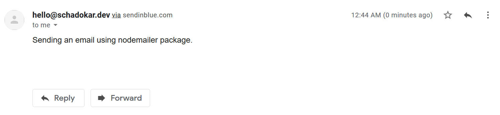

This is the 2nd part of the ***How to send email in Nodejs*** series. In the last section, we created the function to send the email using node cli.  

In this section, we will use the Expressjs and expose the functionality as an API. To test the api, we're going to use 2 options Curl command and Postman.  

# Series:
- [How to Send Email in Nodejs - Part 1](https://schadokar.dev/posts/how-to-send-email-in-nodejs/)  
- [How to Send Email in Nodejs with Expressjs - Part 2](https://schadokar.dev/posts/how-to-send-email-in-nodejs-with-expressjs/)

# Pre-requisite

- Node.js (>v6.0.0 for nodemailer module)
- Code Editor (For Ex. VS Code, Atom)
- An account in [Sendinblue](https://www.brevo.com/?tap_a=30591-fb13f0&tap_s=956728-d372bc)

> Check out this step by step tutorial to [Create an account in sendinblue](https://schadokar.dev/to-the-point/create-an-account-in-sendinblue/).

# Getting Started

Let's first install all the dependencies.
- express - To create routes
- body-parser - To access the parameters passed with API request
- cors - To handle the cross origin resource sharing
- dotenv - To access the .env file which we are going to use to save the credentials

Open the terminal inside the project and run the below command.
```js
npm install --save express body-parser cors dotenv
```

## Project Directory Structure

```
node-email
  |- routes
    |- mail-api.js
  |- src
    |- send-mail.js
  |- template
    |- mail.html
  |- .env
  |- index.js
```

### .env

In the last section, we entered the email and SMTP_KEY in the code, which is not recommended.  
We should always use the environment variables in the code, to keep the secrets safe.
Create a new file `.env` and paste your email and SMTP_KEY.

```
USER=EMAILADDRESS
PASS=SMTP_KEY
```

### src

In the `src` folder, create a new file `send-mail.js` and paste the below code.

```js
"use strict";
require("dotenv").config();
const nodemailer = require("nodemailer");
const path = require("path");
/**
 * sendEmail
 * @param {Object} mailObj - Email information
 * @param {String} from - Email address of the sender
 * @param {Array} to - Array of receipents email address
 * @param {String} subject - Subject of the email
 * @param {String} text - Email body
 */
const sendEmail = async (mailObj) => {
  const { from, to, subject, text } = mailObj;

  try {
    // Create a transporter
    let transporter = nodemailer.createTransport({
      host: "smtp-relay.sendinblue.com",
      port: 587,
      auth: {
        user: process.env.USER,
        pass: process.env.PASS,
      },
    });

    // send mail with defined transport object
    let info = await transporter.sendMail({
      from: from, // sender address
      to: to, // list of receivers
      subject: subject, // Subject line
      text: text, // plain text body
      html: {
        path: path.resolve(__dirname, "../template/mail.html"),
      }, // html body
    });

    console.log(`Message sent: ${info.messageId}`);
    return `Message sent: ${info.messageId}`;
  } catch (error) {
    console.error(error);
    throw new Error(
      `Something went wrong in the sendmail method. Error: ${error.message}`
    );
  }
};

module.exports = sendEmail;
```

Let's understand the code
- `require("dotenv").config();` is used to load the `.env` file, so that using `process.env.{KEY}` we can access the environment variables defined in the `.env` file.
- The function takes an object with `to`, `from`, `subject` and `text` arguments.
- `nodemailer.createTransport` creating a transport object with all the required details of the message service provider and user access to that.
- `transporter.sendMail`: Enter all the details to mail. The `text` field send a plain text while the `html` field send the mail in the html format.

### routes

Open the `routes` folder and create a new file `mail-api.js`. In this file, we will create a send email route.  
This endpoint then triggers the `sendEmail` function, defined in the `src` directory.

Copy and paste the below code in the file.

```js
const express = require("express");
const router = express.Router();
const sendMailMethod = require("../src/send-mail");

// Post request to send an email
router.post("/sendmail", async (req, res) => {
  try {
    const result = await sendMailMethod(req.body);

    // send the response
    res.json({
      status: true,
      payload: result,
    });
  } catch (error) {
    console.error(error.message);
    res.json({
      status: false,
      payload: "Something went wrong in Sendmail Route.",
    });
  }
});

module.exports = router;
```

Instead of taking out the variables from the `req.body`, we directly send this to the function as it is accepting an object.  
This approach is optional, if the application requires the input validation, then validate it at route end, instead of at method end. As it is for education purpose not for production.

### template

In the `html` field of `sendMail` method, it can read the pure `html` code. But this is not recommended.  
Instead you can create a `mail.html` template and give its path to it.  
Create a new file `mail.html` and paste the below code in it.
```html
<div style="text-align: center;">
  <h1 style="color: #3584c8;">Nodemailer Example</h1>
  <p>
    This is an example html template to demonstrate the sending email using
    html.
    <br />
    🤗 🤗 🤗 🤗 🤗 🤗
  </p>
</div>
```

You can use a dynamic html template, in which you pass the arguments. But that is out of the scope for this tutorial.  

### index.js  

Open the `index.js` and paste the below code. This `index.js` is the entry point for this application. It is importing all the application route and creating a express server to host the application on `4444` port.

```js
"use strict";
const express = require("express");
const bodyParser = require("body-parser");
const cors = require("cors");
const app = express();
const mailAPI = require("./routes/mail-api.js");

// Express body parser
app.use(cors());
app.use(bodyParser.json());
app.use(
  bodyParser.urlencoded({
    limit: "50mb",
    extended: false,
    parameterLimit: 50000
  })
);

// use the routes specified in route folder
app.use("/api/v1", mailAPI);

const port = process.env.PORT || 4444;

//listen to the server
app.listen(port, function () {
  console.log(`listening to the port ${port} .....`);
});
```

## Run Time
Now, the fun part. Let's send some emails.  
Open the terminal inside the project directory and run the below command.
```
node index.js
```

This will start the server at `4444` if no `PORT` environment variable defined.

Open the Postman and create a `POST` request to `localhost:4444/api/v1/sendmail`.  
In the `Body` tab, select the `JSON` option. Modify the body accordingly.  
```js
{
    "from": "hello@schadokar.dev",
    "to": [
        "shubham@schadokar.dev"
    ],
    "subject": "Mail from Nodemailer",
    "message": "Sending an email using nodemailer package."
}
```  
Hit Send.


## Check Email

Open you email and check the inbox. If you could not find it in inbox try to check in promotion.

### Text email
If you haven't used the `html` field in the `sendMail` then your mail will look like this.  



### HTML email

When you are using `html` field then it ignores the `text` field and only send the `html` message.


# Conclusion
We have finished the api part of this application and with this our backend is completed.  
Now, you can use any frontend framework to utilize this API.  

You can find the complete code on the [GitHub](https://github.com/schadokar/nodemailer-app).  
Thanks for reading.

> Cover is designed in [Canva](https://canva.7eqqol.net/KD6B9)

---
