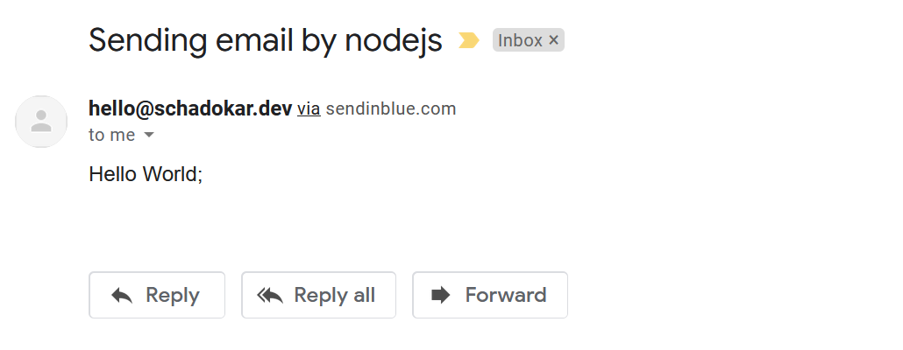

This is a series of articles on how to send an email in nodejs.  
In the first article, we will send an email using the `node` command. Later, we will create a APIs and a frontend.

Sending emails in nodejs have only 2 requirements:

- Mail service provider (For ex. Gmail, Sendinblue, Mailchimp)
- Middleware to connect with mail service (For ex. nodemailer)

# Series:

- [How to Send Email in Nodejs - Part 1](https://schadokar.dev/posts/how-to-send-email-in-nodejs/)
- [How to Send Email in Nodejs with Expressjs - Part 2](https://schadokar.dev/posts/how-to-send-email-in-nodejs-with-expressjs/)

# Prerequisites

- Node.js (>v6.0.0 for nodemailer module)
- Code Editor (For Ex. VS Code, Atom)
- An account in [Brevo (formerly Sendinblue)](https://www.brevo.com/?tap_a=30591-fb13f0&tap_s=956728-d372bc)

# Getting Started

For this series, we are going to use `nodemailer` package. It is an open source project.

### Nodemailer Features

- A single module with Zero dependencies
- Support HTML Content
- Add attachments to messages
- Supports SMTP as default transport method. Other supported transport methods are SES, Sendmail, Stream.
- OAuth2 authentication

For the mailing service, we are going to use [Sendinblue](https://www.brevo.com/?tap_a=30591-fb13f0&tap_s=956728-d372bc).
This mailing service offers many different solutions other than emails, for ex. SMS.  
It provide **300 mails/day** for a free account and paid account is also very cheap and offer more features compared to many other available mailing service provider.

## Create a new Project

Create a new directory `node-email`.
Open the terminal or cmd inside the directory.

Initiate the nodejs project using the `npm init -y` command. `-y` flag is optional, by passing this flag it uses the default arguments.

### Install Nodejs Dependencies

Install `nodemailer` package.

```js
npm install --save nodemailer
```

### Create a new SMTP Key in Brevo (formerly Sendinblue)

This key will be used for authentication and sending the email via your Brevo (formerly Sendinblue).

Sign in to your Brevo (formerly Sendinblue) and click on SMTP & API from the top-right menu.

Go to **SMTP** tab and click on _CREATE A NEW SMTP KEY_.
Copy the key and paste it somewhere safe.

> ⚠️ Note: If you lose this key, then you can't retrieve it. Then you have to create a new one and replace it accordingly.

### Send Email

Create a `index.js` file and paste the below code.

```js
"use strict";
const nodemailer = require("nodemailer");

/**
 * sendEmail
 * @param {Object} mailObj - Email meta data and body
 * @param {String} from - Email address of the sender
 * @param {Array} recipients - Array of recipients email address
 * @param {String} subject - Subject of the email
 * @param {String} message - message
 */
const sendEmail = async (mailObj) => {
  const { from, recipients, subject, message } = mailObj;

  try {
    // Create a transporter
    let transporter = nodemailer.createTransport({
      host: "smtp-relay.sendinblue.com",
      port: 587,
      auth: {
        user: "hello@schadokar.dev",
        pass: "SMTP-KEY",
      },
    });

    // send mail with defined transport object
    let mailStatus = await transporter.sendMail({
      from: from, // sender address
      to: recipients, // list of recipients
      subject: subject, // Subject line
      text: message, // plain text
    });

    console.log(`Message sent: ${mailStatus.messageId}`);
    return `Message sent: ${mailStatus.messageId}`;
  } catch (error) {
    console.error(error);
    throw new Error(
      `Something went wrong in the sendmail method. Error: ${error.message}`
    );
  }
};

const mailObj = {
  from: "hello@schadokar.dev",
  recipients: ["me@schadokar.dev"],
  subject: "Sending email by nodejs",
  message: "Hello World;",
};

sendEmail(mailObj).then((res) => {
  console.log(res);
});
```

In the `auth` object, `user` will be your email address of Brevo (formerly Sendinblue) and `pass` will be your SMTP KEY.

In the `mailObj`, `from` will be your email address of Brevo (formerly Sendinblue), `recipients` is an array of email addresses, `subject` is subject of email and `message` is plain text message.

Open the terminal and run the file.

```js
node index.js
```

On successful run, output will be

```
Message sent: <72ff9668-8200-831b-e585-afbeaeeea09d@schadokar.dev>
Message sent: <72ff9668-8200-831b-e585-afbeaeeea09d@schadokar.dev>
```

Now, go and check your mailbox. You have received a mail. If you could not find the mail, check in the promotion.



# Conclusion

In this tutorial, we created a basic sendEmail function to send the email using the nodemailer package. In the [next section](https://schadokar.dev/posts/how-to-send-email-in-nodejs-with-expressjs/), we are going to create the server and APIs and in the last section we will send the email using the frontend.

> Cover is designed in [Canva](https://canva.7eqqol.net/KD6B9)

---
