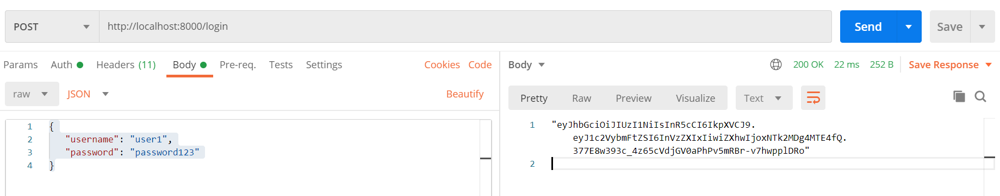

In this tutorial, we will learn how to secure the APIs using the JWT authentication in Golang.  
In any application, APIs are the bridge between two services. These services can be anything, like a backend service or a frontend service.  
To secure the application, bridge security is important.

JWT is a JSON web token. In which, a token is generated by 1 service and shared with another service. Whenever the 2nd service make a request to the 1st service, it will send the token with the request. Then the first service will validate if the token is valid or not, in this way, it is validating if it is requested from the genuine service or not.

For Ex.
In a web application, when a user login, the content is unique and personalized according to him. Even when you reload the page or close the browser, when you will open it, it is still logged in.

How the application knows this? As every time it is making a new request to the server and it is not asking to login user with each request. It is the token which is saved in the browser. It can be saved in the cookie or in the browser storage. These tokens are not limited to the JWT, there are many alternatives available.

Next time, when you login in to any application, check the cookie and storage. Then clear the cookies and storage of that site and reload it. It will ask you for sign in again. 😃

# What is JWT?

JWT stands for JSON Web Token. JWT represents a claim between two parties which is shared in a JSON format.

In simple words, it is similar to your ID cards. In school, college, office etc places this ID card is provided by the organization to you to authenticate yourself whenever you enter the premises. 🧐

> JSON Web Token (JWT) is an open standard (RFC 7519) that defines a compact and self-contained way for securely transmitting information between parties as a JSON object. This information can be verified and trusted because it is digitally signed. JWTs can be signed using a secret (with the HMAC algorithm) or a public/private key pair using RSA or ECDSA.

# How JWT works?

The JWT structured in three parts:

- **Header**: It identify which algorithm is used
- **Payload**: The information
- **Signature**: The encryption of the information by a Secret Key using the Algorithm

The three parts are separated by the dot(.).  
For Ex:
**_Header.Payload.Signature_**

Let's understand it with an example.
Suppose the Header is `algorithm1` and `algorithm1` is the below equation.

```go
Signature = Payload * SecretKey
```

Then, the **Payload** is `11` and the **SecretKey** is `5`.

When the **Payload** and **SecretKey** is passed to the `algorithm1` it will generate a unique **Signature**.

```go
Signature = Payload * SecretKey = 11 * 5 = 55
```

The **Signature** is `55`.

Then the JWT token will look like this.

```go
algorithm1.11.55
```

This JWT token will be shared with the requested party. After this whenever this party raise a request to this party, it will also share this token to authenticate itself.  
When the first party receives the request with the token, it will first validate the token before processing the request.

As all the details are available in the token it is very easy task for the party to validate the token. It will take the **Payload** and passed it to the **Header** (algorithm1) using the **SecretKey** which it already have to generate the **Signature**. Then it will compare the token Signature with the generated Signature, if it matched _Voila_ go ahead with the request else decline the request. 🔎

The actual JWT Token looks like this.

```js
eyJhbGciOiJIUzI1NiIsInR5cCI6IkpXVCJ9.eyJuYW1lIjoiSSBhbSBJcm9uIE1hbi4ifQ.li -
  FDEyAdayupFIS5P2EKexN -
  Rm_SWe4LXO9Xjyja4o;
```

Take a quick look and you can see the token is divided in 3 parts:

- **Header**: eyJhbGciOiJIUzI1NiIsInR5cCI6IkpXVCJ9
- **Payload**: eyJuYW1lIjoiSSBhbSBJcm9uIE1hbi4ifQ
- **Signature**: li-FDEyAdayupFIS5P2EKexN-Rm_SWe4LXO9Xjyja4o

The **Header** and **Payload** are base64 encoded.

```go
package main

import (
	b64 "encoding/base64"
	"fmt"
)

func main() {
	header := "eyJhbGciOiJIUzI1NiIsInR5cCI6IkpXVCJ9"
	payload := "eyJuYW1lIjoiSSBhbSBJcm9uIE1hbi4ifQ"

	decodedHeader, _ := b64.StdEncoding.DecodeString(header)
	decodedPayload, _ := b64.StdEncoding.DecodeString(payload)

	fmt.Printf("Decoded Header: %s\nDecoded Payload:%s", decodedHeader, decodedPayload)

}
```

[Try it](https://play.golang.org/p/IssyQPPmkJG)

Output

```js
Decoded Header: {"alg":"HS256","typ":"JWT"}
Decoded Payload:{"name":"I am Iron Man."}
```

The algorithm in Header is **HS256** which is used to sign the Payload.  
The Payload is a JSON object with a key as `name` and `value` as `I am Iron Man.`

To sign this payload, the SecretKey is `secretKey`. 😅

# Getting Started

We are going to create a simple web application. In this application, there will be 2 routes, first login and second dashboard.

## Prerequisites

- Go v1.11 or greater (I am using Go v1.14)
- Code Editor (For ex. VS Code, Atom)
- Postman - to test the APIs. Curl commands can also be used.

## Project Structure

Create a new project `go-jwt-app`.  
Open the terminal inside the `go-jwt-app` and initialize the go modules using the below command.

```go
go mod init go-jwt-app
```

Go modules is a dependency manager or a package manager. It will track all the dependencies used in the project with their version. You can read more about it [here](https://medium.com/rungo/anatomy-of-modules-in-go-c8274d215c16).

### Install the dependencies

There are 3 packages used in this Project.

1. [Gorilla/mux](https://github.com/gorilla/mux): It is a feature rich package to create the APIs and server.
2. [jwt-go](https://github.com/dgrijalva/jwt-go): It is a Golang implementation of JSON Web Token(JWT). Using this package, we can create and verify the JWT tokens.
3. [godotenv](https://github.com/joho/godotenv): Using this package, we can access the `.env` file in which environment variables can be saved.

```go
go get github.com/gorilla/mux
go get github.com/dgrijalva/jwt-go
go get github.com/joho/godotenv
```

## Environment Variable

Create a new `.env` file and paste the below code in it.

```env
SECRET_KEY=secret007
```

Using the `godotenv` package, we can read the `SECRET_KEY`.

## JWT implementation

In this section, we can divide the process in modules to understand clearly.

### Create Server and Routes

```go
package main

import (
	"fmt"
	"log"
	...
	"github.com/gorilla/mux"
)

func main() {
	r := mux.NewRouter()

	r.HandleFunc("/login", login).Methods("POST")
	r.HandleFunc("/me", dashboard).Methods("GET")

	fmt.Println("Starting server on the port 8000...")
	log.Fatal(http.ListenAndServe(":8000", r))
}
```

First, create a new instance of mux router using the `mux.NewRouter()` method.

Using the `HandleFunc` create 2 routes. `/login` as a `POST` request and `/me` as a `GET` request.  
The `/login` endpoint will execute `login` function and `/me` will execute the `dashboard` function.

### Create a new JWT Token

In this `login` function, when a user will enter its `username` and `password`, it will first validate if the user registered or not. To validate, we will create a local user db using the `map`.

On successful, verification it will generate a Token using the `jwt-go` package and send to the request as a response.

To generate the JWT token, we are going to use the `HS256` algorithm.

```go
package main

import (
	"encoding/json"
	"fmt"
	"log"
	"net/http"
	"os"
	"strings"
	"time"

	jwt "github.com/dgrijalva/jwt-go"
	"github.com/gorilla/mux"
	"github.com/joho/godotenv"
)

// Secret key to uniquely sign the token
var key []byte

// Credential User's login information
type Credential struct{
	Username string `json:"username"`
	Password string `json:"password"`
}

// Token jwt Standard Claim Object
type Token struct {
	Username string `json:"username"`
	jwt.StandardClaims
}

// Create a dummy local db instance as a key value pair
var userdb = map[string]string{
	"user1": "password123",
}

// assign the secret key to key variable on program's first run
func init() {
	// Load the .env file to access the environment variable
	err := godotenv.Load()

	if err != nil {
		log.Fatal("Error loading .env file")
	}

	// read the secret_key from the .env file
	key = []byte(os.Getenv("SECRET_KEY"))
}

// login user login function
func login(w http.ResponseWriter, r *http.Request) {
	// create a Credentials object
	var creds Credential
	// decode json to struct
	err := json.NewDecoder(r.Body).Decode(&creds)
	if err != nil {
		w.WriteHeader(http.StatusBadRequest)
		return
	}
	// verify if user exist or not
	userPassword, ok := userdb[creds.Username]

	// if user exist, verify the password
	if !ok || userPassword != creds.Password {
		w.WriteHeader(http.StatusUnauthorized)
		return
	}

	// Create a token object and add the Username and StandardClaims
	var tokenClaim = Token {
		Username: creds.Username,
		StandardClaims: jwt.StandardClaims{
			// Enter expiration in milisecond
			ExpiresAt: time.Now().Add(10 * time.Minute).Unix(),
		},
	}

	// Create a new claim with HS256 algorithm and token claim
	token := jwt.NewWithClaims(jwt.SigningMethodHS256, tokenClaim )

	tokenString, err := token.SignedString(key)

	if err != nil {
		log.Fatal(err)
	}
	json.NewEncoder(w).Encode(tokenString)
}
```

In the `init` function, using the `godotenv` package load the `.env` file to read the `SECRET_KEY`.  
Check this to learn more on [environment variables in Golang](https://schadokar.dev/posts/use-environment-variable-in-your-next-golang-project/).

In the `login` function, first read the request body to get the `username` and `password`. The request body is in JSON format. Read the JSON using the `encoding/json` package.  
Check this to learn more on [how to use JSON in Golang](https://schadokar.dev/posts/how-to-use-json-in-golang/).

In the `userdb`, we have created a dummy user. It will validate the user using the `userdb`.

On successful user validation, create a Token object. The Token object has a Username and a StandardClaims. In the StandardClaims, you can define the validity of the token.

> The StandardClaims takes Unix time.

Create a new Claims, with the HS256 algorithm and the token claim.

Then, sign this claim using the `key` which is the `SECRET_KEY` in the []byte form.

In the end, return the token as a response.

### Verify the Token

When the `/me` endpoint hit, it will execute the `dashboard` function.  
We are going to send the token as **Bearer Token**. You can also send it as a key value pair in the request object.

In simple language, Bearer token is the same token with **Bearer** prefixed to it.

```c
Bearer <Token>
```

```go
// dashboard User's personalized dashboard
func dashboard(w http.ResponseWriter, r *http.Request) {
	// get the bearer token from the reuest header
	bearerToken := r.Header.Get("Authorization")

	// validate token, it will return Token and error
	token, err := ValidateToken(bearerToken)

	if err != nil {
		// check if Error is Signature Invalid Error
		if err == jwt.ErrSignatureInvalid {
			// return the Unauthorized Status
			w.WriteHeader(http.StatusUnauthorized)
			return
		}
		// Return the Bad Request for any other error
		w.WriteHeader(http.StatusBadRequest)
		return
	}
	// Validate the token if it expired or not
	if !token.Valid {
		// return the Unauthoried Status for expired token
		w.WriteHeader(http.StatusUnauthorized)
		return
	}

	// Type cast the Claims to *Token type
	user := token.Claims.(*Token)

	// send the username Dashboard message
	json.NewEncoder(w).Encode(fmt.Sprintf("%s Dashboard", user.Username))
}


// ValidateToken validates the token with the secret key and return the object
func ValidateToken(bearerToken string) (*jwt.Token, error) {

	// format the token string
	tokenString := strings.Split(bearerToken, " ")[1]

	// Parse the token with tokenObj
	token, err := jwt.ParseWithClaims(tokenString, &Token{}, func(token *jwt.Token)(interface{}, error) {
		return key, nil
	})

	// return token and err
	return token, err
}
```

Get the Bearer Token from the request header. The Bearer token's key is **Authorization**.

```go
bearerToken := r.Header.Get("Authorization")
```

Pass the `bearerToken` to the `ValidateToken` function. This function will validate the token if it is valid or not.  
Using the `ParseWithClaims` method from the `jwt-go` package, it will validate the token and returns a `*jwt.Token` object and an error.

To get the user information from the `*jwt.Token` object, type cast it to (\*Token).

## Complete Code

Create a new file `main.go` and paste the below code.

```go
package main

import (
	"encoding/json"
	"fmt"
	"log"
	"net/http"
	"os"
	"strings"
	"time"

	jwt "github.com/dgrijalva/jwt-go"
	"github.com/gorilla/mux"
	"github.com/joho/godotenv"
)

// Secret key to uniquely sign the token
var key []byte

// Credential User's login information
type Credential struct{
	Username string `json:"username"`
	Password string `json:"password"`
}

// Token jwt Standard Claim Object
type Token struct {
	Username string `json:"username"`
	jwt.StandardClaims
}

// Create a dummy local db instance as a key value pair
var userdb = map[string]string{
	"user1": "password123",
}

// assign the secret key to key variable on program's first run
func init() {
	// Load the .env file to access the environment variable
	err := godotenv.Load()

	if err != nil {
		log.Fatal("Error loading .env file")
	}

	// read the secret_key from the .env file
	key = []byte(os.Getenv("SECRET_KEY"))
}

func main() {
	r := mux.NewRouter()

	r.HandleFunc("/login", login).Methods("POST")
	r.HandleFunc("/me", dashboard).Methods("GET")

	fmt.Println("Starting server on the port 8000...")
	log.Fatal(http.ListenAndServe(":8000", r))
}

// login user login function
func login(w http.ResponseWriter, r *http.Request) {
	// create a Credentials object
	var creds Credential
	// decode json to struct
	err := json.NewDecoder(r.Body).Decode(&creds)
	if err != nil {
		w.WriteHeader(http.StatusBadRequest)
		return
	}
	// verify if user exist or not
	userPassword, ok := userdb[creds.Username]

	// if user exist, verify the password
	if !ok || userPassword != creds.Password {
		w.WriteHeader(http.StatusUnauthorized)
		return
	}

	// Create a token object
	var tokenObj = Token {
		Username: creds.Username,
		StandardClaims: jwt.StandardClaims{
			// Enter expiration in milisecond
			ExpiresAt: time.Now().Add(10 * time.Minute).Unix(),
		},
	}

	token := jwt.NewWithClaims(jwt.SigningMethodHS256, tokenObj )

	tokenString, err := token.SignedString(key)

	if err != nil {
		log.Fatal(err)
	}
	json.NewEncoder(w).Encode(tokenString)
}

// dashboard User's personalized dashboard
func dashboard(w http.ResponseWriter, r *http.Request) {
	// get the bearer token from the reuest header
	bearerToken := r.Header.Get("Authorization")

	// validate token, it will return Token and error
	token, err := ValidateToken(bearerToken)

	if err != nil {
		// check if Error is Signature Invalid Error
		if err == jwt.ErrSignatureInvalid {
			// return the Unauthorized Status
			w.WriteHeader(http.StatusUnauthorized)
			return
		}
		// Return the Bad Request for any other error
		w.WriteHeader(http.StatusBadRequest)
		return
	}
	// Validate the token if it expired or not
	if !token.Valid {
		// return the Unauthoried Status for expired token
		w.WriteHeader(http.StatusUnauthorized)
		return
	}

	// Type cast the Claims to *Token type
	user := token.Claims.(*Token)

	// send the username Dashboard message
	json.NewEncoder(w).Encode(fmt.Sprintf("%s Dashboard", user.Username))
}


// ValidateToken validates the token with the secret key and return the object
func ValidateToken(bearerToken string) (*jwt.Token, error) {

	// format the token string
	tokenString := strings.Split(bearerToken, " ")[1]

	// Parse the token with tokenObj
	token, err := jwt.ParseWithClaims(tokenString, &Token{}, func(token *jwt.Token)(interface{}, error) {
		return key, nil
	})

	// return token and err
	return token, err
}
```

## Run the server

Open the terminal and first build the application.

```go
go build
```

It will generate a `go-jwt-app.exe` executable file.

```go
./go-jwt-app.exe

Starting server on the port 8000...
```

The server is started on the port 8000.

## Test the application

Open the Postman and create a new POST request.

- **URL**: `http://localhost:8000/login`
- **Body**: raw/JSON

```js
{
   "username": "user1",
   "password": "password123"
}
```

Send the request. It will send a JWT token in the response.  
Copy the JWT Token.  


Create a new GET request.

- **URL**: `http://localhost:8000/me`
- **Auth**: Bearer Token

In the Token field, paste the JWT token from the last request and hit Send.

It will return `"user1 Dashboard"` as the response.


# Conclusion

In this tutorial, we used the HS256 algorithm which accepts a text as a Secret Key. For more security, you can use other algorithms like ECDSA.  
For ECDSA, you have to first create a private-public key pair.

JWT is not the only method to secure the APIs. You should check out them too.  
Thanks for reading.

> Cover is designed in [Canva](https://canva.7eqqol.net/KD6B9)

---
