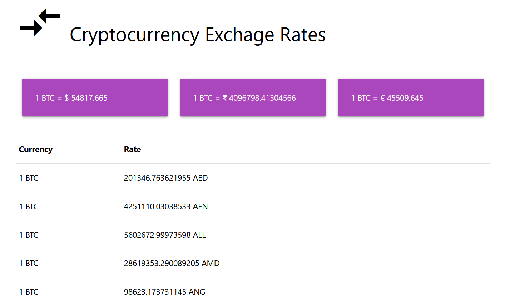

This is a  series of 3 tutorials in which we will build a cryptocurrency exchange rate dashboard in HTML using materialize css and coinbase free api.

- **Part 1**: Simple Cryptocurrency Exchange Rate Dashboard
- **Part 2**: Add pagination in cryptocurrency exchange rate
- **Part 3**: Change base currency BTC to other currencies like USD, EUR INR.



## Project Setup

Create a `cryptocurrency-exchange-rate` directory.

```shell
|- cryptocurrency-exchange-rate
	|- icons
	|- exchange-rates.js
	|- index.html
	|- style.css
```

## Coinbase API

We are using coinbase free to use APIs which don't require any sign up and secret key.  

[Coinbase Developer API](https://developers.coinbase.com/api/v2)

We are using [Exchange Rates](https://developers.coinbase.com/api/v2#exchange-rates) API for our use case. 

```curl
curl https://api.coinbase.com/v2/exchange-rates?currency=BTC
```

**Example Response**

```json
{
  "data": {
    "currency": "BTC",
    "rates": {
      "AED": "36.73",
      "AFN": "589.50",
      "ALL": "1258.82",
      "AMD": "4769.49",
      "ANG": "17.88",
      ...
    }
  }
}
```

> Default base currency is BTC

## index.html

Create an `index.html` file and paste the code.

```html
<!DOCTYPE html>
<html lang="en">
  <head>
    <meta charset="UTF-8" />
    <meta http-equiv="X-UA-Compatible" content="IE=edge" />
    <meta name="viewport" content="width=device-width, initial-scale=1.0" />
    <link
      rel="apple-touch-icon"
      sizes="180x180"
      href="/icons/apple-touch-icon.png"
    />
    <link
      rel="icon"
      type="image/png"
      sizes="32x32"
      href="/icons/favicon-32x32.png"
    />
    <link
      rel="icon"
      type="image/png"
      sizes="16x16"
      href="/icons/favicon-16x16.png"
    />
    <link rel="manifest" href="/icons/site.webmanifest" />
    <!-- Compiled and minified CSS -->
    <link
      rel="stylesheet"
      href="https://cdnjs.cloudflare.com/ajax/libs/materialize/1.0.0/css/materialize.min.css"
    />
    <link rel="preconnect" href="https://fonts.gstatic.com" />
    <link
      href="https://fonts.googleapis.com/icon?family=Material+Icons"
      rel="stylesheet"
    />

    <link rel="stylesheet" href="./style.css" />

    <!-- Compiled and minified JavaScript -->
    <script src="https://cdnjs.cloudflare.com/ajax/libs/materialize/1.0.0/js/materialize.min.js"></script>
    <script src="./exchange-rates.js"></script>
    <script>
      // onload
      window.addEventListener("load", getExchangeRates);
    </script>
    <title>Cryptocurrency Exchage Rates</title>
  </head>
  <body>
    <div class="container">
      <span>
        <header>
          <i class="large material-icons" style="vertical-align: text-bottom"
            >compare_arrows</i
          >
          Cryptocurrency Exchage Rates
        </header></span
      >
      <main>
        <div class="row">
          <div class="col s4">
            <div class="card-panel purple lighten-1">
              <span id="usd" class="white-text"> </span>
            </div>
          </div>
          <div class="col s4">
            <div class="card-panel purple lighten-1">
              <span id="inr" class="white-text"> </span>
            </div>
          </div>
          <div class="col s4">
            <div class="card-panel purple lighten-1">
              <span id="eur" class="white-text"> </span>
            </div>
          </div>
        </div>

        <div class="row">
          <table>
            <thead>
              <!-- <th>#</th> -->
              <th>Currency</th>
              <th>Rate</th>
            </thead>
            <tbody id="ratetable"></tbody>
          </table>
        </div>
      </main>

      <footer class="center">
        <div class="footer-copyright">
          <div class="container">
            Made with <span style="color: red">❤️</span> by
            <a href="https://schadokar.dev">schadokar</a>
          </div>
          <div class="container">
            Ingredients <span> 🧪</span> html, css and
            <a href="https://materializecss.com/">material ui</a>
          </div>
          <div class="container">
            <a
              href="https://github.com/day-to-day-coding/html-cryptocurrency-rates/"
              ><i class="material-icons">developer_mode</i></a
            >
          </div>
        </div>
      </footer>
    </div>
  </body>
</html>
```

## style.css

Create a `style.css` and paste the code.

```css
body {
  background-color: white;
  color: black;
  background-size: auto;
  background-repeat: no-repeat;
  display: flex;
  flex-direction: column;
}

header {
  font-size: xx-large;
  margin-bottom: 50px;
}

main {
  flex: 1 0 auto;
}

input {
  font-family: "Pacifico", cursive;
}

.vertical-divider {
  border-left: 1px solid gray;
}

.page-footer .footer-copyright {
  background-color: white;
}
```

## exchange-rates.js

Create a `exchange-rates.js` for the logic and paste the code.

```js
function getExchangeRates(event, baseCurrency = "BTC") {
  var requestOptions = {
    method: "GET",
    redirect: "follow",
  };

    // call the api
  fetch(
    `http://api.coinbase.com/v2/exchange-rates?currency=${baseCurrency}`,
    requestOptions
  )
    .then((response) => response.json())
    .then((result) => {
      // render cards
      renderCards(result.data.rates, baseCurrency);
      // render currency table
      renderCurrencyTable(result.data.rates, baseCurrency);
    })
    .catch((error) => console.log("error", error));
}

function renderCards(rates, baseCurrency) {
  // Get the usd card
  document.getElementById(
    "usd"
  ).innerHTML = `1 ${baseCurrency} \t=\t &#36 ${rates["USD"]}`;

  // Get the inr card
  document.getElementById(
    "inr"
  ).innerHTML = `1 ${baseCurrency} \t=\t &#x20B9 ${rates["INR"]}`;

  // Get the eur card
  document.getElementById(
    "eur"
  ).innerHTML = `1 ${baseCurrency} \t=\t &#8364 ${rates["EUR"]}`;
}

function renderCurrencyTable(rates, baseCurrency) {
  // get the tbody element
  const tbodyElement = document.getElementById("ratetable");
  tbodyElement.textContent = "";

  for (let i = 0; i < Object.keys(rates).length; i++) {
    const currency = Object.keys(rates)[i];
    // create a new table row element
    const tr = document.createElement("tr");
    tr.id = currency;
    // create currency column
    const currencyTd = document.createElement("td");
    currencyTd.textContent = `1 ${baseCurrency}`;
    // create rate column
    const rateTd = document.createElement("td");
    rateTd.textContent = `${rates[currency]} ${currency}`;
    tr.appendChild(currencyTd);
    tr.appendChild(rateTd);
    tbodyElement.appendChild(tr);
  }
}
```

### favicons

You can create custom favicon on [favicon.io](https://favicon.io) and save in icons folder.

You can download this app's icons from [GitHub](https://github.com/day-to-day-coding/html-cryptocurrency-rates/). 

## Run

Open the `index.html` in the browser and test it.

To run it as server, install `serve` using `npm install --global serve`. Install nodejs first to run `npm` command.

Open the terminal or cmd in the project and run `serve`.

This will start a server at `localhost:5000` and serve `index.html`.

## Host it

You can host it on GitHub Pages.

Create a `cryptocurrency-exchange-rate` repository on the GitHub. You can name it anything.

Open the terminal or cmd in the project and instantiate `git init`.

Stage and commit the code.

```shell
git init
git add .
git commit -m 'crypto exchange part 1 is complete'
```

Open GitHub repo and copy the repo URL. Add it as `origin` and push the code to the GitHub.

```shell
git remote add origin https://github.com/<Your username>/<repo name>.git
git branch -M main
git push -u origin main
```

Open the GitHub repo settings and go to `pages`.

Under `Source`, select the `main` branch, `/root` folder and **save** it.

The app is now live at

```js
https://<Your Username>.github.io/<your repo name>/
```

---