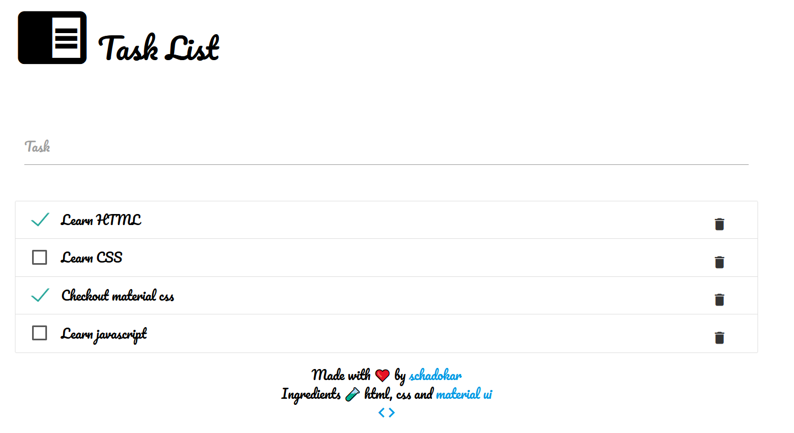

In this post, we are building a task list in HTML using material css.

The tasks will save in the browser local storage.

In the end, the app can be hosted on GitHub Pages.

The code is available on [GitHub](https://github.com/day-to-day-coding/html-task-list/).

[Demo App](https://day-to-day-coding.github.io/html-task-list/)

The final app will look like this.



## Project Setup

Create a `html-task-list` directory.

```shell
|- html-task-list
	|- icons
	|- index.html
	|- style.css
	|- tasks.js
```

### index.html

Create a `index.html` and paste the code.

In the head, favicon icons, material css, tasks.js, google fonts are imported.

```html
<!DOCTYPE html>
<html lang="en">
  <head>
    <meta charset="UTF-8" />
    <meta http-equiv="X-UA-Compatible" content="IE=edge" />
    <meta name="viewport" content="width=device-width, initial-scale=1.0" />
    <link
      rel="apple-touch-icon"
      sizes="180x180"
      href="/icons/apple-touch-icon.png"
    />
    <link
      rel="icon"
      type="image/png"
      sizes="32x32"
      href="/icons/favicon-32x32.png"
    />
    <link
      rel="icon"
      type="image/png"
      sizes="16x16"
      href="/icons/favicon-16x16.png"
    />
    <link rel="manifest" href="/icons/site.webmanifest" />
    <!-- Compiled and minified CSS -->
    <link
      rel="stylesheet"
      href="https://cdnjs.cloudflare.com/ajax/libs/materialize/1.0.0/css/materialize.min.css"
    />
    <link rel="preconnect" href="https://fonts.gstatic.com" />
    <link
      href="https://fonts.googleapis.com/css2?family=Pacifico&display=swap"
      rel="stylesheet"
    />
    <link
      href="https://fonts.googleapis.com/icon?family=Material+Icons"
      rel="stylesheet"
    />

    <link rel="stylesheet" href="./style.css" />
    <!-- Compiled and minified JavaScript -->
    <script src="https://cdnjs.cloudflare.com/ajax/libs/materialize/1.0.0/js/materialize.min.js"></script>
    <script src="./tasks.js"></script>
    <script>
      // onload render the previous tasks
      window.addEventListener("load", renderTaskList);
    </script>
    <title>Task List</title>
  </head>
  <body>
    <div class="container">
      <span>
        <header>
          <i class="large material-icons" style="vertical-align: text-bottom"
            >chrome_reader_mode</i
          >
          Task List
        </header></span
      >
      <main>
        <div class="row">
          <div class="input-field col s12">
            <input
              id="task"
              type="text"
              class="validate"
              onkeypress="clickPress(event)"
            />
            <label for="task">Task</label>
          </div>
        </div>
        <div class="row">
          <ul id="tasks" class="collection"></ul>
        </div>
      </main>

      <footer class="center">
        <div class="footer-copyright">
          <div class="container">
            Made with <span style="color: red">❤️</span> by
            <a href="https://schadokar.dev">schadokar</a>
          </div>
          <div class="container">
            Ingredients <span> 🧪</span> html, css and
            <a href="https://materializecss.com/">material ui</a>
          </div>
          <div class="container">
            <a href="https://github.com/day-to-day-coding/html-task-list"
              ><i class="material-icons">code</i></a
            >
          </div>
        </div>
      </footer>
    </div>
  </body>
</html>
```

### style.css

Create a `style.css` and paste the code.

```css
body {
  background-color: white;
  color: black;
  background-size: auto;
  background-repeat: no-repeat;
  font-family: "Pacifico", cursive;
  display: flex;
  flex-direction: column;
}

header {
  font-size: xx-large;
  margin-bottom: 50px;
}

main {
  flex: 1 0 auto;
}

input {
  font-family: "Pacifico", cursive;
}

.vertical-divider {
  border-left: 1px solid gray;
}

.page-footer .footer-copyright {
  background-color: white;
}

.task-delete {
  float: inline-end;
}
```

### tasks.js

Create a `tasks.js` and paste the code.

```js
function clickPress(event) {
  // on press enter run the saveTask
  if (event.keyCode == 13) {
    saveTask(document.getElementById("task").value);
  }
}

function saveTask(task) {
  const taskList = JSON.parse(localStorage.getItem("tasklist"));
  // tasklist is null then create a new empty array
  if (!taskList) {
    taskList = [];
  }
  // push the task and its status
  taskList.push({
    task: task,
    done: false,
  });

  // save the updated tasklist
  localStorage.setItem("tasklist", JSON.stringify(taskList));
  // render the updated tasklist
  renderTaskList();
  // clear the input field
  document.getElementById("task").value = "";
}

function renderTaskList() {
  const taskList = JSON.parse(localStorage.getItem("tasklist"));
  // get ui element
  const ui = document.getElementById("tasks");
  // clear ui content else it will keep append
  ui.textContent = "";
  // check if taskList is not empty
  if (taskList) {
    taskList.forEach((task, index) => {
      // create a li element
      const liElement = document.createElement("li");
      liElement.id = index;
      liElement.className = "collection-item";
      // create a checkbox input
      const checkbox = document.createElement("label");
      const input = document.createElement("input");
      input.id = index;
      input.type = "checkbox";
      input.setAttribute("onclick", `taskStatusToggle(${index})`);
      // check if task is done
      if (task.done) {
        input.setAttribute("checked", "checked");
      }
      // task text in span
      const span = document.createElement("span");
      span.style = "color: black;";
      span.textContent = task.task;

      checkbox.appendChild(input);
      checkbox.appendChild(span);
      liElement.appendChild(checkbox);
      // create a btn element
      const btn = document.createElement("a");
      btn.className = "waves-effect waves-red btn-flat task-delete";
      btn.setAttribute("onclick", `deleteTask(${index});`);

      // create an icon element
      const icon = document.createElement("i");
      icon.textContent = "delete";
      icon.className = "material-icons prefix";
      // make icon child of btn
      btn.appendChild(icon);
      // make btn child of liElement
      liElement.appendChild(btn);
      ui.appendChild(liElement);
    });
  }
}

function taskStatusToggle(index) {
  const taskList = JSON.parse(localStorage.getItem("tasklist"));
  // toggle the status from true to false and false to true
  taskList[index]["done"] = !taskList[index]["done"];
  // save the updated list
  localStorage.setItem("tasklist", JSON.stringify(taskList));
  renderTaskList();
}

function deleteTask(index) {
  const taskList = JSON.parse(localStorage.getItem("tasklist"));
  if (taskList) {
    // remove the index element from the array
    taskList.splice(index, 1);
    // save the updated tasklist
    localStorage.setItem("tasklist", JSON.stringify(taskList));
    renderTaskList();
  }
}
```

### favicons

You can create custom favicon on [favicon.io](https://favicon.io) and save in icons folder.

You can download this app's icons from [GitHub](https://github.com/day-to-day-coding/html-task-list). 

## Run

Open the `index.html` in the browser and test it.

To run it as server, install `serve` using `npm install --global serve`. Install nodejs first to run `npm` command.

Open the terminal or cmd in the project and run `serve`.

This will start a server at `localhost:5000` and serve `index.html`.

## Host it

You can host it on GitHub Pages.

Create a `html-task-list` repository on the GitHub. You can name it anything.

Open the terminal or cmd in the project and instantiate git init.

Stage and commit the code.

```shell
git init
git add .
git commit -m 'task app is complete'
```

Open GitHub repo and copy the repo url. Add it as `origin` and push the code to the GitHub.

```shell
git remote add origin https://github.com/<Your username>/<repo name>.git
git branch -M main
git push -u origin main
```

Open the GitHub repo settings and go to `pages`.

Under `Source`, select the `main` branch, `/root` folder and **save** it.

The app is now live at

```js
https://<Your Username>.github.io/<your repo name>/
```

---
