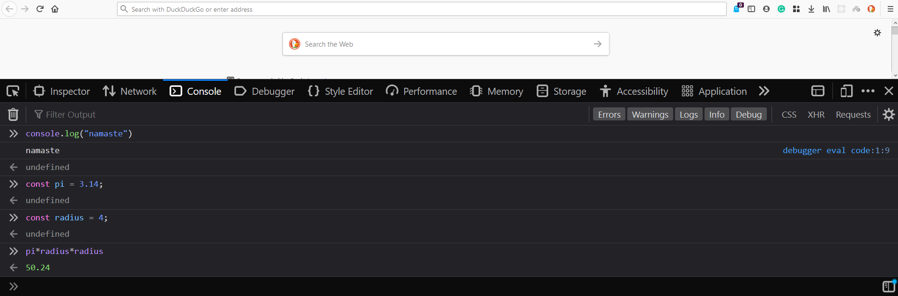

In this post, I will try to document the different ways to run the javascript code.  

As a beginner, you always need a simple way to run the code and test it. 

## Browser Console

The best way to test a piece of code is Browser console.

Open any browser except Internet Explorer as it doesn't support many modern javascript feature.  

Press `ctrl+shift+I` or right click and select `Inspect`. 

In the `console` tab you can write the javascript code and run.



## Run Offline using Nodejs

Install nodejs in your machine.

Write the javascript code in the `.js` file and run using `node` command.

### Demo 

Create a file `hello.js` and paste the below code.

```js
console.log("hello world!");
```

Open terminal or cmd in the location of `hello.js`. 

Run the code using `node`.

```shell
node hello.js
```

## Online Editor

There are many javascript online editors are available.

Few of them are:

- [Playcode](https://playcode.io/online-javascript-editor/)
- [jsfiddle](https://jsfiddle.net/)
- [Replit](https://replit.com/languages/nodejs) - It supports dozens of language and framework. For javascript select nodejs.

## Javascript Playground By Stephen Grider

This is my way to go playground to test the js code.

It is created by Stephen Grider. [JSPlayground](https://stephengrider.github.io/JSPlaygrounds/)

This is a [open-source GitHub](https://github.com/StephenGrider/JSPlaygrounds) project which you can fork and run it locally.

## Quokka.js

This is a extension available in VS Code.

This is a real time js editor. With each line it shows what is the result.

Checkout this short tutorial by [Brad Traversy on Youtube](https://youtu.be/f_sEWa5hA0Q).

## Conclusion

This is my small list to test js code.

If you have other great tools or library, please ping me on [twitter](https://twitter.com/schadokar1). I will update it here.

---

