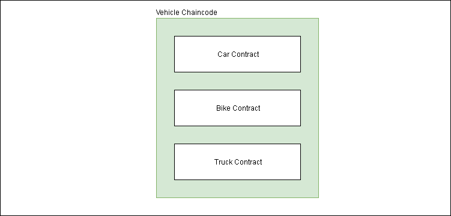

Often Hyperledger Fabric users use the terms smart contract and chaincode interchangeably. Lets first understand what a smart contract is:

> A smart contract is a computer protocol intended to digitally facilitate, verify, or enforce the negotiation or performance of a contract. Smart contracts allow the performance of credible transactions without third parties. These transactions are trackable and irreversible. — [Wikipedia](https://en.wikipedia.org/wiki/Smart_contract)

Let's deduce this in simple language — a contract can execute on its own if it satisfies the terms of the contract without any interference from a third party.

In Hyperledger Fabric:

> A smart contract defines the transaction logic that controls the lifecycle of a business object contained in the world state.

Too technical? Let's simplify it. Let’s take an example of a Car whose owner is Alice. The object is Car and it is saved in the World State.

> World State stores the latest state of any object while the blockchain stores all the history of the object from its creation to its current state.

- Now, Alice wants to sell this car to Bob.
- Alice will initiate a transaction proposal to change the ownership from her to Bob.
- The smart contract will change the ownership of the car in the world state according to the transaction logic.

In Fabric, a smart contract is packaged into the chaincode and then chaincode is deployed to a blockchain network. For simple understanding, you can think of chaincode as the superset of the smart contracts.

Multiple smart contracts can be defined within the same chaincode.

There can be a chaincode for a Vehicle and it can have multiple smart contracts such as Car Contract, Bike Contract, and Truck Contract.

Every chaincode has an endorsement policy associated to it while deploying it on a blockchain network. This endorsement policy will apply to all the smart contracts defined in it.

> An endorsement policy is the guideline which defines which organizations must sign a transaction to declared the transaction as valid.

---

In short, the smart contracts manage the transaction logic or business logic while chaincode manages the smart contracts defined in it.

In the Fabric documentation, chaincode’s definition varies a little bit according to the audience.

In “Key Concepts”, the definitions are precise and short. Ideal for the beginners. According to key concepts, chaincode is a program which works according to the business logic written in it.

For developers, a chaincode is typically used by administrators to group related smart contracts for deployment, but can also be used for low-level system programming of Fabric.

For a deeper understanding of fabric concepts keep reading.

---

**References:**

[**Smart Contracts and Chaincode - hyperledger-fabricdocs master documentation**  
\_From an application developer's perspective, a smart contract, together with the ledger, form the heart of a…\_hyperledger-fabric.readthedocs.io](https://hyperledger-fabric.readthedocs.io/en/release-1.4/smartcontract/smartcontract.html "https://hyperledger-fabric.readthedocs.io/en/release-1.4/smartcontract/smartcontract.html")

[**Chaincode Tutorials - hyperledger-fabricdocs master documentation**  
\_A chaincode typically handles business logic agreed to by members of the network, so it may be considered as a "smart…\_hyperledger-fabric.readthedocs.io](https://hyperledger-fabric.readthedocs.io/en/release-1.4/chaincode.html "https://hyperledger-fabric.readthedocs.io/en/release-1.4/chaincode.html")

[**Chaincode for Developers - hyperledger-fabricdocs master documentation**  
\_whose methods are called in response to received transactions. In particular the method is called when a chaincode…\_hyperledger-fabric.readthedocs.io](https://hyperledger-fabric.readthedocs.io/en/release-1.4/chaincode4ade.html "https://hyperledger-fabric.readthedocs.io/en/release-1.4/chaincode4ade.html")
