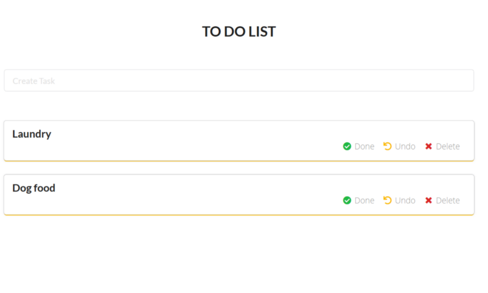

The main purpose of this tutorial to get hands-on experience in Golang. When I was learning Golang, I realized there are very few tutorials and articles out there which give you a complete end to end hands-on experience.

This is the [GitHub link](https://github.com/schadokar/go-to-do-app/) for the complete code.

---

In this tutorial, we will build a todo app in which the server will be in Golang, the database will be MongoDB, and the frontend will be in React.

1.  **Server — Go**
2.  **Database — MongoDB**
3.  **Frontend — React**

---

I am assuming that you have Go installed and have a basic understanding of it. If you don’t, I’ll explain all the steps and will mention the references of the related topics.

> **Note:** This project is developed outside the GOPATH due to which the local imports are working.

Create a project directory and give it an appropriate name.

I am using `go-todo` .

Let’s first create the server.

#### Server in Golang

Create a `server` directory inside the `go-todo` .

The `server` directory structure will be:

```
go-todo
  - server
    - middleware
      - middleware.go
    - models
      - models.go
    - router
      - router.go
    - main.go
```

In the server, we require 2 dependencies: the first to connect with MongoDB and the second to create RESTAPIs.

We are going to use the official [MongoDB Go Driver](https://github.com/mongodb/mongo-go-driver) from MongoDB.

To install it run the below command in the terminal or command window.

```
go get go.mongodb.org/mongo-driver
```

Second, install the `gorilla/mux` [package](https://github.com/gorilla/mux) for the router. `mux` is one of the most popular packages for the router in the Golang.

To install it run the below command in the terminal or command window.

```
go get -u github.com/gorilla/mux
```

#### **Models**

Once both the packages installed successfully, create a `models` directory and `models.go` file inside it and paste the below code.

```
package models

import "go.mongodb.org/mongo-driver/bson/primitive"

type ToDoList struct {

  ID     primitive.ObjectID `json:"_id,omitempty" bson:"_id,omitempty"`

  Task   string             `json:"task,omitempty"`
  Status bool               `json:"status,omitempty"`
}
```

The first line is the package name for this file. To learn more about packages follow this [link](https://medium.com/rungo/everything-you-need-to-know-about-packages-in-go-b8bac62b74cc).

The second line is `import` primitive from `mongo-driver` the package.

To define how the data will get stored in the database we have to create a `model`for it. In Golang, we use `struct` type for this.

In the `ToDoList` we have 3 fields:

1.  ID: This objectID will be generated by the MongoDB
2.  Task: The test
3.  Status: `true` or `false`

The type of id in MongoDB is `Object(id)` .

> Note: ToDoList must be in uppercase as it is exported.

#### **Middleware**

Create a new folder by name `middleware` in the `server` directory and create a new file `middleware.go` inside it and paste the below code in it.

middleware.go

**MongoDB Set up**

First set up the MongoDB connection.

Here I am using MongoDB Atlas for the demo. You can sign up for free tier, it gives you 512MB of storage, that is more than enough for learning purpose.

[Sign up](https://docs.atlas.mongodb.com/getting-started/) for MongoDB Atlas. Follow the link instructions.

Once you have your cluster ready, a few things need to be done.

First, white list your IP address.

- Click on “Network Access” under “Security”.
- Click “ADD IP ADDRESS” and select “ADD CURRENT IP ADDRESS”. This will allow only your computer to interact with it.


Second, create a user. You can learn more about the user in this [link](https://docs.atlas.mongodb.com/getting-started/#create-a-mongodb-user-for-your-cluster).

- Click “Database Access” under “Security” and create a new user.
- I have `admin` as a user.


Now, its time to get the connection string.

- Go to “Cluster” and click “connect” and then “Connect Your Application”.
- Copy the connection string and paste it in `connectionString`in `middleware.go`


Let me explain the functionality. All the functions which are in uppercase are exported and will be used in `router.go` which we will be writing in some time.

- `**init()**`**:** runs only once throughout the program life. In the init function the connection to the MongoDB will be established. Check out this [answer on StackOverflow](https://stackoverflow.com/a/49831018/9790416) to learn more about init.
- `**GetAllTask**`**:** First it set the header to tackle the cors issue and then it will call the `getAllTask()` function. It uses a`bson` package to get the data from the MongoDB. `_bson.M_` _is used where M is an unordered, concise representation of a BSON document. It should generally be used to Serialize BSON._ All the documents returned in `primitive.M` type. Package `primitive` contains types similar to Go primitives for BSON types can do not have direct Go primitive representations.
- `**CreateTask**`**:** It first decodes the request body and store in `models.ToDoList` type. It is imported from a `models` package. Then, it will call `insertOneTask` function and insert the task into the collection.
- `**TaskComplete**`**:** It is an update request where it will update the task’s status according to task ID. To get the `params` from the URL, we are using `mux` package. Using `mux`, send task id as a string to the `taskComplete` function. MongoDB assigns ids to the data in ObjectID format. To get the ObjectID from the task id (string), we are using `primitive` package’s method `ObjectIDFromHex` . It will return the `ObjectID` . The `updateOne` method requires 3 arguments `context` , `filter` and `update` . `context` is `Background` you can learn more about context package from this [link](https://golang.org/pkg/context/#Background). The second argument is `filter` , filter by id and the third one is `update` where status is updated to `true` .
- `**UndoTask**`**:** This is same as TaskComplete, it only updates the task’s status to `false`
- `**DeleteTask**`**:** It is a delete request. First, it’ll get the task id from the URL and then pass it to the `deleteOneTask` . It will retrieve the `ObjectID` of the task and then it will delete the task by its id from the collection.
- `**DeleteAllTask**`**:** As its names speak for itself, it deletes all the tasks from the collection.

The middleware is complete.

#### Router

Create a `router` folder in the `server` directory and then create a new file `router.go` in it. Paste the below code in the file.

router

First, we’re importing all task functions from the `middleware` package.

Second, we’re using `mux` package to create routes.

- Line 11: create a new instance of the router using `mux.NewRouter()`
- Line 13: `GET` method to get all task from the DB. In `Methods` the first parameter is `Method` in this case, it is `GET` and second `OPTIONS`, this is to tackle `cors` .
- Line 14: `POST` method to create a task in the DB.
- Line 15: `PUT` method to update the task’s status to `true` in the DB. The task’s id is passed as params in the URL.
- Line 16: `PUT` method to update the task’s status to `false` in the DB. The task’s id is passed as params in the URL.
- Line 17: `DELETE` method to delete the task from the DB. The task’s id is passed as params in the URL.
- Line 18: `DELETE` method to delete all the tasks from the DB.
- Line 19: Return the `router` instance. This router will be served in the `main.go`

#### main.go

Create a `main.go` file in the `server` directory. Paste the below code in it.

```
package main

import (
    "fmt"
    "log"
    "net/http"
    "./router"
)

func main() {

    r := router.Router()

    fmt.Println("Starting server on the port 8080...")

    log.Fatal(http.ListenAndServe(":8080", r))
}
```

Import `net/http` package to serve the routes at `8080` port and `./router`to import `router` package.

Create an instance of `router` package.

```
r := router.Router()
```

Serve/host the application on the `8080` port.

```
http.ListenAndServe(":8080", r)
```

A`log` package is used to track logs.

Open the terminal from the `server` directory and run the below command to serve the server. You’ll see the output as the image.

```
go run main.go
```


You can test the APIs using `POSTMAN` .

---

#### Frontend in React

We’re using the `create-react-app` module as a boilerplate for this project. You can learn more about it [here](https://github.com/facebook/create-react-app).

Run the below command from the project directory `go-todo`

```
npx create-react-app client
```

It will take a while to install. Once it is finished, install the following dependencies for the project. Open terminal from the `client` directory.

1.  **Axios:** For interacting with the server rest APIs.
2.  **semantic-ui-react:** It is a great react component library to quickly build a frontend. Refer to this [link](https://react.semantic-ui.com/) to learn more it.

```
npm install axios

npm install semantic-ui-react
```

Semantic UI React provides React components while Semantic UI provides themes as CSS stylesheets. Add the stylesheet in `index.html` inside the `public` folder. Check the semantic UI version from this [link](https://react.semantic-ui.com/usage).

```
<link rel="stylesheet" href="//cdn.jsdelivr.net/npm/semantic-ui@2.4.2/dist/semantic.min.css"/>
```

Update the title in the `title` tag. This will be the title of the tab in the browser. Save the `index.html`

```
<title>ToDo App</title>
```

Go to the `src` folder and open `App.js` . Delete the content in it and paste the below code.

```
import React from "react";
import "./App.css";

// import the Container Component from the semantic-ui-react
import { Container } from "semantic-ui-react";

// import the ToDoList component
import ToDoList from "./To-Do-List";

function App() {
  return (
    <div>
      <Container>
        <ToDoList />
      </Container>
    </div>
  );
}
export default App;
```

Create a new file `To-Do-List.js` inside the `src` folder. This component will be the frontend.

You can download the component from the [GitHub](https://github.com/schadokar/go-to-do-app/blob/master/client/src/To-Do-List.js).

You can save the file and it is ready to go.

---

**Run the Application**

- Open the terminal and start the `server` from the server directory.

```
go run main.go
```

- Open the terminal and start the react application from the client directory.

```
npm start
```

- Go to `http://localhost:3000`


- **Create tasks**


- **Complete task by clicking** `Done`


- **Undo a task**


- **Delete Task**



---

Congratulations! You just build a To-Do App in Golang.

For the complete code. This is the [Github Link.](https://github.com/schadokar/go-to-do-app/)

[**Learn Go - Best Go Tutorials (2019) | gitconnected**  
\_Go is a statically-typed, imperative, and compiled language. However, unlike many compiled programming languages, Go is…\_gitconnected.com](https://gitconnected.com/learn/golang "https://gitconnected.com/learn/golang")[](https://gitconnected.com/learn/golang)
