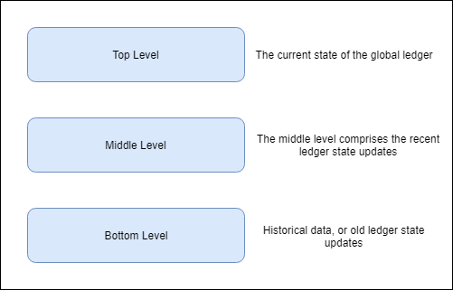

What is decentralized internet? Why we need the decentralized Internet?

 on [Unsplash](https://unsplash.com/search/photos/internet?utm_source=unsplash&utm_medium=referral&utm_content=creditCopyText)](./asset-1.jpeg)

I know these questions are obvious once you read the title.

First, understand the current situation of the internet and then we’ll explore the possibilities of the Catalyst Network.

### What is the current situation of the Internet?

A global network connecting millions of computers is the Internet. The Internet is decentralized by design. But today’s situation is far from this. The tech giants like Amazon, Google, Microsoft and Facebook dominating the internet. They are not only controlling the user’s data but also the user’s private data. Today, these companies are the centre of the internet, it leads to the situation of a single point of failure. The handful of players holding the majority on the internet created a centralized internet ecosystem.

> I’ve always believed the web is for everyone. That’s why I and others fight fiercely to protect it. The changes we’ve managed to bring have created a better and more connected world. But for all the good we’ve achieved, the web has evolved into an engine of inequity and division; swayed by powerful forces who use it for their own agendas. — [Tim Berners-Lee](https://medium.com/@timberners_lee/one-small-step-for-the-web-87f92217d085)

The Catalyst Network is a decentralized internet which is using the power of blockchain. Atlas City is managing the Catalyst Network.

Blockchain technology is similar to the internet in the ’90s. But the adoption of blockchain is not smooth, even when it demonstrated promising value. The major challenge is scaling. The 2 main public blockchains are Bitcoin and Ethereum. The Bitcoin’s average block time is 10 mins and 7 transactions per secs and Ethereum’s average block time is 10–20 secs and 15 transactions per secs. The Bitcoin and the Ethereum use proof of work to verify the transaction. The proof of work takes lots of energy to verify a single transaction. The energy consumption is also a challenge when the world is suffering from Global Warming. The [bitcoin energy consumption](https://digiconomist.net/bitcoin-energy-consumption) is greater than the countries like Ireland, Austria and the Czech Republic. The annual carbon footprint of bitcoin is 34.73 Mt. CO2, more than Denmark.

These statistics are only of bitcoin and there are 100s of blockchain using proof of work.

These were the first steps in the blockchain. But, What next?

Catalyst…….

---

### How Catalyst is different than other blockchains and how it is overcoming the challenges?

Like the most blockchains catalyst is not the hard forked from the existing one. Learning from other blockchains and distributed ledgers, Atlas City created the catalyst from scratch.

> As described in their paper, the key objectives of the Catalyst are:

> 1\. Become increasingly decentralised at scale.

> 2\. Be capable of scaling to meet future data and distributed service demands.

> 3\. Be able to run nodes on limited resource devices, such as IoT devices, as well as those with larger computing power.

> 4\. Have a flexible and dynamic economy that encourages activity and good behaviour.

> 5\. Be able to benefit from the investment in skills and technology already made by businesses, by allowing decentralised Applications (dApps) to be developed in popular industry programming languages and frameworks.

> 6\. Have simple and recognizable pricing models for dApps, more in line with cloud computing.

> 7\. Allow anyone to earn from the network, not just people who can afford expensive mining equipment or large stakes.

> 8\. Allow rich file types such as documents and videos to be stored and shared efficiently.

> 9\. Enable web3.0 and a new generation of online services, that respect the privacy and confidentiality of users: decentralised messaging, email and web applications which give the user control of their data while creating new markets for online services.

---

#### Catalyst Consensus

The catalyst network uses a very innovative way to confirm the transaction.

In the current blockchains, whenever a transaction submits to the blockchain, all the nodes start mining it to come to a single result. Once a node confirms a transaction all the work and energy of other nodes goes in vain.

> In reality, not every node needs to validate every transaction for a network to be secure and a ledger fully decentralised. — [Documentation](https://catalystnet.org/Introduction%20to%20Catalyst%20Network.pdf)

To tackle this problem Catalyst creates a pool of nodes from all the nodes and this pool validate the transaction. Once the transaction is validated all the other nodes add the transaction to their ledger. This pool can validate the transactions to a certain time limit and later a new pool will be created. The other remaining nodes can also make a new pool and validate the transactions at the same time. Using this approach network can validate more transactions in a sec and randomness in the pool ensures the integrity of the network.

For every transaction validation, the network will inject new tokens and these tokens and transaction fees will distribute among the nodes.

The approach is similar to Proof of Stakes (PoS). But the Catalyst network applied this in the Proof of Work. For more details how it is working under the hood [please read the documentation](https://catalystnet.org/).

---

#### Catalyst Distributed File Structure

To make the network fast and robust. Catalyst network is using the 3 level structure.

The ledger stored in the Distributed File System (DFS). The DFS is built upon the [IPFS](https://ipfs.io/) protocol.

All the nodes in the network need not require to store all the data. The nodes can store the current state of the ledger or the current state of all the accounts. This makes the node lightweight which makes it ideal for devices like mobile phones and IoT devices. These are the top-level nodes.

In the middle level, the nodes store the recent ledger states.

In the bottom level, the nodes store the historical data of the ledger.

This model gives the privilege to the nodes to store the data as per their need. In this way, even the IoT devices can act as a top-level node which is very light-weight compared to others. This opens an entirely new area for the blockchain where bandwidth is very less.

As the data is distributed among the 3 levels, it makes the dapps on the Catalyst very fast compared to other blockchains. As dapps don’t have to query through the entire blockchain just for a state check.

---

#### Smart Contracts and Dapps

> An important feature of Catalyst Network is the ability to run feature-rich dApps without restrictions around the programming languages employed or the type of data stored on the ledger (structured versus unstructured data), therefore providing a similar experience to developers of applications and services running in the cloud.

KVM the Catalyst Virtual Machine ’s bytecode is a superset of Ethereum Virtual Machine (EVM). In short, Catalyst Network will support all the Ethereum dapps. Ethereum dapps can use the Catalyst’s ability to provide high transaction throughput. KVM is designed to keep the efforts at a minimal while migrating dapps from the Ethereum to the Catalyst.

> It removes the need for developers already working in the Ethereum space to learn other programming languages and provides a convenient opportunity to use developer tools created for Solidity.

---

#### **Distributed Compute System**

The blockchain technology made its first appearance in early 2009, but it gains popularity in 2017 when bitcoin almost touched the 20k USD mark. The blockchain is next Internet, web3.0, but it is still in an incubation state. Blockchain requires the large developer community support to make the web3.0 a reality.

To make web3.0 a reality, Catalyst created a **Distributed Compute System.**

> **Distributed Compute System** which enables rich software services to be developed in any language or framework and run in a decentralised fashion using containers.

The DSC allows developers to write dapps in any language and framework.

The dapps in Catalyst runs in a _virtualized environment._ This gives the estimate of the running cost before deployment. The running cost of the dapp can be calculated as per the resources it is using in the virtualized environment. This approach is derived from cloud computing. The dapps will be charged on the resources basis instead of the smart contract complexity.

To make the dapp more fast and efficient, Catalyst network has an off-chain. The dapp can do all the complex computation off-chain and can submit the results to the on-chain anytime.

---

#### Catalyst Native Token

Catalyst Native Token is called as KAT. It provides the network to trade on exchanging the networking services. Catalyst provides a market place where user can buy or sell their storage space. In this market place, developers can sell their dapps and the user can pay in KAT to use them.

---

Catalyst Network has created an ecosystem where everyone can participate in one way or another irrespective of their technological background.

If I have to sum up the Catalyst Network, I can mathematically express it as;

_Catalyst Network = PoW as PoS + Raiden Network + IPFS + Filecoin + etc._

To know more about the Catalyst Network, join the upcoming virtual meetup. This is a monthly virtual meetup.

[**Catalyst**  
\_Sep 19, 2019 at 5:00 PM (CET) Approx. 40 min The Catalyst Network is a fast, light, secure and decentralised network…\_catalystnet.org](https://catalystnet.org/RegisterNow.html "https://catalystnet.org/RegisterNow.html")

---

#### References

- [Introduction to Catalyst Network](https://catalystnet.org/Introduction%20to%20Catalyst%20Network.pdf)
- [Catalyst Consensys Paper](https://catalystnet.org/consensus-paper.pdf)
- [Catalyst Website](https://catalystnet.org/)
- [Catalyst Blogs](https://medium.com/catalystnetorg)

---