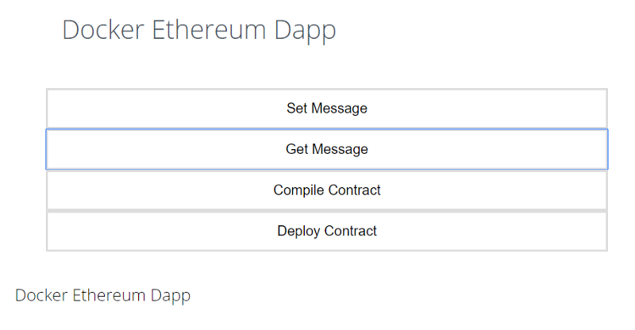

In this tutorial, we’ll create an Ethereum Dapp and will run its different components in a separate docker container.

You can clone the project using this [GitHub link](https://github.com/schadokar/docker-ethereum.git).

Thanks to the people who’s article and courses helped a lot:

[Brandon Morelli](https://medium.com/u/e9031892baf5) For HTML and CSS ( [Build a Weather Website](https://codeburst.io/build-a-weather-website-in-30-minutes-with-node-js-express-openweather-a317f904897b) )

[Stephen Grider](https://medium.com/u/d058882d8cd2) For [Ethereum](https://www.udemy.com/share/1000CIAkUTc1xbQng=/) and [Docker](https://www.udemy.com/share/100r4uAkUTc1xbQng=/) course on Udemy.

---

Before beginning lets understand what we’re going to build and how the structure of our Dapp will look like.

In the Dapp there will be three modules:

1.  ganache-cli
2.  Ethereum-Dapp and Server
3.  Client (React App)

The above 3 modules will run in individual docker containers.


> Why we’re building individual container for each service when they all can be build in one container?

Yeah, all can be build in one container and everything will be straight forward. Just for some fun, we’re using different containers.

---

### **Project Setup**

Create a project folder and give it the name **“docker-ethereum”**.

**Directory Structure**

```
docker-ethereum
- client
- ethereum
- server
- .dockerignore
- docker-compose.yml
- Dockerfile
- Dockerfile.ganache
- package.json
```

#### package.json

Create a `package.json` and paste the below code:

package.json

We have finished installing the dependencies for the project.

---

To build any application our network should be ready. So, let’s first start with our ganache-cli as the network.

### 1\. ganache-cli

It is a test network which comes with 10 accounts with 100 ethers each. It is best for development where you don’t have to wait for the transactions to mine.

> [Ganache](https://truffleframework.com/ganache) is a personal blockchain for Ethereum development you can use to deploy contracts, develop your applications, and run tests.

In our application ganache-cli will run in a docker container.

Inside the project directory, create a `Dockerfile.ganache` .

In this Dockerfile, we’ll write all the instructions to set up and run the ganache-cli inside the container.

Dockerfile.ganache

On line 2, to build this ganache-cli image, we’re taking node:alpine as a base image.

On line 5, we’re setting /app folder as the working directory of the image where all our instructions will run.

On line 8, we’re installing **ganache-cli** globally.

On line 12, we’re setting `ganache-cli -h 0.0.0.0` as the default command of the image.

> Ganache-cli’s default host is 127.0.0.1 but for docker instance it is 0.0.0.0

I have explained all the above instructions in detail in [my last post](https://medium.com/@shubhamchadokar04/run-the-ganache-cli-inside-the-docker-container-5e70bc962bfe). Please check it, if you find any difficulty here.

Our network is configured.

---

### 2\. Ethereum Dapp and Server

#### Ethereum Dapp

Create a `Ethereum`folder in the project directory.

**Directory Structure**

```
Ethereum
- build
- contracts
  - Message.sol
- compile.js
- deploy.js
- logic.js
- receipt-ganache.json
- web3.js
```

Inside the Ethereum directory:

#### **contracts**

Create a new folder `contracts`and a new file `Message.sol` in the contracts folder and paste the below code.

Message.sol

We’re creating a simple message contract. There will be 3 functions in this smart contract (1) constructor (2) setMessage (3) getMessage

In the Message smart contract when it will run for the first time, that time the `constructor`will set the message as the initial message.

The `setMessage` function will set a new message.

The `getMessage` is a view function and it’ll return the value of the message variable which was set either by `constructor` or `setMessage` .

#### compile.js

Create a new file `compile.js` and paste the below code in it. This will compile the `Message.sol`smart contract and save the compiled contract in the `build` folder as `Message.json` .

compile.js

#### web3.js

Create a `web3.js` file which will work as a bridge between the application and the ethereum network.

> web3.js is a collection of libraries which allow you to interact with a local or remote Ethereum node, using an HTTP, WebSocket or IPC connection.

web3.js can be used in 2 ways, (1) server-side web3js: transaction signed on the server side (2) client-side web3js: transaction signed on the browser side. In this web3js invoked by third-party like Mist or Metamask. In the client-side web3js invoked in the html pages.

For this project, we’re using server-side web3js.

Copy and paste the below code to the `web3.js`

web3.js

> Take note of web3 provider `http://ganache:8545` . Here, **ganache** is the name of the container in which ganache-cli is running.

#### deploy.js

Create a `deploy.js` file and paste the below code in it. It will take the compiled contract `Message.json` and deploy the contract to the network.

deploy.js

From the `web3.js` file, `deploy.js` import the `web3` instance of `ganache-cli` and `web3network` as `ganache` .

#### logic.js

Create a new file `logic.js` and paste the below code in it. It consists of all the logic to interact with the deployed `Message` contract on the network.

logic.js

There are 3 functions inside the `logic.js`

1.  `getContractObject` it will return the contract object/instance which was deployed on the network using `deploy.js` . This object will then call the smart contract.
2.  `setMessage` it requires 1 string argument and set this as a message to the `message` variable in the smart contract.
3.  `getMessage` will return the message set either by `constructor` or `setMessage`

The `ethereum` module is complete.

Now, `server` needs to be set up which will call the `ethereum` module.

### server

Create a `server` folder in the project directory.

**Directory Structure**

```
server
- routes
  - contract-API.js
  - smart-contract-API.js
- index.js
```

#### routes

Create a `routes` folder inside the `server` folder.

**contract-API.js**

Create a `contract-API.js` file and paste the below the code.

contract-API.js

To compile and deploy the contract we have created APIs instead of manually compiling and deploying it on the network.

If you remember, our `Message` smart contract’s constructor requires an initial message. To keep it simple, by default we’re setting initial message as `Hello World!` . You can change it in the deploy router.

#### smart-contract-API.js

Create a `smart-contract-API.js` and paste the below code.

smart-contract-API.js

`smart-contract-API.js` routers will call `setMessage` and `getMessage` from `logic.js`

#### index.js

Create a `index.js` file in the`server` folder and paste the below code.

This is the server for ethereum dapp.

At the top, we’re importing routes `contract-API.js` and `smart-contract-API.js` . The server is listening at the port `4000` .

The server module is complete here.

Let’s dockerize it.

#### Dockerfile

Create a `Dockerfile` in the root project directory and paste the below code.

server Dockerfile

The docker image will create according to Dockerfile.

- `node:alpine` To create an image we require a base image which comes with some pre-requisite software. Our server and ethereum are dependent on `node` that’s why we are using `node:alpine` as a base image. `alpine` in short, is the minimum required libraries to run a node application.
- `WORKDIR /app` setting `/app` directory of base image as the working directory.
- Line 8 & 9 Installing the pre-requisite software for the ethereum dapp like `python` is required to install the `web3` library.
- `COPY ./package.json .` Copy `package.json`in `/app` directory
- `RUN npm install` Install the dependencies mentioned in `package.json`
- `COPY . .` Copy the complete root directory and paste in the `/app` directory
- `CMD ["npm","start"]` set the default command

If you noticed we are copying the complete root directory which includes `node_modules` . This will make the image large and it makes no sense as we’re installing it from the copied `package.json` inside the image.

To ignore the files or folders while building the docker image just like the `.gitignore` in docker there is `.dockerignore` file.

#### .dockerignore

Create a `.dockerignore` file and paste the below code.

```
node_modules/

client/
```

It will ignore the `node_modules` and `client` directory which we’ll create in the next section. If we don’t ignore the `client` directory then it will copy the client application too.

Now, we can move to our last module React application the `client` .

---

### 3\. Client (React Application)

For the react application, we’re using `create-react-app` tool for the Dapp.

> Create React App is a tool (built by developers at Facebook) that gives you a massive head start when building React apps. It saves you from time-consuming setup and configuration. — [treehouse](https://blog.teamtreehouse.com/getting-started-create-react-app-tool)

**Installing Create React App**

We need to install the `create-react-app`globally. Open your Terminal or console and run:

```
npm install -g create-react-app
```

From the project directory, open the terminal or console to create the react app by name `client` and run the below command.

```
create-react-app client
```

**Directory Structure**

```
client
- public
  - favicon.ico
  - index.html
  - manifest.json
- src
  - App.css
  - App.js
  - App.test.js
  - index.css
  - index.js
  - logo.svg
  - message.js
  - serviceWorker.js
- .dockerignore
- Dockerfile
- package-lock.json
- package.json
- README.md
```

Once the `client` is created you will see a folder structure like above except `message.js` inside the `src` ,`Dockerfile` and `.dockerignore`.

For more information on react please follow the below links:

- [https://facebook.github.io/create-react-app/docs/getting-started](https://facebook.github.io/create-react-app/docs/getting-started)
- [https://blog.teamtreehouse.com/getting-started-create-react-app-tool](https://blog.teamtreehouse.com/getting-started-create-react-app-tool)

#### index.html

Open `index.html` from the `public` folder and change the title to `Message App` . Add the below link in the `<head>` tag. This is the fonts which are used in the application.

```
<link href='https://fonts.googleapis.com/css?family=Open+Sans:300' rel='stylesheet' type='text/css'>
```

#### App.css

Open the `App.css` from the `src` folder and paste the `css` from this [link](https://gist.github.com/schadokar/7635212e2a284bf6055f806f8fc1f664).

#### message.js

Create a `message.js` in the `src` folder and paste the below code. This is the file which will work as the front-end of the application.

> Note: I am not good at React so I can just give details of methods which are used in it.

message.js

A component is the building block of any react app. To create a component it requires `Component` module from `react`the library. The endpoint is set to `http://localhost:4000` as the server is running at `4000` port.

To make any request to the server `axios` library is used. To learn more about it follow this [link](https://www.npmjs.com/package/axios).

Open the terminal from the `client` directory and run the below command:

```
npm install axios --save
```

We have created a `Message` component by extending the `Component` and at the bottom exported the `Message` .

There are 2 states in the `Message` component `message` and `output` .

States are the data which defines and control the behaviour of the component. Learn more about states in this [link](https://facebook.github.io/react-native/docs/state).

The `message`state will store the message entered in the form and this state will use as an argument to send the POST request to `localhost:4000/` to `setMessage`.

The `output` state will store the response from the server and display it.

Following methods are used in `message.js` :

- `onChange` set the `message` state according to the entered input
- `onsubmitcompile` send the request to `localhost:4000/compile` to compile the smart contract
- `onsubmitdeploy` send the request to `localhost:4000/deploy` to deploy the smart contract
- `onsubmitsetmsg` send the request to `localhost:4000/` with `message` state as an argument to set the message to the smart contract
- `onsubmitgetmsg` send the request to `localhost:4000/` to get the message from the smart contract

#### App.js

Open the `App.js` from `src` folder and paste the below code. The application’s `Route` set at `/` . On this route, it will serve the `message.js` component.

To create the route `react-router-dom` library is used.

Open the terminal from `client` directory and run the below command:

```
npm install react-router-dom --save
```

#### Dockerfile

With this Dockerfile our client module will complete.

In this Dockerfile we will write the instruction to create the image of the react application.

Create a `Dockerfile` in the `client` directory and paste the below code.

Dockerfile

All the commands are self-explanatory. According to this Dockerfile, a docker image will build. The client (react-app) will run inside the container using this image.

The `COPY` command is copying the `node_modules` too. Create a `.dockerignore` .

**.dockerignore**

Create a `.dockerignore` file in the client directory and paste the below code.

```
node_modules/
```

Our client module is also finished.

---

Everything is set. Now, the last thing we have to do, build these docker images and run them as individual containers.

#### docker-compose.yml

Create a `docker-compose.yml` in the root project directory and paste the below code.

docker-compose.yml

You might be thinking about why we even need `docker-compose.yml` .

It just makes the application bit smooth. How?

> Compose is a tool for defining and running multi-container Docker applications.

We have created 3 Dockerfile for the 3 modules of the application. If we don’t use the `docker-compose.yml` then we have to separately build the 3 images and then run them separately in 3 different terminals. So, that’s a drag.

In `docker-compose.yml` we can define all the containers’ configuration and all can be run with a single command.

- `version` the version of a docker-compose file
- `services` all the containers’ definition.

There are 3 services/containers:

**1\. ganache**

- `ganache` is the name of the container
- `build` where to find the Dockerfile to build. If we don’t give the name of Dockerfile then by default it builds the `Dockerfile` . For `ganache` we have created `Dockerfile.ganache` . Its syntax will be a little different. Under the `build` there is `context` it is a path of `Dockerfile` and `dockerfile` name of the `Dockerfile` .
- `ports` A container is isolated from outside which means whatever request we will try to make from the outside of the container it will not respond. That’s why we set the `ports` which maps the outside’s port to container’s port. Here we mapped port`8545` to `8545`if we make any request from outside to `8545` it will send the request to the container at `8545` .

**2\. dapp**

- `dapp` is the name of the container.
- `build` find the `Dockerfile` in current directory `.`
- `ports` map the ports at `4000:4000`
- `depends_on` start after the `ganache`

**3\. react**

- `react` is the name of the container
- `build` find the `Dockerfile` in `client` directory
- `ports` map the ports at `3000:3000`
- `depends_on` start after the `dapp`

To learn more about `docker-compose.yml` follow this [link](https://docs.docker.com/compose/overview/).

---

So, the hard part is over. Now, the fun part let’s run the application.

Open the terminal from the root project directory and run the below command:

```
docker-compose up --build
```

It will check for `docker-compose.yml` file in the current directory and will run it. For the first time, it will take some time so have patience.

Once everything is running, open the browser and go to `localhost:3000` you’ll see the react application running.


- **Compile Contract:** You’ll see the message as compiled successfully.


- **Deploy contract:** It will send back the address of the contract at which it is deployed.


**_Note:_** **_After compile or deploy command wait for a couple of seconds before running any other commands as both commands restart the server. Why?_**

**_On compile, it saves the compiled contract in build, if the server doesn’t restart then it will use the last compiled contract to deploy the contract._**

**_On deploy, it saves the receipt in which deployed contract address is saved, if the server doesn’t restart, it will interact with the last deployed contract as the server is still using the last deployed contract’s address._**

- **Get Message:** If you remember we set the initial message as `Hello World!`


- **Set Message:** Set the message and it’ll return the transaction hash of the transaction. I set the message as **“Docker Ethereum Dapp”** and **_“ 0x464385a1914b0d8ffb48d660aa55d419f0afe040e0def20ff581338bbce545e2”_** is the transaction hash.


Check the message using “Get Message”



We successfully created the Ethereum Dapp with React and Docker.

You don’t have to build the `docker-compose.yml` every time. Next time you just have to run the below command to run the application.

```
docker-compose up
```

You can clone the complete project from the [GitHub link](https://github.com/schadokar/docker-ethereum.git).

> Hope you like the tutorial. Please comment for any improvement in the article. Please clap and share if you learn something interesting.
