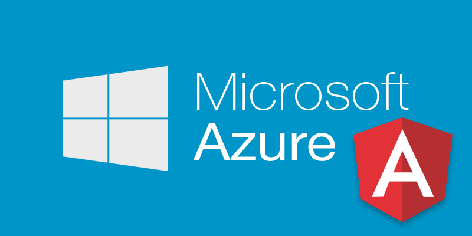
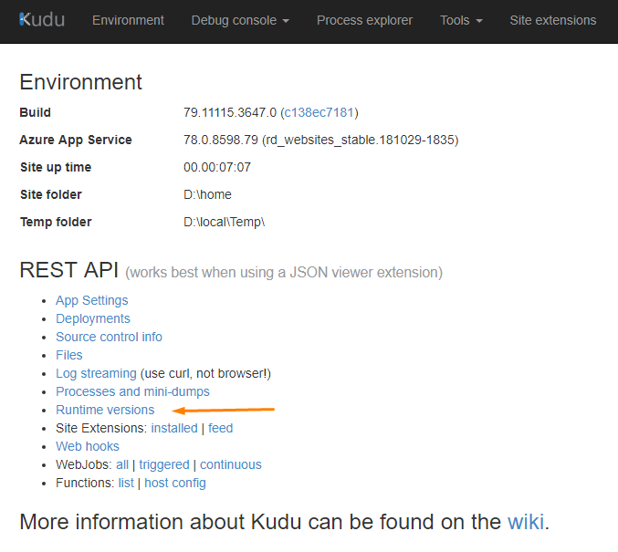
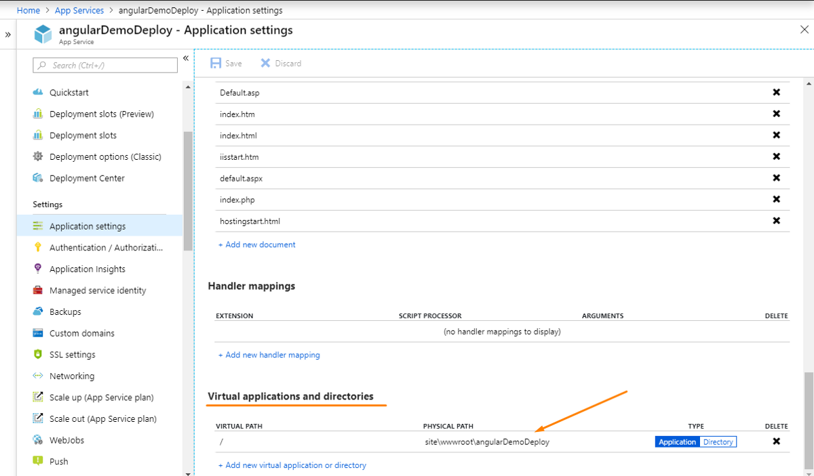

Deploying an Angular application on the Azure Web Service can be a pain if you don’t know from where to start.

This tutorial will consist of the following steps:

1.  **Create an Azure Web Service**
2.  **Build the Angular application**
3.  **Configure the Web Service and deploy it**

---

Let’s start with creating the Azure Web Service;

If you don’t have any account, you can [**_sign up for free account_**](https://azure.microsoft.com/en-us/free/) and \$200 dollars will be credit in your azure account to play with.

Login to your Azure Account.

#### **Step: 1.1** Create a Web App

Click on Create a resource → Search Web App → Create

#### **Step: 1.2**

Give your application a unique name, you can leave the rest of the field as default. Service plan is the host where the application is going to be hosted. It has different plans for that but for our demo let it be the default.

Once it is created you can check your application in App Service blade or search for your application in the search bar.

---

#### **Step 2.1:** Build the angular application

`ng build --prod`

Once this command runs successfully, a `dist` folder will be created in your application directory.

Now we’re ready to deploy our application.

> It is worth reading the [difference between](https://stackoverflow.com/questions/49065635/inconsistency-in-ng-build-vs-ng-build-prod) `[ng build](https://stackoverflow.com/questions/49065635/inconsistency-in-ng-build-vs-ng-build-prod)` [and](https://stackoverflow.com/questions/49065635/inconsistency-in-ng-build-vs-ng-build-prod) `[ng build --prod](https://stackoverflow.com/questions/49065635/inconsistency-in-ng-build-vs-ng-build-prod)`.

---

#### **Step 3.1** Open your Web App in Azure

There are multiple ways to go to your web app, here we’re using App Service click on it and then select your web app.

Click the URL — it is the URL where the application is hosted. By default, azure serve a default static page.

Search advanced tools in the web app search bar and click on `Go`.

A Kudu window will open. To check the **node version of the Web App** supports click on Runtime Versions. At the time of writing this article, it is supporting **node v8.11.1**.

To learn more about how to install a specific version [read this](https://blogs.msdn.microsoft.com/azureossds/2016/04/20/nodejs-and-npm-versions-on-azure-app-services/).

**Step 3.2:** Now go to CMD console under debug console and follow the below commands:

1.  Click site >> wwwroot
2.  Go to Angular Application Folder, Open dist folder >> angularDemoDeploy (In this case)
3.  Drag and drop this folder to the wwwroot folder (CMD console of Kudo)
4.  Delete the hostingstart.html

5\. Go to Azure Web App and open Application Settings

6\. In **Virtual applications and directories** change the physical path

from **site\\wwwroot** to **site\\wwwroot\\angularDemoDeploy** and **save.**

> here angularDemoDeploy is the name of the folder which you uploaded.

Hurray! The angular application is successfully deployed on Azure Web App. Go to your application URL and enjoy!

Thanks for reading! Any comments and suggestions are most welcome.

---

[**Learn Angular - Best Angular Tutorials (2019) | gitconnected**  
\_The top 48 Angular tutorials - learn Angular for free. Courses are submitted and voted on by developers, enabling you…\_gitconnected.com](https://gitconnected.com/learn/angular "https://gitconnected.com/learn/angular")
