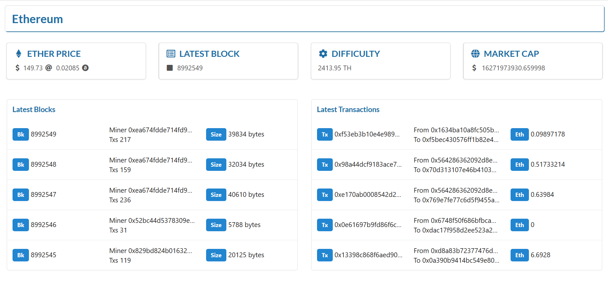

###### Photo by [Radek Grzybowski](https://unsplash.com/@rgrzybowski?utm_source=unsplash&utm_medium=referral&utm_content=creditCopyText) on [Unsplash](https://unsplash.com/s/photos/laptop?utm_source=unsplash&utm_medium=referral&utm_content=creditCopyText)

In this tutorial, we'll create a simple single-page etherscan in reactjs. For the clean UI, we are going to use the amazing  `semantic-ui-react` which is the official react integration for `semantic-ui`.

> You can find the complete code in the [github](https://github.com/schadokar/etherscan-react).

Without wasting any time let's build it.

--- 

## Prerequisite

- nodejs

- Code editor -- (I am using VS Code)

---

I am assuming that you have a basic understanding of reactjs and components.

## Create a react project

We are using `create-react-app` as a boilerplate. Follow this [link](https://github.com/facebook/create-react-app) to learn more about it.

Open a terminal and run

```js
// this command will install create-react-app
npx create-react-app etherscan-react
```

> If you've previously installed `create-react-app` globally via `npm install -g create-react-app`, we recommend you uninstall the package using `npm uninstall -g create-react-app` to ensure that npx always uses the latest version.

`etherscan-react` is the name of the project. You can name it anything you like.

Once it is installed, open the terminal in the project and run `npm start`.

Go to `localhost:3000`. You can see the boilerplate homepage.

Now, our react boilerplate is ready.

---

## Install Dependencies

Following packages are required in this project.

### semantic-ui-react: 

> Semantic UI React is the official React integration for [Semantic UI](https://semantic-ui.com/).

```js
npm install semantic-ui-react
```

### axios:

To make http request we are using `axios`.

```js
npm install axios
```
---

## Etherscan API

We are going to use Etherscan API to get the ethereum blockchain data like the latest block details, transaction detail, ether price etc. 

Follow this [link](https://etherscan.io/) to register for an Etherscan account. Sign in if you already registered.

Go to the API-Keys section on the left side.

Create a new api key token. Give `eth-react` as the app name. You can give it any name.

Note down the API-KEY.

---

## Set up the semantic-ui-react

Open the `public/index.html` in the editor.

Import the `semantic-ui` cdn in the `head` of the `index.html`.

```html
<link
      rel="stylesheet"
      href="//cdn.jsdelivr.net/npm/semantic-ui@2.4.2/dist/semantic.min.css"
    />
```

You can check the latest version of semantic-ui from this [link](https://react.semantic-ui.com/usage).

Change the `title` of the application.

```html
<title> Ethereum Dashboard </title>
```
---

## Let's start the fun part, the coding

Open the project in your favourite code editor. I am using VS Code. 

Create a `components` folder inside the `src`. Inside the `components` create the following components.

```
- src
	- components
		- Eth-Overview
		- Header
		- Latest-Blocks
		- Latest-Txs 
```

- **Eth-Overview:** The overview of the ethereum blockchain such as ether price, latest block no., difficulty, and market cap. 

- **Header:** Simple header of the application.

- **Latest-Blocks:** This component will fetch the latest 5 blocks.

- **Latest-Txs:** This component will fetch all the transactions in the latest block.

---

## Header

The directory structure of the `Header`

```
Header
	- Header.jsx
	- header.css
	- index.js
```

### Header.jsx

Open the `Header.jsx` in the editor and paste the below code.

```js
import React from "react";
// import Header component from the semantic-ui-react
import { Header } from "semantic-ui-react";
import "./header.css";

function AppDashboard() {
  return (
    <div>
      <Header as="h2" block>
        Ethereum
      </Header>
    </div>
  );
}

export default AppDashboard;
```

Here we are creating a function component by name `AppDashboard` and then we are exporting it at line 16. 

- **Line 3:** We are using the `Header` component from the `semantic-ui-react`. 

- **Line 9-11:** We are using a specific header `block`, `as` is a props, which defines how the content inside it looks like. The `Ethereum` is the heading for the dashboard.

To learn more about the `Header` component, [check out the official documentation](https://react.semantic-ui.com/elements/header/).

### header.css

Open the `header.css` and paste the below css.

```css
.ui.block.header {
  text-align: left;
  background: white;
  color: #1d6fa5;
  box-shadow: 1px 1px #1d6fa5;
  margin: 10px;
}
```

> In the `header.css` we are directly overriding the `semantic-ui.css`. This is not recommended. This is just for demonstration that we can change it.

### index.js

Open the `index.js`. From the `index.js` we will export the `Header.jsx`.

```js
import AppHeader from "./Header.jsx";

export default AppHeader;
```

### app.js

Instead of updating the `app.js` at once, we'll update as it required.

Now, Open the `app.js` in the editor and paste the below code.

```js
import React from "react";
// import the Header component
import Header from "./components/Header/index";

function App() {
  return (
    <div>
      <Header></Header>
    </div>
  );
}

export default App;
```

Open the terminal in the project's root directory and run `npm start`.

Go to browser, you will see the Header.

---

## Eth-Overview

The directory structure of the `Eth-Overview`

```
Eth-Overview
	- Eth-Overview.jsx
	- eth-overview.css
	- index.js
```

### Eth-Overview.jsx

Open the `Eth-Overview.jsx` in the editor and paste the below code.

```js
import React, { Component } from "react";
import axios from "axios";
import "./eth-overview.css";
import { Card, Grid, Icon } from "semantic-ui-react";
import LatestBlocks from "../Latest-Blocks/index";
import LatestTxs from "../Latest-Txs/index";

// import api key from the env variable
const apiKey = process.env.REACT_APP_ETHERSCAN_API_KEY;

const endpoint = `https://api.etherscan.io/api`;

class EthOverview extends Component {
  constructor() {
    super();
    this.state = {
      ethUSD: "",
      ethBTC: "",
      blockNo: "",
      latestBlock: 0,
      difficulty: "",
      marketCap: 0
    };
  }

  async componentDidMount() {
    // get the ethereum price
    axios
      .get(endpoint + `?module=stats&action=ethprice&apikey=${apiKey}`)
      .then(res => {
        const { result } = res.data;
        this.setState(
          {
            ethUSD: result.ethusd,
            ethBTC: result.ethbtc
          },
          () => {
            // get the market cap of ether in USD
            axios
              .get(endpoint + `?module=stats&action=ethsupply&apikey=${apiKey}`)
              .then(res => {
                const { result } = res.data;
                // in wei
                const priceWei = result.toString();

                // in ether
                const priceEth = priceWei.slice(0, priceWei.length - 18);
                console.log(result, priceWei, priceEth);
                // convert eth in USD
                this.setState({
                  marketCap: parseInt(priceEth) * this.state.ethUSD
                });
              });
          }
        );
      });

    // get the latest block number
    axios
      .get(endpoint + `?module=proxy&action=eth_blockNumber&apikey=${apiKey}`)
      .then(res => {
        this.setState({
          latestBlock: parseInt(res.data.result),
          blockNo: res.data.result // save block no in hex
        });

        // get the block difficulty
        axios
          .get(
            endpoint +
              `?module=proxy&action=eth_getBlockByNumber&tag=${res.data.result}&boolean=true&apikey=${apiKey}`
          )
          .then(blockDetail => {
            const { result } = blockDetail.data;

            const difficulty = parseInt(result.difficulty).toString();

            // convert difficulty in Terra Hash
            // instead of dividing it with 10^12 we'll slice it
            const difficultyTH = `${difficulty.slice(0, 4)}.${difficulty.slice(
              4,
              6
            )} TH`;

            this.setState({
              difficulty: difficultyTH
            });
          });
      });
  }

  getLatestBlocks = () => {
    if (this.state.latestBlock) {
      return <LatestBlocks latestBlock={this.state.latestBlock}></LatestBlocks>;
    }
  };

  getLatestTxs = () => {
    if (this.state.blockNo) {
      return <LatestTxs blockNo={this.state.blockNo}></LatestTxs>;
    }
  };

  render() {
    const { ethUSD, ethBTC, latestBlock, difficulty, marketCap } = this.state;
    return (
      <div>
        <Grid>
          <Grid.Row>
            <Grid.Column width={4}>
              <Card>
                <Card.Content>
                  <Card.Header style={{ color: "#1d6fa5" }}>
                    <Icon name="ethereum"></Icon> ETHER PRICE
                  </Card.Header>
                  <Card.Description textAlign="left">
                    <Icon name="usd"></Icon>
                    {ethUSD} <Icon name="at"></Icon> {ethBTC}{" "}
                    <Icon name="bitcoin"></Icon>
                  </Card.Description>
                </Card.Content>
              </Card>
            </Grid.Column>
            <Grid.Column width={4}>
              <Card>
                <Card.Content>
                  <Card.Header style={{ color: "#1d6fa5" }}>
                    <Icon name="list alternate outline"></Icon> LATEST BLOCK
                  </Card.Header>
                  <Card.Description textAlign="left">
                    <Icon name="square"></Icon> {latestBlock}
                  </Card.Description>
                </Card.Content>
              </Card>
            </Grid.Column>
            <Grid.Column width={4}>
              <Card>
                <Card.Content>
                  <Card.Header style={{ color: "#1d6fa5" }}>
                    <Icon name="setting"></Icon> DIFFICULTY
                  </Card.Header>
                  <Card.Description textAlign="left">
                    {difficulty}
                  </Card.Description>
                </Card.Content>
              </Card>
            </Grid.Column>
            <Grid.Column width={4}>
              <Card>
                <Card.Content>
                  <Card.Header style={{ color: "#1d6fa5" }}>
                    <Icon name="world"></Icon> MARKET CAP
                  </Card.Header>
                  <Card.Description textAlign="left">
                    <Icon name="usd"></Icon> {marketCap}
                  </Card.Description>
                </Card.Content>
              </Card>
            </Grid.Column>
          </Grid.Row>
        </Grid>

        <Grid divided="vertically">
          <Grid.Row columns={2}>
            <Grid.Column>{this.getLatestBlocks()}</Grid.Column>
            <Grid.Column>{this.getLatestTxs()}</Grid.Column>
          </Grid.Row>
        </Grid>
      </div>
    );
  }
}

export default EthOverview;
```

Don't panic, let me breakdown the code for you so that you can understand.

- **Line 4:** Importing `Grid` component for the dashboard layout. There are 2 rows, the first row will show the `etherprice` in USD and Bitcoin. The second row is for the latest blocks and the latest transactions. `Card` component is used to show the ether price, difficulty, latest block and market cap. `Icon` component is for the icons we require in the dashboard, such as `$`.

- **Line 5:** `LatestBlocks` component will return the table of latest 5 blocks using the etherscan api. `latestBlock` number will send as param to this component. 

- **Line 6:** `LatestTxs` component will return the last 5 transactions of the latest block. `blockNo` (latestBlock) in hex format will be sent as a param.

- **Line 9:** For testing purpose you can paste your api key and check the functionality. But it is recommended to get the api key from the environment variable.

- **Line 11:** endpoint for all the requests.

- **Line 26:** `ComponentDidMount` is a special function in the react, which will run first for that particular component. You can think of it as a constructor of the component. The comments explained everything in the code. It is fetching and calculating the basic information like ether price, latest block, difficulty and market cap.

- **Line 92:** The `getLatestBlocks` method will render the `LatestBlocks` component.

- **Line 98:** The `getLatestTxs` method will render the `LatestTxs` component.

### index.js

Open the `index.js`. From the `index.js` we will export the `Eth-Overview.jsx`.

```js
import AppHeader from "./Header.jsx";

export default AppHeader;
```

---

## Latest-Blocks

The directory structure of the `Latest-Blocks`

```
Latest-Blocks
	- Latest-Blocks.jsx
	- index.js
```

### Latest-Blocks.jsx

Open the `Latest-Blocks.jsx` in the code editor and paste the below code.

```js
import React, { Component } from "react";
import {
  Table,
  Label
} from "semantic-ui-react";

import axios from "axios";

const apiKey = process.env.REACT_APP_ETHERSCAN_API_KEY;
const endpoint = `https://api.etherscan.io/api`;

class LatestBlocks extends Component {
  constructor(props) {
    super(props);
    this.state = {
      blocks: []
    };
  }

  componentDidMount = () => {
    this.getBlocks();
  };

  getBlocks = async () => {
    const { latestBlock } = this.props;

    let blocks = [];

    for (let i = 0; i < 5; i = i + 1) {
      // get the block transaction
      const blockDetail = await axios.get(
        endpoint +
          `?module=proxy&action=eth_getBlockByNumber&tag=${(
            latestBlock - i
          ).toString(16)}&boolean=true&apikey=${apiKey}`
      );

      const { result } = blockDetail.data;
      blocks.push(
        <Table.Row key={i}>
          <Table.Cell>
            <Label color="blue">Bk</Label> {latestBlock - i}
          </Table.Cell>
          <Table.Cell>
            Miner {result.miner} <br></br>
            Txs {result.transactions.length}
          </Table.Cell>
          <Table.Cell>
            <Label color="blue">Size </Label> {parseInt(result.size)} bytes
          </Table.Cell>
        </Table.Row>
      );

      this.setState({
        blocks: blocks
      });
    }
  };

  render() {
    return (
      <Table fixed>
        <Table.Header>
          <Table.Row>
            <Table.Cell style={{ color: "#1d6fa5" }}>
              <h4>Latest Blocks</h4>
            </Table.Cell>
          </Table.Row>
        </Table.Header>

        <Table.Body>{this.state.blocks}</Table.Body>
      </Table>
    );
  }
}

export default LatestBlocks;
```

This component will fetch the latest 5 blocks from the etherscan and returns the table. You can increase the no. of blocks to fetch inline 29. 

### index.js

Open the `index.js`. From the `index.js` we will export the `Latest-Blocks.jsx`.

```js
import latestBlocks from "./Latest-Blocks.jsx";

export default latestBlocks;
```

---

## Latest-Txs

The directory structure of the `Latest-Txs`

```
Latest-Txs
	- Latest-Txs.jsx
	- index.js
```

### Latest-Txs.jsx

Open the `Latest-Txs.jsx` in the code editor and paste the below code.

```js
import React, { Component } from "react";
import {
  Table,
  Label
} from "semantic-ui-react";
import axios from "axios";

const apiKey = process.env.REACT_APP_ETHERSCAN_API_KEY;
const endpoint = `https://api.etherscan.io/api`;

class LatestTxs extends Component {
  constructor(props) {
    super(props);
    this.state = {
      transactions: []
    };
  }

  componentDidMount = () => {
    this.getTxs();
  };

  getTxs = async () => {
    const { blockNo } = this.props;

    // get the block transaction
    const blockDetail = await axios.get(
      endpoint +
        `?module=proxy&action=eth_getBlockByNumber&tag=${blockNo}&boolean=true&apikey=${apiKey}`
    );

    const { transactions } = blockDetail.data.result;

    let txsDetails = [];

    for (let i = 0; i < 5; i = i + 1) {
      const tx = transactions[i];
      txsDetails.push(
        <Table.Row key={i}>
          <Table.Cell>
            <Label color="blue">Tx</Label> {tx.hash}
          </Table.Cell>
          <Table.Cell>
            From {tx.from} <br></br>
            To {tx.to}
          </Table.Cell>
          <Table.Cell>
            {" "}
            <Label color="blue">Eth</Label> {parseInt(tx.value) / 10 ** 18}
          </Table.Cell>
        </Table.Row>
      );
    }

    this.setState({
      transactions: txsDetails
    });
  };

  render() {
    return (
      <div>
        <Table fixed>
          <Table.Header>
            <Table.Row>
              <Table.Cell style={{ color: "#1d6fa5" }}>
                <h4> Latest Transactions</h4>
              </Table.Cell>
            </Table.Row>
          </Table.Header>

          <Table.Body>{this.state.transactions}</Table.Body>
        </Table>
      </div>
    );
  }
}

export default LatestTxs;
```

This component will fetch the latest 5 transactions of the latest block from the etherscan and returns the table. You can increase the no. of transactions to fetch inline 36. 

### index.js

Open the `index.js`. From the `index.js` we will export the `Latest-Blocks.jsx`.

```js
import latestBlocks from "./Latest-Blocks.jsx";

export default latestBlocks;
```

## app.js

Now, Open the `app.js` in the editor and paste the below code.

```js
import React from "react";
import "./App.css";
// import the header component
import Header from "./components/Header/index";
// import the eth-overview component
import EthOverview from "./components/Eth-Overview/index";

function App() {
  return (
    <div className="App">
      <Header />
      <EthOverview />
    </div>
  );
}

export default App;
```

Open the terminal in the project's root directory and run `npm start`.

Go to the browser and run `localhost:3000`. 



Congratulations, you just created your own etherscan dashboard. 

Now, you can integrate other etherscan api and add more feature to your etherscan dashboard.

You can find the complete code in the [GitHub](https://github.com/schadokar/etherscan-react).

---