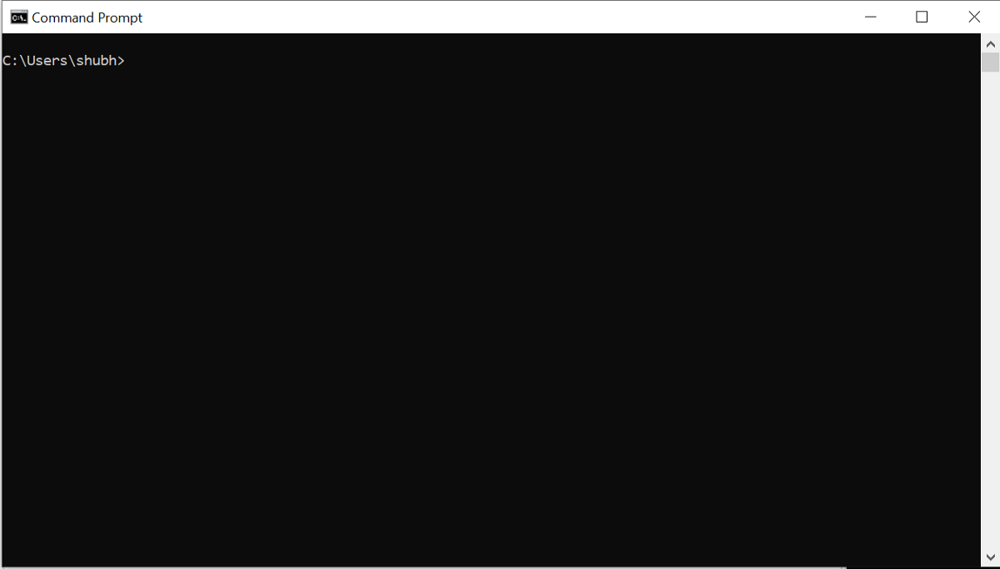
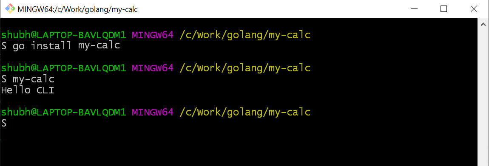
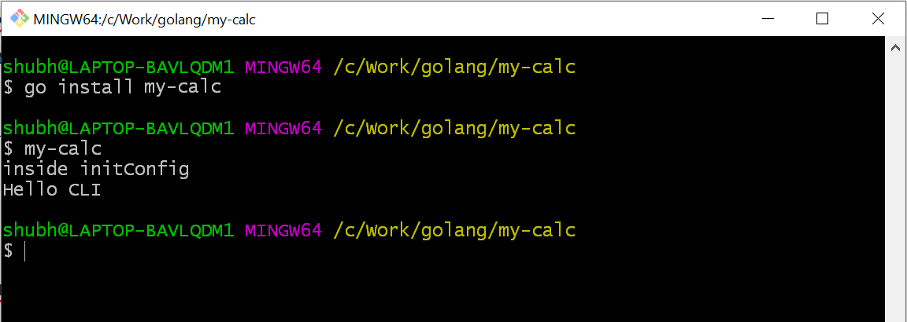
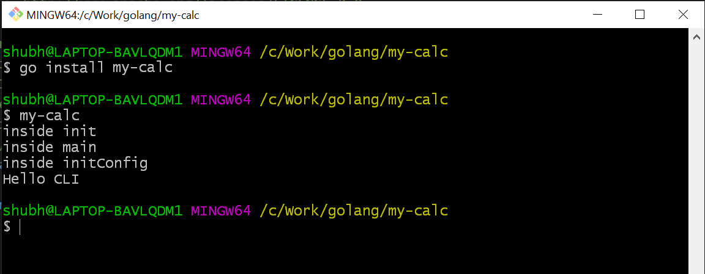
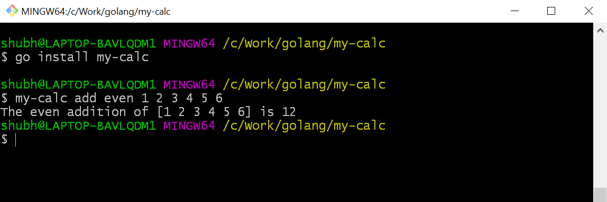

Have you ever wonder why in the world of GUI, CLI still exist? You’ll better understand it when you build one of your own.

When you learn golang then it is very often that you’ll come across that ‘golang is great to build cli tools’. This fascinated me too. So, I tried to get my hands dirty and found a few tutorials of creating a cli but most of all are not basic. In this tutorial, I’ll try to smooth the learning curve.

This is the basic cli application where we are going to cover basic cli operations. I am planning to write another article with advance cli operations but that’s for later.

We are creating a simple mathematical cli which will be capable of doing the following 2 jobs:

- addition of numbers
- addition of only even or odd numbers

I know these jobs don’t meet your expectations but trust me, after this, you will feel comfortable with building a cli.

---

### What is CLI? (Command Line Interface)

CLI works on the basic principle of software engineering, takes the input, process it and gives the output. In the cli tool instead of a flashing frontend, it takes the input from the **black window**. *Remember, Matrix Trilogy*.

If you are using **Windows** just type `cmd` or `powershell` in the `start`and enter, the black window or blue window is a cli.



In Mac or Linux it is known by the name `terminal` .

> A [**command-line interface** (**CLI**)](https://en.wikipedia.org/wiki/Command-line_interface) is a means of interacting with a [computer program](https://en.wikipedia.org/wiki/Computer_program "Computer program") where the [user](https://en.wikipedia.org/wiki/User_%28computing%29 "User (computing)") (or [client](https://en.wikipedia.org/wiki/Client_%28computing%29 "Client (computing)")) issues [commands](https://en.wikipedia.org/wiki/Command_%28computing%29 "Command (computing)") to the program in the form of successive lines of text (command lines). The program which handles the interface is called a **command-line interpreter** or **command-line processor**. — [wikipedia](https://en.wikipedia.org/wiki/Command-line_interface)

There are many CLIs’ you might work on like npm, node, go, python, docker, Kubernetes etc. All are an ideal interface to interact with the software.

#### Why they are still using CLI?

- It is lightweight and fast.
- Minimal or no dependencies.
- Best for system administration and task-based automation etc.

---

Enough of theory, let’s start with the requirements:

- golang installed (I am using go1.11.5 windows/amd64)
- Cobra library (`go get -u github.com/spf13/cobra/cobra`)
- Any code editor of your choice. (I am using VS Code)

> I recommend to use VS code and install the `go` extension by Microsoft. This will update the import statement according to the code. If you use a new package, it will import that package on save. If a package is imported and not used, it will remove that package from the import.

A little introduction to the `Cobra` library. We will use cobra cli to use the cobra library. We will use a cli to build a cli 😃

> [Cobra](https://github.com/spf13/cobra) is both a library for creating powerful modern CLI applications as well as a program to generate applications and command files.

> Many of the most widely used Go projects are built using Cobra, such as: [Kubernetes](http://kubernetes.io/), [Hugo](http://gohugo.io/), [Docker (distribution)](https://github.com/docker/distribution) etc. — [Github](https://github.com/spf13/cobra)

---

### Cobra Concepts

Cobra is built on a structure of commands, arguments & flags.

- **Commands** represent actions
- **Args** are things
- **Flags** are modifiers for those actions

The basic structure will be like a simple sentence

`APPNAME Command Args --Flags` or `APPNAME Command --Flags Args`

**For Ex.**

- `git clone URL -bare`
- `go get -u URL`
- `npm install package --save`
- `docker run image -d`

---

Create a new project directory **outside** the **GOPATH**. I have created `my-calc` project directory for this tutorial. You can name any of your choices.

Creating projects outside the **GOPATH** ease the importing local files. Initialize modules in the project. This module will keep all the libraries and dependency require and used in this project. It is similar to the `package.json` in the nodejs. To read more about the modules, please read this great [article](https://medium.com/rungo/anatomy-of-modules-in-go-c8274d215c16).

> A _module_ is a collection of related Go packages that are versioned together as a single unit.

> Modules record precise dependency requirements and create reproducible builds. — [wiki](http://A%20module%20is%20a%20collection%20of%20related%20Go%20packages%20that%20are%20versioned%20together%20as%20a%20single%20unit.%20%20Modules%20record%20precise%20dependency%20requirements%20and%20create%20reproducible%20builds.)

Open the project directory in the command line of your choices. I am using `bash`. Once you are inside the project directory, run the below command to initialize the modules.

```go
go mod init my-calc
```

You can notice that it creates a `go.mod` file in the project.

> **Note:** Creating modules inside the `$GOPATH`is disabled by default. You will get this error if you run above command — `go: modules disabled inside GOPATH/src by GO111MODULE=auto; see ‘go help modules’` . If you still want to create the go modules inside the `$GOPATH` then first set `GO111MODULE` environment variable to `on`. `export GO111MODULE=on`

Now whenever you use any third-party packages in the project, it’ll save it as a dependency with their version. In this way, even if a breaking change introduces in the new version of the library, your project will work as expected.

---

If you still haven’t installed the `cobra` library, you can install it using below command.

```go
go get -u github.com/spf13/cobra/cobra
```

Initialize the cli scaffolding for the project using `cobra init`command.

```go
cobra init my-calc
```

It will initialize the `my-calc` project with `cobra` library. You can observe that it created a few files in the project.

```
▾ my-calc/
  ▾ cmd/
     root.go
   main.go
```

The `main.go` is the entry point of the `cli` . Inside the `main.go` it is calling the `Execute` function of the `cmd/root.go` .

```go
// main.go
package main

import "my-calc/cmd"

func main() {
   cmd.Execute()
}
```

Let’s examine the `root.go` .

### rootCmd

Root command is the base command of any cli. For Ex. `go get URL` — `go` is the root command here and `get` is the child command of the `go`. In the `root.go` it is initiating the `rootCmd` struct variable with the `cobra` command. All the other commands in the cli will be a child of the `rootCmd`.

Open the `root.go` in the editor and inside the `rootCmd` uncomment the

```go
Run: func(cmd *cobra.Command, args []string) {},
```

And paste the `fmt.Println("Hello CLI")` inside the curly braces.

```go
Run: func(cmd *cobra.Command, args []string) {fmt.Println("Hello CLI"},
```

> ⚠️ Don’t remove the comma after the closing curly braces. It will throw syntax error.

Open the terminal inside the `my-calc` project and run

```go
go install my-calc
```

This command will generate the binary or executable file of the project in the `$GOPATH/bin` folder.

Now run `my-calc` in the terminal. As it is saved in the bin folder you don’t have to set the environment variable for this.

> The name of cli is the **rootCmd**. **my-calc** is the rootCmd.

You will see the output similar to this.



---

### init

This is the first function which gets called whenever a package initialize in the golang. The `cobra.OnInitialize(funcDeclarations)` append the user-defined functions in the command’s initialization. ***Whenever the command run or called it will first execute all the functions in the command’s initialization and then it will run the execute method.*** This initialization can be used in loading the configuration file or can be used as constructor. It all depends on your use case and your creativity.

I believe I lost you here. Let’s understand this with an example.

In the `root.go` , the command is the `rootCmd`.

The `cobra.OnInitialize(initConfig)` append the `initConfig`function declaration in the `rootCmd`’s initialization. So, whenever the `rootCmd` ‘s execute method (`RUN: func`) run, the `rootCmd` will first run the `initConfig`function. Once the execution of all the initialize functions over, it will run the `RUN: func` execution method of `rootCmd`.

To visualize it, add a print message in the `initConfig` function.

```go
func initConfig() {

   fmt.Println("inside initConfig")
...
```

Save the changes. Open the terminal inside the `my-calc` project.

Rebuild the binary `go install my-calc`.

```go
go install my-calc
```

Run `my-calc`. Whenever you’ll make any changes in the cli you have to rebuild the binary. Run `go install my-calc` to reflect it in the cli commands.



You can see that `initConfig` run first and later `Hello CLI` .

To understand the complete flow of cli, add a message inside the `init` function and a message inside the `main` func in the `main.go`.

```go
// root.go

func init() {
     fmt.Println("inside init")
     cobra.OnInitialize(initConfig)
...

// main.go

func main() {
     fmt.Println("inside main")
     cmd.Execute()
}
```

Save the changes. Rebuild the binary `go install my-calc` and run `my-calc`.



Now, you know the cli command flow.

The last thing in the `init` function is `flags` .

Flags are like modifiers to the command. You can think of them as conditional actions. We will learn more about it later in the tutorial.

There are 2 types of flags `Persistent Flags` and `Local Flags`.

- **Persistent Flags:** This flag will be available to the command it is assigned as well as all the child or subcommands of the command.
- **Local Flags:** This flag is only available to the command which it is assigned to.

---

### initConfig

This function is setting the configuration path in the home directory and config filename is `.my-calc` . It will use the configuration file if it exists.

The `viper` library is famous for configuration solution for go application. It reads from JSON, TOML, YAML, HCL, envfile and Java properties config files. It does much more than reading configuration. To learn more about it, follow this [link](https://github.com/spf13/viper).

With this function, we completed the `root.go` examination. It is a bit lengthier, but it is good to understand what we are using.

> **Note:** Now if you want, you can remove all the print statements from the `root.go` and `main.go` . I have removed all the print statements to keep the code clean.

---

It’s time to add some commands in our cli. We already created one command which is `my-calc` as`rootCmd` which returns **Hello CLI.**

### add numbers

Open the terminal inside the project directory and create a command named `add` . The cobra command to add a new command is

`cobra add <commandName>`

```
cobra add add

// output
add created at C:\Work\golang\my-calc
```

Check the `cmd` folder, an `add.go` file is added in it.

Open the `add.go` . It is similar to the `root.go` .

First, an `addCmd` struct variable is declared of type `*cobra.Command` .

The `*cobra.Command` have `RUN` which is a func and takes pointer of `*cobra.Command` and a slice of string `[]string`.

Then it is initialized in `init` function. In the `init`, it is added to the `rootCmd`. We can understand it as `addCmd`is the sub-command or child command of the `rootCmd`.

```go
func init() {
   rootCmd.AddCommand(addCmd)
```

In the terminal, rebuild the binary using `go install my-calc` command and run `my-calc add`.


The `add` command is working fine. It’s time to modify it to add a series of numbers.

The commands only take a slice of string as an argument. To add the numbers, we first have to convert the `string` into `int` then return the result. We will use `strconv` library to convert the `string` to `int`.

Import the `strconv` package.

```go
import (
   "fmt"
   "strconv"

   "github.com/spf13/cobra"
)
```

Inside the `add.go`, create a new `addInt` function.

```go
// add.go

func addInt(args []string) {

   var sum int

  // iterate over the arguments
  // the first return value is index of args, we can omit it using _

   for _, ival := range args {

 // strconv is the library used for type conversion. for string
 // to int conversion Atio method is used.
       itemp, err := strconv.Atoi(ival)

       if err != nil {
           fmt.Println(err)
       }
       sum = sum + itemp
    }

   fmt.Printf("Addition of numbers %s is %d", args, sum)
}
```

Save the changes.

In the `addCmd` variable, update the `RUN` func. Remove the print message and call the `addInt` function with `args`.

```go
// addCmd
Run: func(cmd *cobra.Command, args []string) {
  addInt(args)
},
```

Rebuild the binary using `go install my-calc` .

Run `my-calc add 2 3` .

> ⚠️Don’t forget the space between the arguments.


You can pass as many arguments as you want. If you remember the args is a slice of string. But there is a limitation in this function. It can only add integers not decimal number. In the `addInt` function we are converting the string into `int` not in `float32/64` .

It is time to introduce a `flag` in the `addCmd` . This flag will help the cli to decide if it is an `int` operation or `float`.

In the `add.go` , inside the `init` func, create a local flag of the bool type, `Flags().BoolP`. Its name will be `float` , shortened name `f` , default value `false` and description. The default value is very important. It means even if flag is not called in the command, the flag value will be `false` . For bool type, if a flag is called it will toggle the default.

```go
// add.go

func init() {
 rootCmd.AddCommand(addCmd)
 addCmd.Flags().BoolP("float", "f", false, "Add Floating Numbers")
}
```

Create a new `addFloat` function in the `add.go`

```go
// add.go

func addFloat(args []string) {

    var sum float64

    for _, fval := range args {
    // convert string to float64
       ftemp, err := strconv.ParseFloat(fval, 64)

       if err != nil {
          fmt.Println(err)
       }
       sum = sum + ftemp
    }

    fmt.Printf("Sum of floating numbers %s is %f", args, sum)
}
```

This function is the same as `addInt` except, it is converting `string` to `float64`.

In the `addCmd` `RUN` function, it will call the `addInt` or `addFloat` according to the flag. If flag `--float or -f` is passed then it will call `addFloat` .

```go
// add.go
// addCmd

Run: func(cmd *cobra.Command, args []string) {
 // get the flag value, its default value is false
 fstatus, _ := cmd.Flags().GetBool("float")

 if fstatus { // if status is true, call addFloat
    addFloat(args)
  } else {
    addInt(args)
  }
},
```

Save all the changes. Rebuild the binary using `go install my-calc`.

Run `my-calc add 1.2 2.5 -f` or `my-calc add 1.2 2.5 --float`


You can do lots of things with flags. You can even pass values to flags like a slice of int, float, string etc.

The basic addition of operation implementation is completed.

Let’s expand it by adding sub-commands to the `addCmd`.

---

### add even numbers

Open the terminal in the project directory and create a new `even` command.

```
cobra add even
```

The `even` command as `even.go` added in the `cmd` folder.

Open the `even.go` in the editor. Change `rootCmd` to `addCmd` in the `init` .

```go
// even.go
func init() {
    addCmd.AddCommand(evenCmd)
...
}
```

The `addCmd.AddCommand(evenCmd)` will add `evenCmd` as child or subcommand of the `addCmd` .

Update the `evenCmd` struct variable’s `RUN` method.

```go
// even.go
Run: func(cmd *cobra.Command, args []string) {

   var evenSum int
   for _, ival := range args {
      itemp, _ := strconv.Atoi(ival)
      if itemp%2 == 0 {
         evenSum = evenSum + itemp
      }
   }

   fmt.Printf("The even addition of %s is %d", args, evenSum)
},
```

It will first convert the `string` into `int` using `strconv` package, then adding only even numbers.

Save all the changes. Rebuild the binary using `go install my-calc` .

Run `my-calc add even 1 2 3 4 5 6`



The `my-calc` is the root command, `add` it the command of the `rootCmd` and `even` is the command (subcommand) of the `addCmd` .

---

### add odd numbers

This is same as `evenCmd` . Instead of adding even numbers, it will add odd numbers.

Open the terminal in the project directory and create a new odd command.

```
cobra add odd
```

The `odd` command as `odd.go` added in the `cmd` folder.

Open the `odd.go` in the editor. Change `rootCmd` to `addCmd` in the `init`.

```go
// odd.go
func init() {
    addCmd.AddCommand(oddCmd)
...
}
```

The `addCmd.AddCommand(oddCmd)` will add `oddCmd` as child or subcommand of the `addCmd`.

Update the `oddCmd` struct variable’s `RUN` method.

```go
// odd.go

Run: func(cmd *cobra.Command, args []string) {
    var oddSum int
    for _, ival := range args {
      itemp, _ := strconv.Atoi(ival)
      if itemp%2 != 0 {
         oddSum = oddSum + itemp
      }
    }

    fmt.Printf("The odd addition of %s is %d", args, oddSum)
},
```

It will first convert the `string` into `int` using `strconv` package, then adding only even numbers.

Save all the changes. Rebuild the binary using `go install my-calc`.

Run `my-calc add odd 1 2 3 4 5 6`


The `my-calc` is the root command, `add` it the command of the `rootCmd` and `odd` is the command (subcommand) of the `addCmd`.

---

Congratulations! You created your own cli in golang with cobra.

> The complete code is saved on [Github](https://github.com/schadokar/my-calc.git).

The `my-calc` cli project is complete. The main aim of this tutorial to understand the basics of the cobra library. The tutorial covered most of the basic operations required to create a cli. I will keep updating it with more basic operations if it requires. I hope I smoothened the learning curve of creating cli. Thanks for your time to read the tutorial. I hope you learned something and it is worth your time.

Please give your valuable feedback on this tutorial. I’ll make changes accordingly.

If you like my work and want to support me. You can buy me a coffee.

[](https://www.buymeacoffee.com/uTDINEc)
