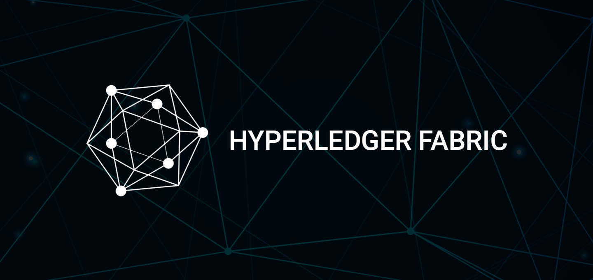
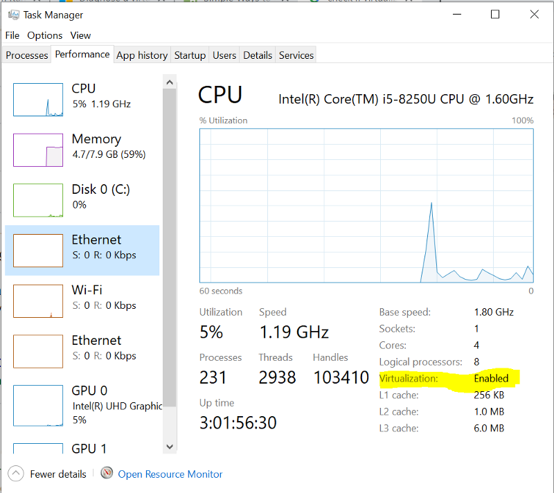
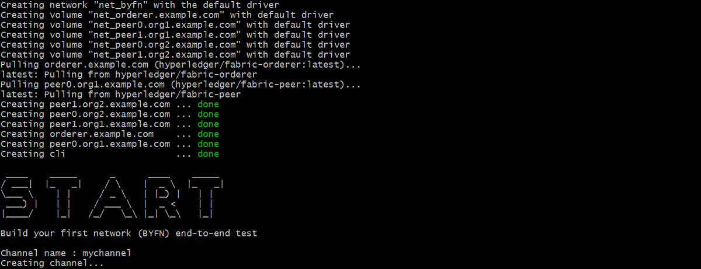

When I started learning Hyperledger Fabric, installing it is really a pain in a neck and it turned miserable as I was using Windows.

The purpose of this article to put all the instructions at one place to set up the Hyperledger Fabric network irrespective of the fact if you’re using Windows or Linux.

My apologies for macOS readers, instructions for macOS is not included as I don’t have one.

---

#### **Contents:**

1.  Prerequisites
2.  [Linux Installation](#linux-installation)
3.  [Windows Installation](#windows-installation)

---

### **Prerequisites**

1.  cURL — latest version
2.  Docker — version 17.06.2-ce or greater
3.  Docker Compose — version 1.14.0 or greater
4.  Golang — version 1.12.x
5.  Nodejs — version 8.x (other versions are not in support yet)
6.  NPM — version 5.x
7.  Python 2.7

These prerequisites’ versions are according to the fabric v1.4 [documentation](https://hyperledger-fabric.readthedocs.io/en/release-1.4/prereqs.html).

---

### Linux Installation

Linux installation is pretty straight forward compared to windows. Few commands and Fabric is ready.

I have provisioned a Linux 16.04 VM from AWS for this article. All the instructions will run in the terminal. I haven’t found any system requirement information in Hyperledger documentation. Please comment if you have a reference for the system requirement.

#### Step 1: Create a new sudo user

It is recommended that Hyperledger Fabric shouldn’t be installed as a root user. Open the terminal.

- Add the new user “fabric”

```
sudo adduser fabric
```

- Add the user “fabric” to the Sudo groups

```
sudo usermod -aG sudo newuser
```

- Login to “fabric” user

```
su fabric
```

- Test the sudo access

```
sudo ls
```

If you get any error then the user is not added to the sudo group. Follow this [link](https://www.digitalocean.com/community/tutorials/how-to-add-and-delete-users-on-ubuntu-16-04) for more information.

#### **Step 2: cURL**

Check if your Linux has curl install or not. `curl --version`

If not follow the below instructions to install:

```
sudo apt-get update
sudo apt-get install curl
curl --version
```

#### **Step 3: Docker and Docker Compose**

Following are the ways to install Docker and Docker-compose.

1.  **According to the Documentation**

- Install the latest version of Docker from the official Docker repository.

```
curl -fsSL https://download.docker.com/linux/ubuntu/gpg | sudo apt-key add -
```

- Add the Docker repository to APT sources

```
sudo add-apt-repository “deb [arch=amd64] https://download.docker.com/linux/ubuntu $(lsb_release -cs) stable”
```

- Update the package database

```
sudo apt-get update
```

- Install Docker

```
sudo apt-get install -y docker-ce
```

**2\. Install using a command**

This command will install both docker and docker-compose with a single command. Thanks to [KC Tam](https://medium.com/u/32dec75e8ca9)

```
sudo apt-get -y install docker-compose
```

The above 2 methods will install the docker and docker-compose.

- To use docker commands it requires root privileges. Instead of using `sudo` for all the docker commands, add the user to `docker` group

```
sudo usermod -aG docker fabric
```

- Logout using `exit` command and log in again. Check the groups' user is part of, using `id -nG` command.

```
Output
fabric sudo docker
```

**Test the Installation**

- Check the docker and docker-compose version

```
docker --version
Docker version 18.09.7, build 2d0083d

docker-compose --version
docker-compose version 1.17.1, build unknown
```

- Pull the [hello-world image](https://hub.docker.com/r/library/hello-world/) from Docker Hub and run a container:

```
docker run hello-world
```


If you get this message then docker is successfully installed.

For more information, please follow this [link](https://www.digitalocean.com/community/tutorials/how-to-install-and-use-docker-on-ubuntu-16-04#step-1-%E2%80%94-installing-docker).

#### **Step 3: Golang**

- Install the golang package

```
curl -O https://storage.googleapis.com/golang/go1.12.linux-amd64.tar.gz
```

- Extract the package

```
tar xvf go1.12.linux-amd64.tar.gz
```

- Set the GOPATH

```
export GOPATH=$HOME/go
export PATH=$PATH:$GOPATH/bin
```

- Check the go version

```
go version
```

For more installation information follow this [link](https://www.digitalocean.com/community/tutorials/how-to-install-go-1-6-on-ubuntu-16-04) and for GOPATH follow this [link](https://hyperledger-fabric.readthedocs.io/en/release-1.4/prereqs.html#go-programming-language).

#### **Step 4: Nodejs and npm**

- Download the installation script using curl

```
curl -sL https://deb.nodesource.com/setup_8.x -o nodesource_setup.sh
```

- Run the script under sudo

```
sudo bash nodesource_setup.sh
```

- Install the nodejs

```
sudo apt-get install nodejs
```

With nodejs, npm also get installed. Check their version

```
node -v
Output
v8.16.0

npm -v
v6.4.1
```

**Step 5: Python 2.7**

By default ubuntu 16.04 comes with Python 3.5.1 installed as python3 binary.

- To install `python 2.7`

```
sudo apt-get install python
```

- Check the python version:

```
python --version
Python 2.7.12
```

All the prerequisites are installed. Now, let's install the Hyperledger Fabric v1.4.

#### **Step 6: Install Samples, Binaries and Docker Images**

Determine the directory where you want to download the fabric samples. Open the directory in terminal and run the below command.

```
curl -sSL http://bit.ly/2ysbOFE | bash -s
```

It will download the latest production release.

If you want a specific release for ex. v1.4.1, follow the below command.

```
curl -sSL http://bit.ly/2ysbOFE | bash -s -- <fabric_version> <fabric-ca_version> <thirdparty_version>

curl -sSL http://bit.ly/2ysbOFE | bash -s -- 1.4.1 1.4.1 0.4.15
```

It’ll take some time, once it is finished you can see a new directory **“fabric-samples”.**

**“fabric-samples”** come with sample examples to start with Hyperledger Fabric. There are many good examples to play within the fabric samples.


#### **Step 7: Test the fabric network**

As we have successfully completed the setting up the Fabric environment, let’s test it. To test it we’ll use the **first-network** sample in the fabric-samples.

Open the **fabric-samples** and go to the **first-network**.

```
cd fabric-samples/first-network
```


To test it, run the `byfn.sh` . It is a test script, it first set up the network with 2 organizations `org1` and `org2` with 2 `peers` each and an `orderer` .

```
./byfn.sh up
```


On successful execution, you’ll see the below message.


If you reach till this point it means you have successfully set up the fabric network.

Now, we have completed the testing of **first-network,** clean the network.

```
./byfn down
```

Congratulations, we have completed the Hyperledger Fabric installation in **Linux machine.**

---

### Windows Installation

For Windows installation, you should be prepared for some obstacles as installation on windows is not easy peasy.

Let's begin the windows installation.

I am using Windows 10 Pro for the Fabric v1.4 installation.

#### **Step 1: cURL**

Please check if cURL is already installed in your PC.

```
curl --help
```

If you don’t get any error it means cURL is installed in your PC and you can go to the next step. For others please follow the below steps.

- To install cURL, download the package according to your Windows 32/64 bit from this [link](https://curl.haxx.se/download.html). Extract the package and run the `curl.exe` present in the `bin` folder.
- Add the `curl` in the environment variable.
- Open the `cmd` and check the `curl --help` .

If you don’t get any error it means you curl is installed successfully.

Follow this [link](https://stackoverflow.com/questions/9507353/how-do-i-install-and-use-curl-on-windows) for troubleshooting.

#### **Step 2: Docker and Docker Compose**

Before installing the docker, check if virtualization is Enabled in your PC or not. To check it, open`Task Manager >> Performance Tab >> CPU`



From the BIOS settings, virtualization can be turned to Enabled. Instructions to enter BIOS settings vary from the pc manufacturer to manufacturer. Please check this [link](https://www.wikihow.tech/Enable-Hardware-Virtualization) for the instructions.

Once the virtualization is Enabled we can move to download the docker.

Please be sure which Windows you’re using before installing Docker. There are 2 versions of Docker for Windows.

Docker Toolbox — Windows 8, Windows 10 Home

Docker Desktop — Windows 10 Pro, Enterprise — 64 bit

You first need to have an account in DockerHub to download the docker desktop. Please signup if you don’t have one.

Download the docker from this [link](https://hub.docker.com/editions/community/docker-ce-desktop-windows).

**Note: While installing keep the settings default don’t change anything.**

**Test the Installation**

- Open the cmd window
- Run `docker --version` and `docker-compose --version`

```
docker --version
Docker version 18.09.2, build 6247962

docker-compose --version
docker-compose version 1.23.2, build 1110ad01
```

- Pull the [hello-world image](https://hub.docker.com/r/library/hello-world/) from Docker Hub and run a container:

```
docker run hello-world
```


If you get this message then the Docker installed successfully in your machine.

For more information on Docker check [the official documentation](https://docs.docker.com/docker-for-windows/).

#### **Step 3: Golang**

Download the Golang package from the [official site](https://golang.org/dl/).

Once it is installed open the `command prompt` and run

```
go version

Output
go version go1.11.5 windows/amd64
```

#### **Step 4: Nodejs and npm**

Download the node v8.x from this [link](https://nodejs.org/dist/latest-v8.x/node-v8.16.0-x64.msi) and install it.

Check if it is installed correctly.

```
node -v
v8.16.0

npm -v
6.4.1
```

#### **Step 5: Python 2.7**

Download the `python 2.7` from [its official site](https://www.python.org/downloads/windows/).

While installing add python to the system Path variable. This allows you to type ‘python’ into a command prompt without needing the full path.

Change `Add python.exe to Path` to `Will be installed on the local hard drive`


Check the `python` installed correctly or not.

```
python --version
Python 2.7.16
```

The Hyperledger Fabric prerequisites are installed. Now, it is time to install the extra windows dependencies.

#### **Windows Extras**

**Step 6: Install windows-build-tools and grpc**

Install the `windows-build-tools` globally using `npm` .

Open the `command prompt` and run the below command.

```
npm install --global windows-build-tools
```

It will take some time around 15 minutes or more. Once it will complete you will get the below message.


Once this is done, you should also install the NPM GRPC module with the following command:

```
npm install --global grpc
```

**Step 7: Install git to run the bash commands**

To run the bash commands we have to install `git` .

> Git is a set of command line utility programs that are designed to execute on a Unix style command-line environment. — [atlassian](https://www.atlassian.com/git/tutorials/git-bash)

> Git Bash is an application for Microsoft Windows environments which provides an emulation layer for a Git command line experience. — [atlassian](https://www.atlassian.com/git/tutorials/git-bash)

Download the `git` from this [link](https://git-scm.com/).

Hang on, for a while we are done with prerequisites and now we are on the final step to install the Hyperledger Fabric.

**Step 8:** **Install Samples, Binaries and Docker Images**

Go to the directory where you want to download the fabric samples.

Once you’re in the directory open `git bash` . Right-click and select `Git Bash Here` .


Run the below command to install Samples, Binaries and Docker Images

```
curl -sSL http://bit.ly/2ysbOFE | bash -s
```

It will download the latest production release.

If you want a specific release for ex. v1.4.1, follow the below command.

```
curl -sSL http://bit.ly/2ysbOFE | bash -s -- <fabric_version> <fabric-ca_version> <thirdparty_version>

curl -sSL http://bit.ly/2ysbOFE | bash -s -- 1.4.1 1.4.1 0.4.15
```

It’ll take some time, once it is finished you can see a new directory “fabric-samples”.


“fabric-samples” come with sample examples to start with Hyperledger Fabric. There are many good examples to play within the fabric samples.

**Step 7: Test the fabric network**

As we have successfully completed the setting up the Fabric environment, it’s time to test it. We are going to use the **first-network** sample from the fabric-samples.

Open the **fabric-samples** and go to **first-network**.

```
cd fabric-samples/first-network
```


To test it, run the `byfn.sh` . It is a test script, it first setup the network with 2 organizations `org1` and `org2` with 2 `peers` each and an `orderer` .

```
./byfn.sh up
```



On successful execution, you’ll see the below message.


If you reach till this point it means you have successfully setup the fabric network.

Now, we have completed the testing of **first-network,** clean the network.

```
./byfn down
```

Here, we have completed the Hyperledger Fabric installation in the **Windows machine.**

Yes, we successfully installed the Fabric on Windows.

Hope, you like the article and save you some time.

---