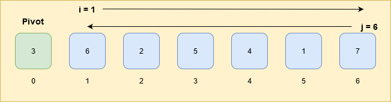

Photo by [Iñaki del Olmo](https://unsplash.com/@inakihxz?utm_source=unsplash&utm_medium=referral&utm_content=creditCopyText) on [Unsplash](https://unsplash.com/s/photos/bookshelf?utm_source=unsplash&utm_medium=referral&utm_content=creditCopyText)

Data structures and Algorithms are the key skills for a software developer. Recently when I was preparing for a job change, learning sorting algorithms was not smooth.  
The theory is simple and straight but its implementation is just the opposite.  

> I think concept and implementation are inversely proportional. 🤔

There are many sorting algorithms like bubblesort, mergesort, quicksort etc. Among all, quicksort is one of the most popular sorting algorithms.

Today, I'll try to put all my learning while learning the quicksort.  

### What is Quicksort?
Quicksort is one of the efficient sorting algorithms and the average complexity is `O(n log n)`.  
There are only 3 worst cases when its complexity is `O(n^2)`.

1. Array is sorted `[2,3,4]`
2. Array is reverse sorted `[4,3,2]`
3. All elements are identical in the array `[4,4,4]`

> Quicksort (sometimes called partition-exchange sort) is an efficient sorting algorithm. Developed by British computer scientist Tony Hoare in 1959 and published in 1961, it is still a commonly used algorithm for sorting. -- [Wikipedia](https://en.wikipedia.org/wiki/Quicksort)

## How quicksort works? :thinking:


Gif by [Wikimedia](https://commons.wikimedia.org/wiki/File:Quicksort.gif)

Quicksort works on the **_divide and conquer algorithm_**.

Select any element in the array and this element is known as **`pivot`**.  
Quicksort is all about finding the correct position(index) of this `pivot` in the array.  
Elements less than pivot must be in the left side of the pivot and elements greater than the pivot must be in the right side of the pivot.

### Example explains better :wink:

We have an array

```js
[3, 6, 2, 5, 4, 1, 7];
```

Any element can be selected as a pivot.  
For this example, the first element of the array is the `pivot` :anchor:

The `pivot` is `3`

```js
pivot: 3, [3, 6, 2, 5, 4, 1, 7];
```

Elements less than pivot: 2, 1  
Elements greater than pivot: 6, 5, 4, 7

Move the elements less than pivot to the left side of pivot and elements greater than pivot to the right side of the pivot.
Now, the correct position of the pivot (3) in the array is at index 2.

```js
[2, 1, 3, 6, 5, 4, 7];
```

Once, the pivot is in the correct position, divide the array. The elements on the left and the right side of the pivot will be the sub-array.

```js
[2, 1, 3, 6, 5, 4, 7];
       ^ last pivot at the correct position
[2, 1]   [6, 5, 4, 7];
```

Sub-array 1: `[2, 1]`  
Sub-array 2: `[6, 5, 4, 7]`

#### Sub-array 1

Select the first element `2` as `pivot`.

```js
pivot: 2, [2, 1];
```

Elements less than the pivot: 1  
Elements greater than the pivot: No elements

Again, move the elements less than pivot to the left side of pivot and elements greater than pivot to the right side of the pivot.
The correct position of the pivot (2) in the sub-array is at index 1.

```js
[1, 2];
```

Now, again divide the array. Elements on the left side and the right side will be sub-array.

There is no need to create a sub-array if there is only 1 element in the sub-array. It means pivot is already at the correct position in the array.

#### Sub-array 2

Select the first element `6` as `pivot`.

```js
pivot: 6, [6, 5, 4, 7];
```

Elements less than the pivot: 5, 4  
Elements greater than the pivot: 7

Again, move the elements less than pivot to the left side of pivot and elements greater than pivot to the right side of the pivot.
The correct position of the pivot (6) in the sub-array is at index 2.

```js
[5, 4, 6, 7];
```

Now, again divide the array. Elements on the left side and the right side of the pivot will be sub-array.

Sub-array 21: [5, 4]  
Sub-array 22: [7]

We have to keep dividing the array by the time all the pivot will be on its correct index.

After finding the correct position of pivot in `sub-array 21`

```js
[4, 5];
```

The final array with all its pivot at the correct position.

```js
[1, 2, 3, 4, 5, 6, 7];
```

Now, we understood the quicksort's process, let's implement it in `javascript`.

---

## JS implementation

The process has the following steps:

1. Select the pivot.
2. The elements less than the pivot and the elements greater than the pivot, move them to the left side and the right side of the pivot respectively.

### Step 1

Select the first element of the array as **`pivot`**.

> :exclamation: Pivot can be any element of the array. Step 2 may vary to how the pivot is selected.

### Step 2

To move the elements on the left and the right side of the pivot.

**_i_**: Start from the `leftmost` element and its index is `i`.  
**_j_**: Start from the `rightmost` element or the last element of the array and its index is `j`.

Whenever an element at index `i` is greater than the `pivot` and element at index `j` is smaller than the `pivot`, swap the elements at index `i` and `j`.

If, index `i` cross-index `j` then stop there and swap the element at `j` index with the `pivot`.

The index `j` is the sorted position of the `pivot` in the array.

> The complete code is available on gist. [js](https://gist.github.com/schadokar/bd991d73d4579da7540227a9ada7f066) and [golang](https://gist.github.com/schadokar/354a4a1114b29a83f633c5c8424145e0) implementation.



:bulb: Roll up your sleeves

- **Line 33:** Check the length of the array. If the length of the array is 1 or less than one, return the array as it is. It means the array is already in sorted order.
- **Line 38:** Select the first element as the pivot.
- **Line 41:** Initialize index `i` to `1` as it is the `leftmost` element of the array.
- **Line 44:** Initialize index `j` to `arr.length-1`, the last index of the array as it is the `rightmost` element of the array.
- **Line 47:** Iterate till index `i` do not cross-index `j`.
- **Line 49:** Iterate index `i` till value at index `i` is larger than the `pivot`. `i` will move away from the pivot, from index `1` to the last index of the array.
- **Line 54:** Iterate index `j` till value at index `j` is smaller than the `pivot`. `j` will move towards the `pivot`, from the last index of the array to the index `1`.



- **Line 61-65:** If index `i` is less than `j` (didn't cross each other), then swap the value at index `i` and at index `j`.
- **Line 71-73:**: Index `j` is the sorted position of the `pivot`. Swap the value at index `j` with the `pivot`.

Now, the `pivot` is sorted in the array. The array on the left and the right side of the `pivot` is still unsorted. Create 2 sub-arrays. A left side of the `pivot` is one sub-array and right side of the `pivot` is another sub-array.

- **Line 78:** Use `slice` to create the left-side sub-array. `slice(indexFrom, indexTo-1)`. The `to` range is not inclusive. If slice is `slice(0,5)`, then its range is `[0-4]`.
- **Line 82:** Check if the left-subarray length is greater than `1`. If `true`, then recursively call `quicksort` and pass left-subarray as an argument.
- **Line 87:** Use `slice` to create the right-side sub-array. 
- **Line 91:** Check if the right-subarray length is greater than `1`. If `true`, then recursively call `quicksort` and pass right-subarray as an argument.
- **Line 100:** Return the sorted array. Concat the left-subarray, the pivot element and the right-subarray.  

A recursive function is a function that calls itself until a predefined condition satisfy.

> Recursion in computer science is a method of solving a problem where the solution depends on solutions to smaller instances of the same problem. -- [wikipedia](https://en.wikipedia.org/wiki/Recursion_(computer_science))

---
## References

- [Hackerearth](https://www.hackerearth.com/practice/algorithms/sorting/quick-sort/tutorial/)
- [Quicksort Algorithm By Abdul Bari](https://www.youtube.com/watch?v=7h1s2SojIRw&t=440s)

---