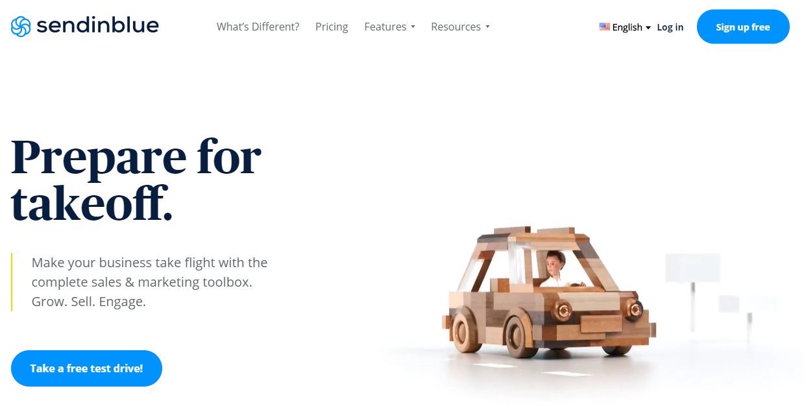
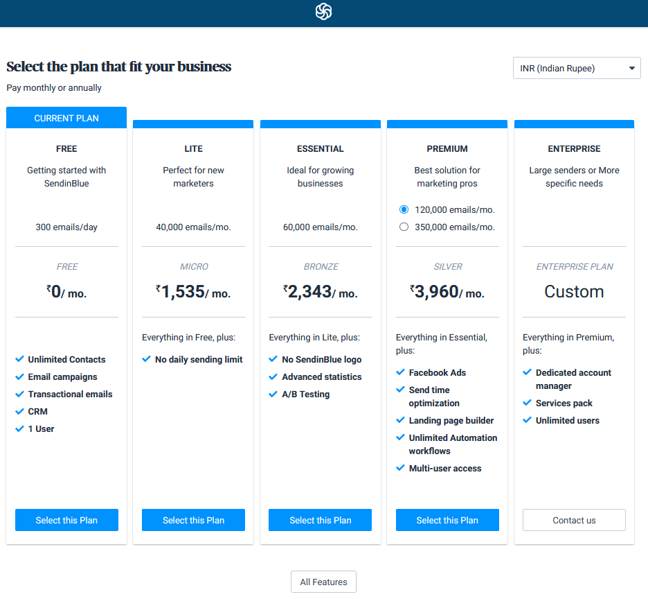
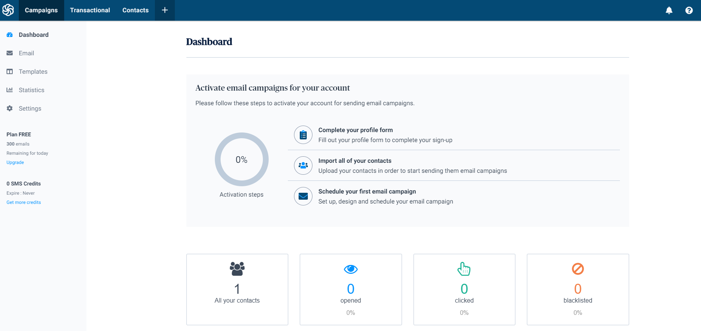

Sendinblue is a SaaS solution for relationship marketing. It offers a cloud-based marketing communication software suite with email marketing, transactional email, marketing automation, customer-relationship management, landing pages, Facebook ads, retargeting ads, SMS marketing, and more.  

Sendinblue offers 300 mails per day for free account. 😃

# Getting started

There are only 3 easy steps to create an account in Sendinblue.

## Step 1

Click on the below **Get started** link. It will redirect you to the signup page.  

Click on *Sign up free*.

## Step 2

Enter your details. For company you can enter your domain name or Self/Individual. It is all up to you.

  

This will send a confirmation link to your email address. Open your mail account and click on confirmation link.  

You can fill the details or can skip for now.  

## Step 3  

Select the plan. For starters you can select the free plan.  

  

## Dashboard  
Once the sign up process, your dashboard will look similar to this.  

# Next Steps

Now, you have a Brevo (formerly Sendinblue). Try these tutorials to send an email using Golang or Nodejs. [Tutorials](https://schadokar.dev/tags/sendinblue/)

---
