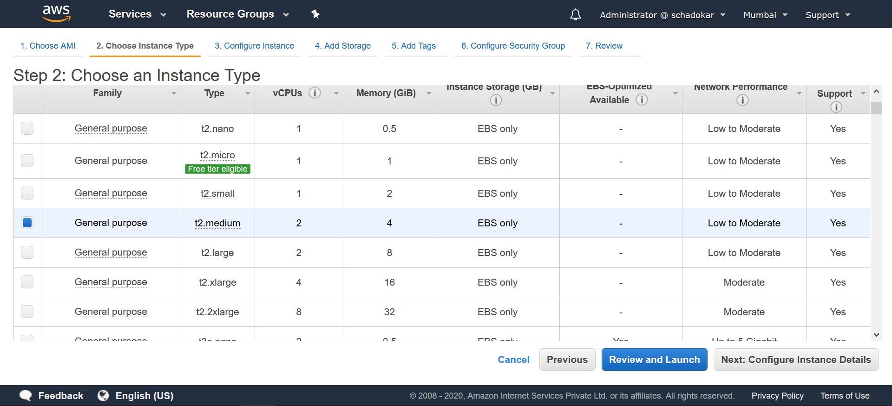
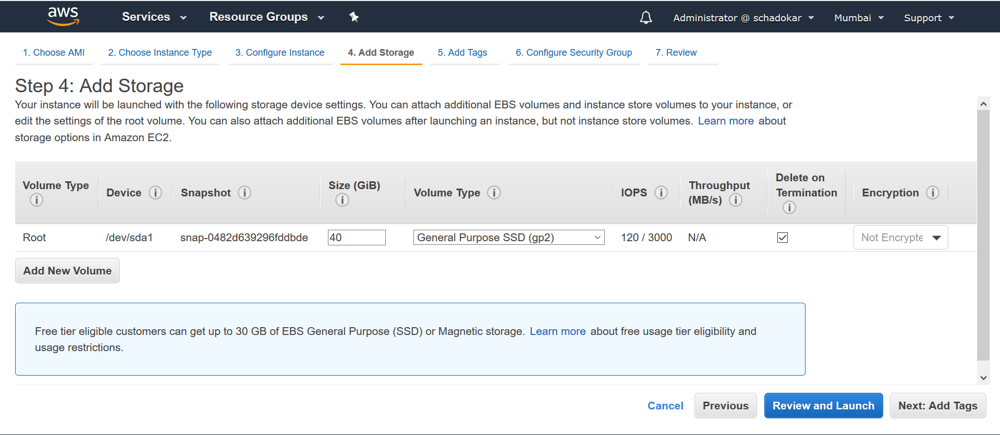
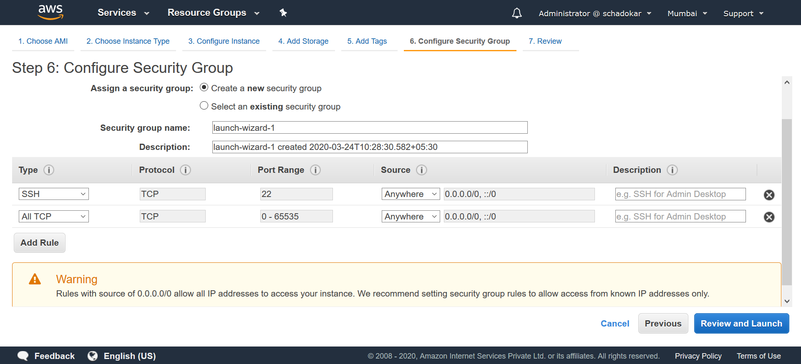
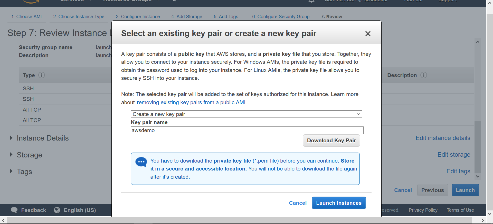
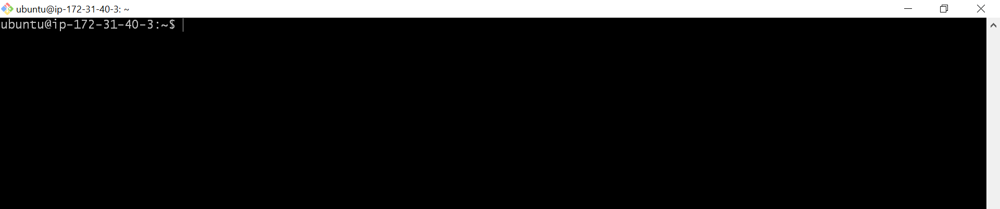
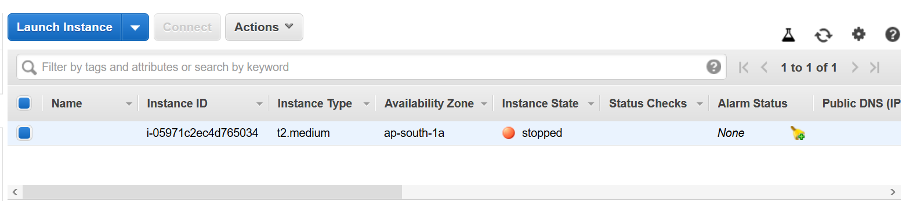

Create a [new aws account](https://portal.aws.amazon.com/billing/signup?nc2=h_ct&src=default&redirect_url=https%3A%2F%2Faws.amazon.com%2Fregistration-confirmation#/start).

Login to your aws account. 
Select services on top left and search **EC2** and select it.

### EC2 Dashboard

Scroll down to ***Launch Instance*** section and select **Launch Instance**.


### Configure Instance

Follow the steps to create a Ubuntu 16.04 VM.

#### Step 1 Choose an Amazon Machine Image (AMI)

Scroll down and select **Ubuntu Server 16.04 LTS (HVM).


#### Step 2 Choose an Instance Type

Select **t2.medium** and click **Configure Instance Details**.



Select next step till **Add Storage**.

#### Step 3 Add Storage

By default all the VMs comes with default storage. You can increase the default storage and add an extra disk.




Select next step till **Configure Security Group**.

#### Step 3 Configure Security Group

Security group allow you restrict the access. As for the learning, keep it simple and open it for everyone.

Add 2 rules, **SSH** and **All TCP**. Change source to **Anywhere**.



Select **Review and Launch**.

#### Step 4 Launch

Scroll down and select **Launch**. 

Create a new key-pair. It is a public-private key pair. AWS stores the **public key** while **private key** is saved by you. While connecting to the instance you need this private key to connect.

Give a Key pair a name.



Select **Launch Instance**. It will take some time to launch the instance.

To check the instance, either you can scroll down and select **View Instance** or go to **EC2 Dashboard** and select **Instance** from the left menu.

### Connect to the Instance

Once the instance is ready. Its **Instance State** is changed to **running**.
Copy the **IPv4 Public IP**.


#### Open the command line.

You can use any terminal such as `cmd`, `bash`, `terminal` etc.
Open the `terminal` and go to the directory where you saved the private key.

Use the `ssh` command to connect to the vm.

```
ssh -i path/privatekey.pem ubuntu@ipaddress

ssh -i awsdemo.pem ubuntu@13.233.125.251
```



> Note: Don't forget to stop the VM when you are not using. When you restart it, that time the ipaddress will change.  
> Go to Actions > Instance State > Stop.



---