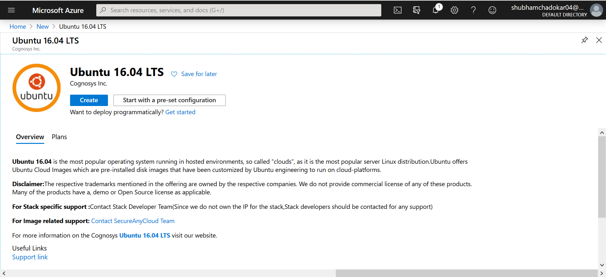
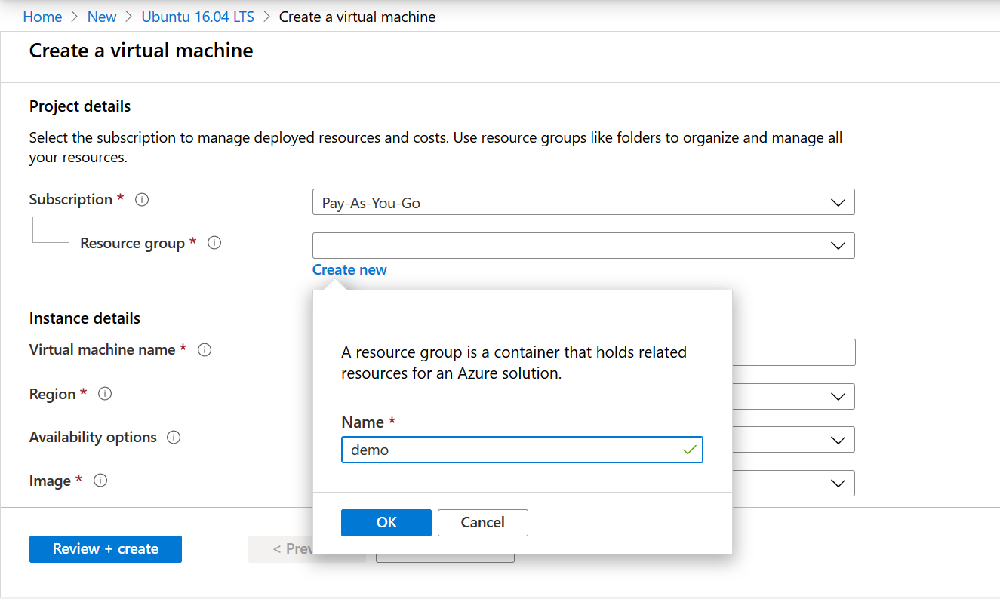
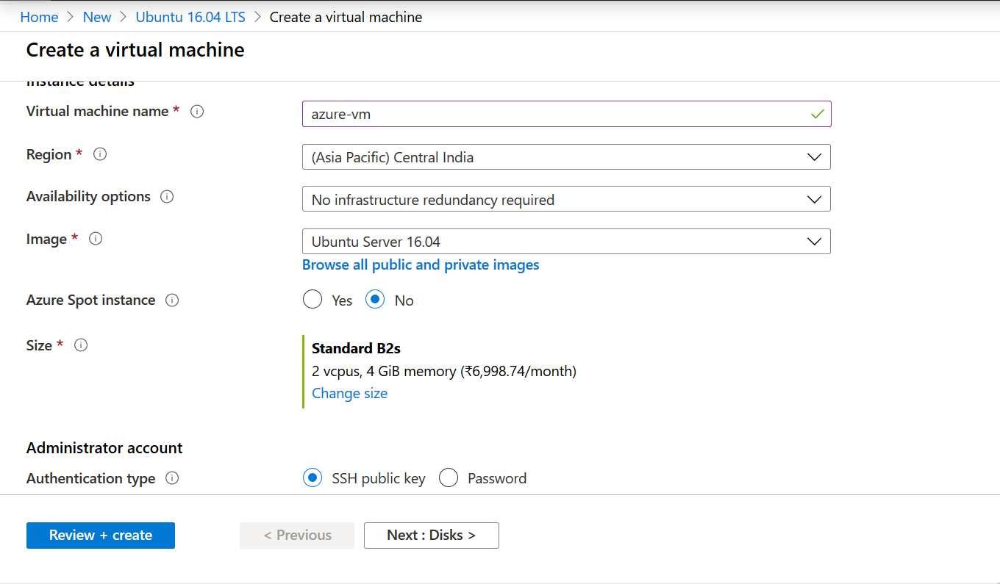
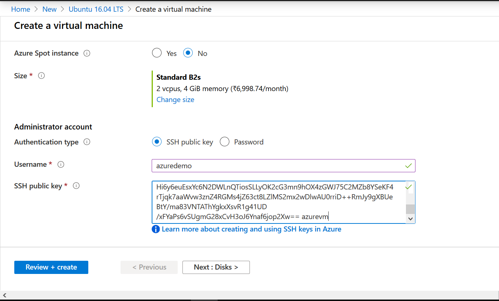
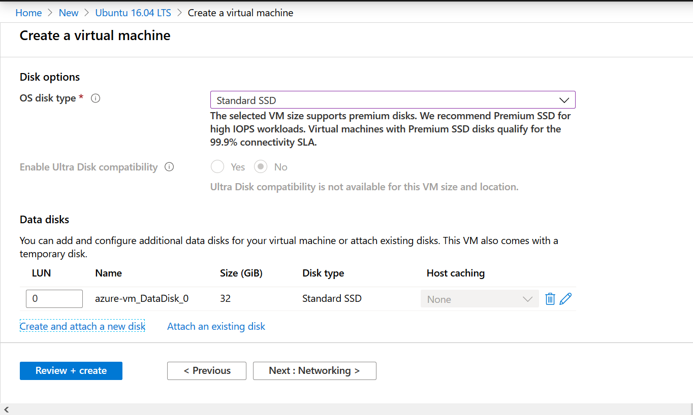
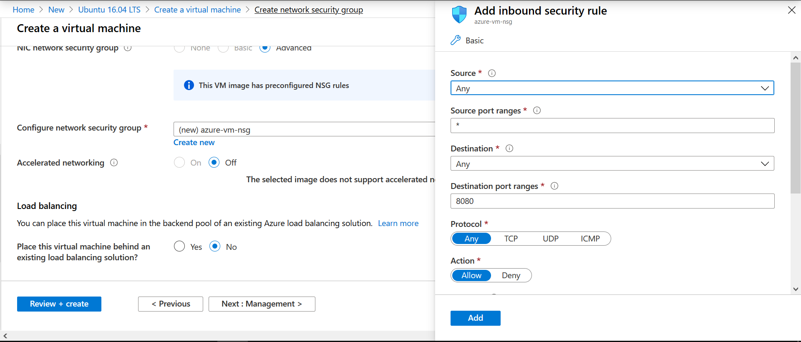
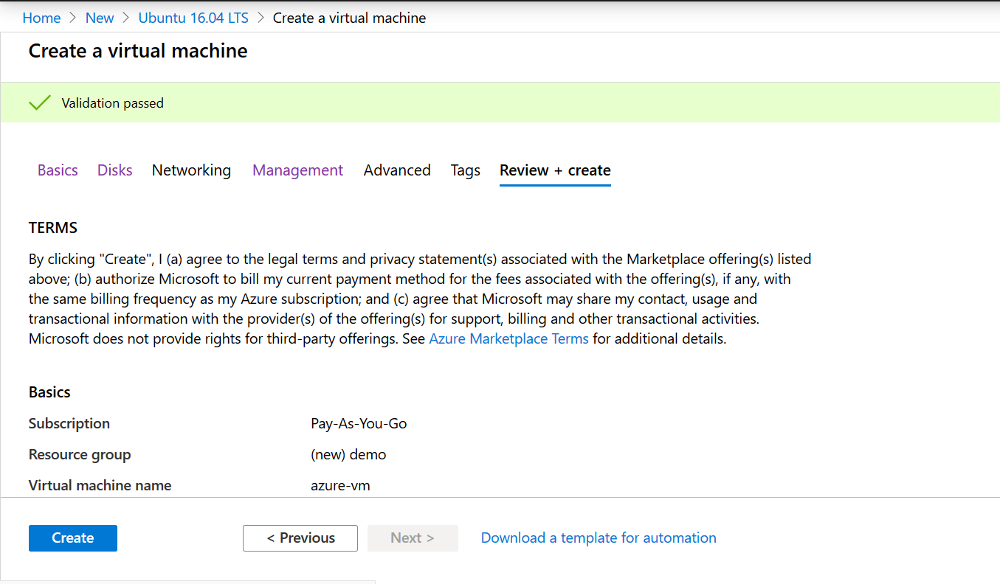
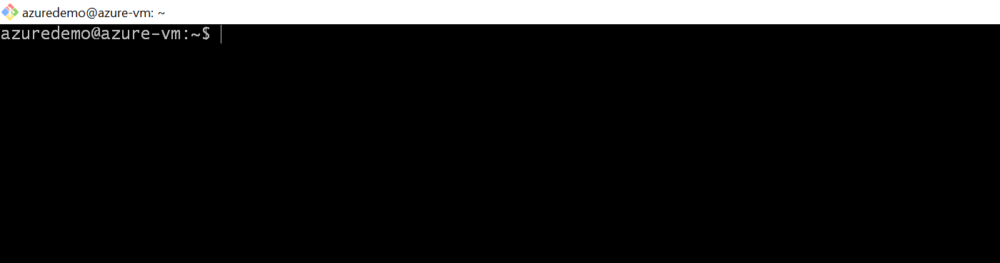
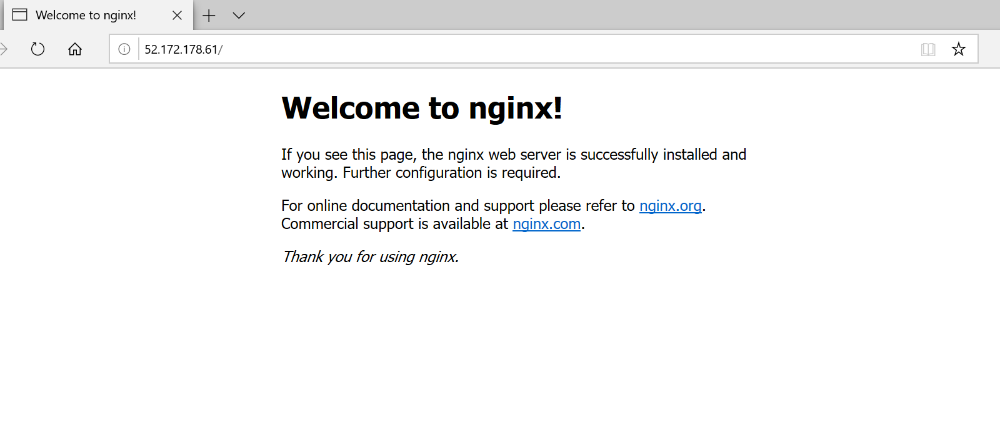

Create a [new account](https://azure.microsoft.com/en-in/free/) in Microsoft Azure. For new users, Azure gives free credits for 30 days and many services free of cost upto a limit for 12 months.

For students, Microsoft also give away many resources and azure credits. You just have to reach to them by their email.

Login to your azure account.

### Step 1 Search for Ubuntu 16.04 LTS

In the search bar, search **Ubuntu 16.04 LTS** and select create.



### Step 2 Enter the Project details

In azure, all the related resources must be in a container, this container is known as Resource Group.

Create a new resource group **demo**.



#### Enter Instance Details

Enter the virtual machine name **azure-vm**.

Change the VM size to **Standard B2s**.



> The VM's price or default configuration may vary region to region.

#### Administrator account

There are 2 options to login in the VM, using the SSH key or the password.

> Azure currently supports SSH protocol 2 (SSH-2) RSA public-private key pairs with a minimum length of 2048 bits.

Let's setup the SSH key.

Open any command line tool. Like bash shell.

Use `ssh-keygen` command to create keys. By default it saves these keys in `~/.ssh` directory.

```sh
$ ssh-keygen -m PEM -t rsa -b 4096
Generating public/private rsa key pair.
Enter file in which to save the key (/c/Users/admin/.ssh/id_rsa):
Enter passphrase (empty for no passphrase):
Enter same passphrase again:
Your identification has been saved in /c/Users/admin/.ssh/id_rsa.
Your public key has been saved in /c/Users/admin/.ssh/id_rsa.pub.
The key fingerprint is:
SHA256:9Hl7Wfo6Et4+QfQ7sKrZr2yaO7Dgb4IVLSIpgsY9ftE admin@LAPTOP-BAVLQDM1
The key's randomart image is:
+---[RSA 4096]----+
|                 |
|              .  |
|o o   o .    . . |
|+= + + E . . .. .|
|+ o o + S o ..o o|
|   . + .   ..o.* |
|    = . o  .oo+..|
|   . o o .=oo.+. |
|      +. **+o+o+.|
+----[SHA256]-----+

```

Enter the absolute path where you want to save the keys or skip it and press Enter.

Passphrase is required to access the private key while login in the VM.

Enter Username `azuredemo`.  
Open the `id_rsa.pub` file. This is the public key.  
Copy the key and paste it in **SSH public key**.



Click **Next**.

### Step 3 Disk

In the Disk section, you can add extra disk space as per your requirement. The Standard B2s VM comes with 32 GB temporary storage.



> For the demo purpose, we don't need extra storage.

Click **Next** to Networking.

### Step 4 Networking

In the networking, you can define network connectivity for the virtual machine.

For the demo purpose, we are not defining network restriction. Anyone can reach the VM.

Create a new **Network Security Group**.

Add an inbound rule where any ip can access the VM.



Leave the remaining to defaults setting and click **Review + create**.

### Step 5 Review + create

In the review, it will take some time to validate all the configuration. On pass you can see **Validation Passed** message.



Click **Create**. It will take some time create the virtual machine.

### Step 6 Connect to the VM

Go to the vm overview and click **Connect** and select **SSH**.

Open the bash or any other command line.

```
ssh -i <private key path> azuredemo@52.172.178.61

ssh -i ~/.ssh/id_rsa azuredemo@52.172.178.61
```

Enter passphrase.



You're connected to the VM.

### Step 7 Test it.

Install `nginx` web server in it.

```
sudo apt-get -y update
sudo apt-get -y install nginx
```

It will take a few seconds to install it. Once it install.  
Open the browser and enter the VM ip address.



### Step 8 Stop the VM

You can save some money by stopping the VM when you're not using it. Go to VM overview and stop it.

Next time when you'll start it only the public ip of the vm will change.

---