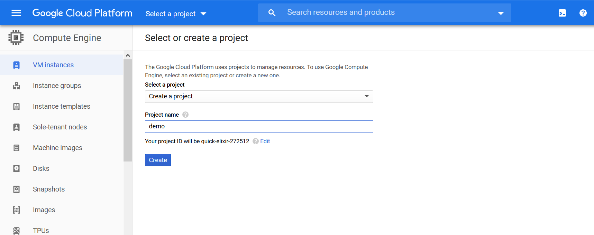
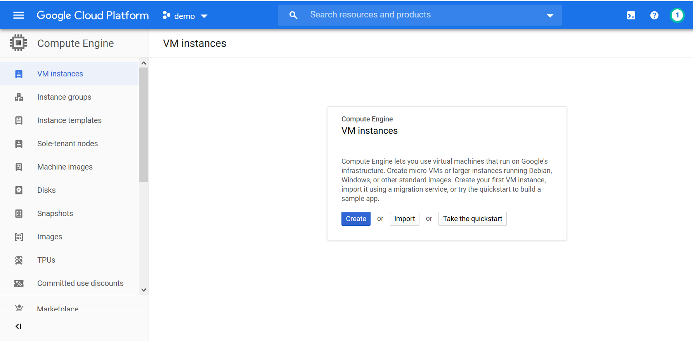
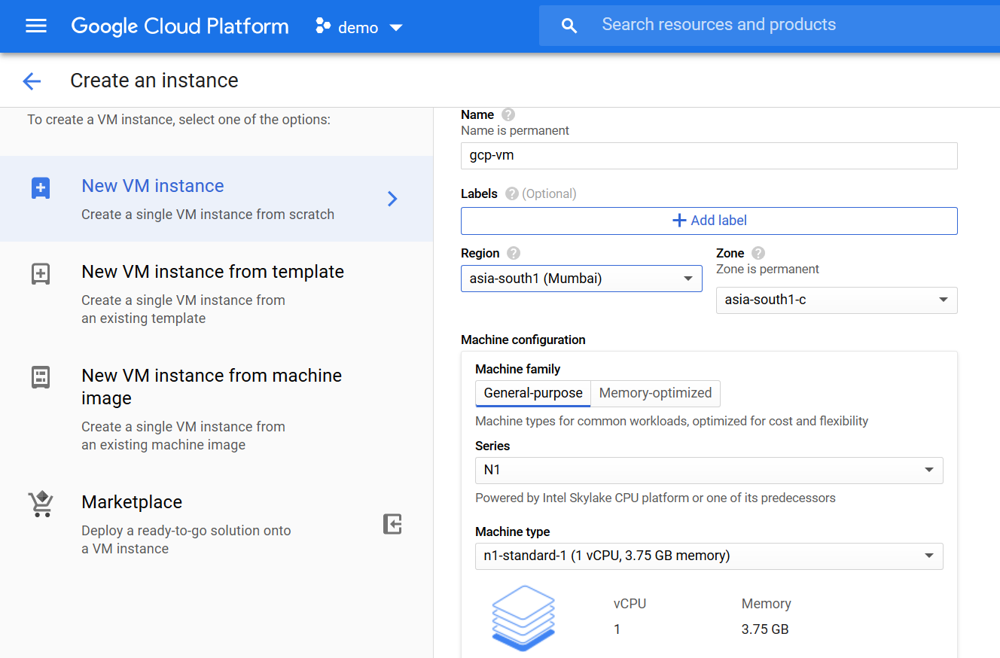
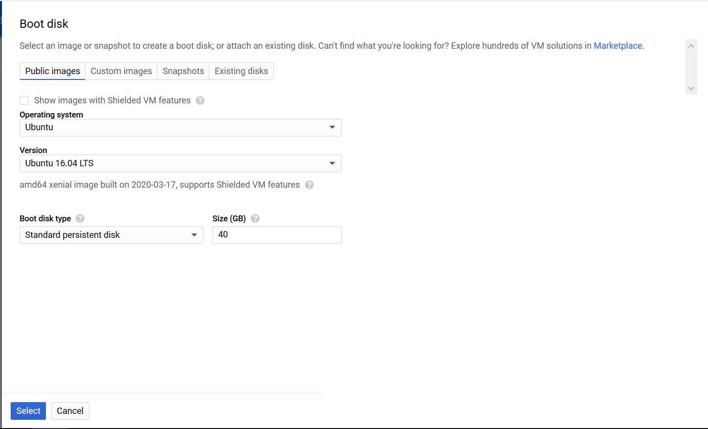
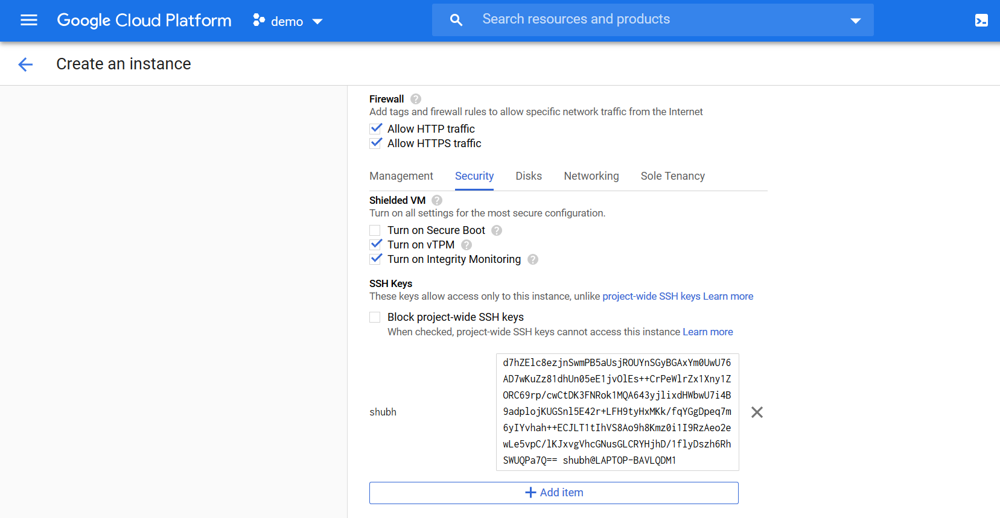
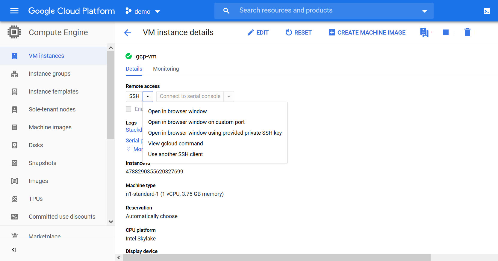
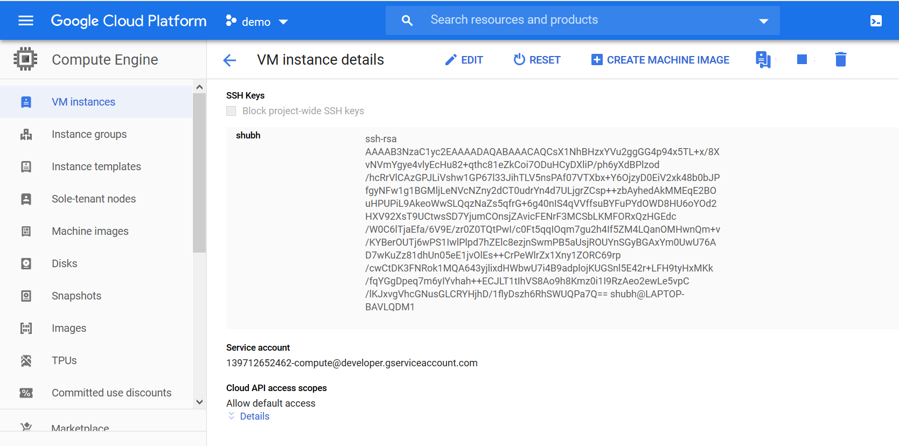
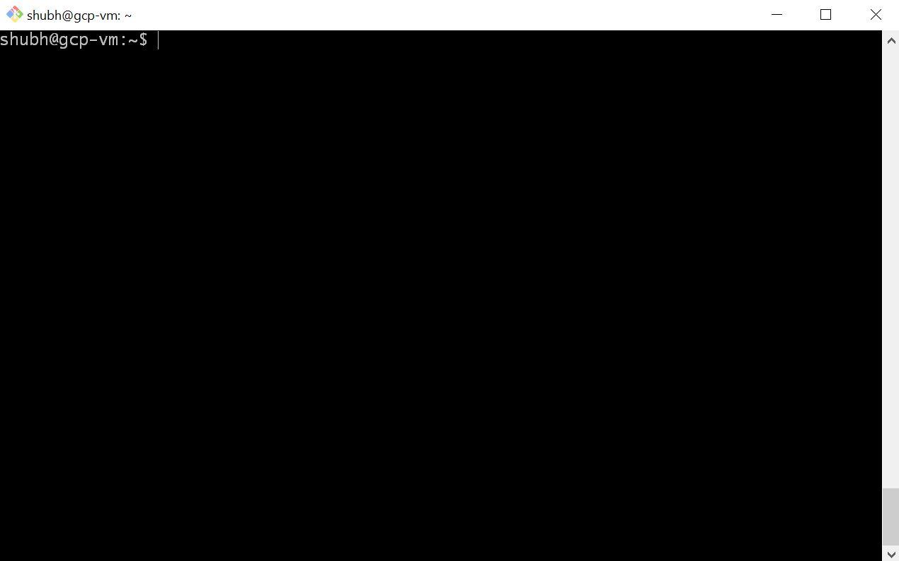
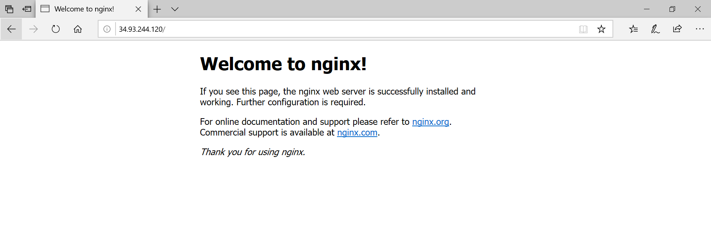
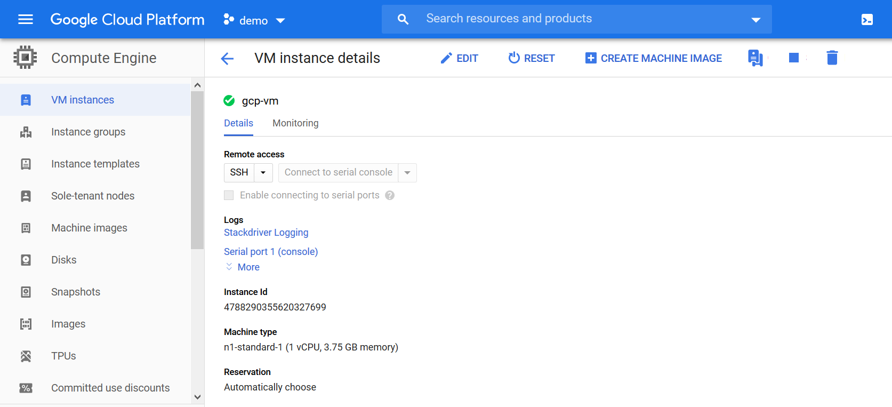

Create a [new account](https://cloud.google.com/free) on GCP. For new users, GCP credits \$300 dollars in the account for 12 months and with many free services.

Login to your GCP account.

## Create a new virtual machine

Select **Compute Engine** from the top left menu.

Menu > Compute > Compute Engine

### Create a new project

In GCP, a project is a resource manager. All the related resources of a project place inside it.
Create a new project **demo**. It will take some time to create the project.



### Create VM instance

Click on **Create**.

> **Take the quickstart** it is a small tutorial on how to create the VM.



### Basic Details

Enter the virtual machine name. `gcp-vm`.

Select the nearest region.

Select the Series **N1** and machine type **n1-standard-1**.



### Select the OS and Disk size

Change the OS Image to **Ubuntu 16.04 LTS**.
Increase the disk size to 40GB.



### Firewall

Allow traffic from **http** and **https**.

> This step is optional. If you don't want to manage the private key then you can skip this step. If this is not setup then GCP manages the private key on your behalf. This private key is required to remotely connect to the VM.

Click on **security**.

Configure SSH to remotely connect to the vm using the command line.

Open the bash or any command line.

Use `ssh-keygen` command to create keys. By default, it saves these keys in `~/.ssh` directory.

```
$ ssh-keygen -m PEM -t rsa -b 4096
Generating public/private rsa key pair.
Enter file in which to save the key (/c/Users/shubh/.ssh/id_rsa):
Enter passphrase (empty for no passphrase):
Enter same passphrase again:
Your identification has been saved in /c/Users/shubh/.ssh/id_rsa.
Your public key has been saved in /c/Users/shubh/.ssh/id_rsa.pub.
The key fingerprint is:
SHA256:5C+NIr1JjM8Oy5R6lgCyRm0EXqhHwToQQPYtN7f0qDY shubh@LAPTOP-BAVLQDM1
The key's randomart image is:
+---[RSA 4096]----+
|=*+o             |
|+.=..            |
|o+oo + o.        |
|*..oo +o+        |
|o=.    oS.       |
|...  =.  +       |
|.  .*E= o o      |
|   +=B.+ .       |
|  .oo.*          |
+----[SHA256]-----+

```

Enter the absolute path where you want to save the keys or skip it and press Enter.

The passphrase is required to access the private key while login in the VM. This step is optional. Passphrase length should be 5 or more. Note it down.

Open the `id_rsa.pub` file. This is the public key.  
Copy the key and paste it in **Enter public SSH key**.

> Remove any leading or trailing spaces while pasting.



Click **Create**. It will take some time to create the VM.

### Connect to the VM

Open the vm. It will show the vm details.

If you haven't configured the SSH then you can connect to the VM using the SSH provided by the GCP. From SSH drop-down select the **Open in browser window** option.



#### For SSH configured

Scroll down and copy the **External IP**.

Open the bash shell or any command line.

```
ssh -i <absolute-private-key-path> username@vmipaddress
```

Username is the key to the SSH.



```
ssh -i /c/Users/shubh/.ssh/id_rsa shubh@34.93.244.120
```

Enter the passphrase if you have set up it while creating the SSH keys.



### Test the VM

Install the **nginx** web server.

```
sudo apt-get -y update
sudo apt-get -y install nginx
```

It will take a few seconds to install it. Once it installs.  
Open the browser and enter the VM IP address.



### Stop the VM

You can save some money by stopping or deleting the VM when you're not using it.

From the top, you can **Stop** or **Delete** the VM.



Next time when you'll start it only the public IP of the vm will change.

---