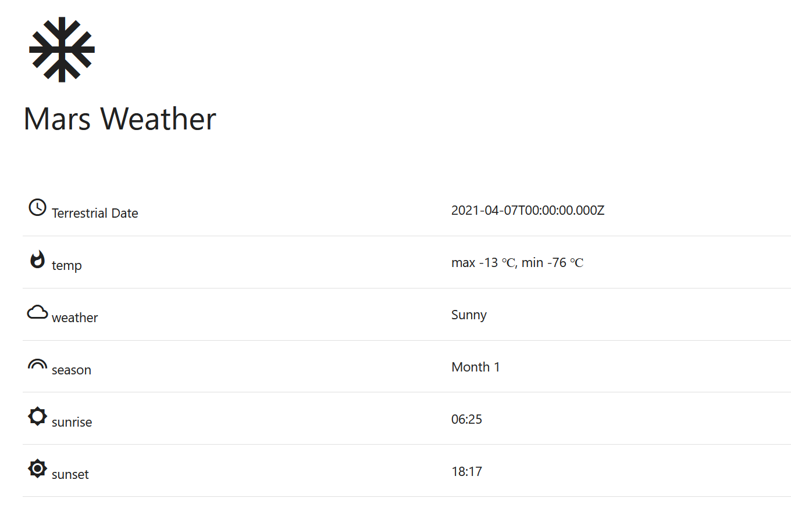

MAAS2 is a REST API that provides the latest weather data transmitted by the Curiosity Rover on Mars. This API is built upon the REMS (Rover Environmental Monitoring Station). MAAS2 responds in JSON formatted data.

[API](https://maas2.apollorion.com/)



## Project Setup

```json
|- mars-weather-app
    |- index.html
    |- style.css
    |- weather.js
```

### index.html

Create a `index.html` and paste the code.

```html
<!DOCTYPE html>
<html lang="en">
  <head>
    <meta charset="UTF-8" />
    <meta http-equiv="X-UA-Compatible" content="IE=edge" />
    <meta name="viewport" content="width=device-width, initial-scale=1.0" />

    <!-- Compiled and minified CSS -->
    <link
      rel="stylesheet"
      href="https://cdnjs.cloudflare.com/ajax/libs/materialize/1.0.0/css/materialize.min.css"
    />
    <link rel="preconnect" href="https://fonts.gstatic.com" />
    <link
      href="https://fonts.googleapis.com/icon?family=Material+Icons"
      rel="stylesheet"
    />

    <link rel="stylesheet" href="./style.css" />
    <!-- Compiled and minified JavaScript -->
    <script src="https://cdnjs.cloudflare.com/ajax/libs/materialize/1.0.0/js/materialize.min.js"></script>
    <script src="./weather.js"></script>
    <script>
      // onload render the previous tasks
      window.addEventListener("load", getWeatherReport);
    </script>
    <title>Mars Weather</title>
  </head>
  <body>
    <div class="mars-header">
      <span>
        <i class="large material-icons">ac_unit</i>
        <header>Mars Weather</header></span
      >
    </div>
    <main>
      <div class="row">
        <div class="info">
          <div>
            <table>
              <tbody>
                <tr>
                  <td>
                    <i class="material-icons">access_time</i> Terrestrial Date
                  </td>
                  <td id="terrestrial_date"></td>
                </tr>
                <tr>
                  <td><i class="material-icons">whatshot</i> temp</td>
                  <td id="temp"></td>
                </tr>
                <tr>
                  <td><i class="material-icons">cloud_queue</i> weather</td>
                  <td id="weather"></td>
                </tr>
                <tr>
                  <td><i class="material-icons">looks</i> season</td>
                  <td id="season"></td>
                </tr>
                <tr>
                  <td><i class="material-icons">brightness_5</i> sunrise</td>
                  <td id="sunrise"></td>
                </tr>
                <tr>
                  <td><i class="material-icons">brightness_7</i> sunset</td>
                  <td id="sunset"></td>
                </tr>
              </tbody>
            </table>
          </div>
        </div>
      </div>
    </main>
    <footer>
      <div class="footer-copyright">
        <div>
          Made with <span style="color: red">❤️</span> by
          <a href="https://schadokar.dev">schadokar</a>
        </div>
        <div>
          Ingredients <span> 🧪</span> html, css and
          <a href="https://materializecss.com/">material ui</a>
        </div>
        <div>
          <a href="https://github.com/day-to-day-coding/mars-weather-app"
            ><i class="material-icons">code</i></a
          >
        </div>
      </div>
    </footer>
  </body>
</html>
```

### style.css

Create a `style.css` and paste the code.

```css
body {
  background-color: white;
  background-repeat: no-repeat;
  flex-direction: column;
  padding-top: 2rem;
  padding-bottom: 2rem;
  padding-left: 4rem;
  padding-right: 4rem;
  background-size: cover;
}

header {
  font-size: xx-large;
  margin-bottom: 50px;
}

main {
  flex: 1 0 auto;
}

.vertical-divider {
  border-left: 1px solid gray;
}

.page-footer .footer-copyright {
  background-color: white;
}

footer {
  margin-top: 7rem;
}
```

### weather.js

Create a `weather.js` and paste the code.

```js
function getWeatherReport(city) {
  var requestOptions = {
    method: "GET",
    redirect: "follow",
  };

  fetch(`https://api.maas2.apollorion.com/`, requestOptions)
    .then((response) => response.json())
    .then((result) => {
      document.getElementById("terrestrial_date").innerHTML =
        result.terrestrial_date;
      document.getElementById(
        "temp"
      ).innerHTML = `max ${result.max_temp} &#8451;, min ${result.min_temp} &#8451;`;
      document.getElementById("weather").innerHTML = result.atmo_opacity;
      document.getElementById("season").innerHTML = result.season;
      document.getElementById("sunrise").innerHTML = result.sunrise;
      document.getElementById("sunset").innerHTML = result.sunset;
    })
    .catch((error) => console.log("error", error));
}
```

## Run

Open the `index.html` in the browser and test it.

To run it as server, install `serve` using `npm install --global serve`. Install nodejs first to run `npm` command.

Open the terminal or cmd in the project and run `serve`.

This will start a server at `localhost:5000` and serve `index.html`.

## Host it

You can host it on GitHub Pages.

Create a `html-weather-app` repository on the GitHub. You can name it anything.

Open the terminal or cmd in the project and instantiate `git init`.

Stage and commit the code.

```shell
git init
git add .
git commit -m 'weather app is complete'
```

> This is a static web app due to which **your api key** is visible to everyone. So either keep the account in free tier or remove/delete the API key from the `weather.js` and then push it. Or you can delete the API key in openweathermap account.

Open GitHub repo and copy the repo url. Add it as `origin` and push the code to the GitHub.

```shell
git remote add origin https://github.com/<Your username>/<repo name>.git
git branch -M main
git push -u origin main
```

Open the GitHub repo settings and go to `pages`.

Under `Source`, select the `main` branch, `/root` folder and **save** it.

The app is now live at

```js
https://<Your Username>.github.io/<your repo name>/
```

---


