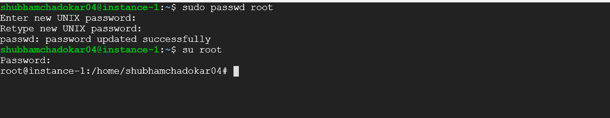

In linux, **root** user is the most privileged user and it has access to all the commands and files. It is also known as the superuser or administrator.  

By default, whenever you login in GCP Linux VM using **SSH** provided by GCP or using the custom **SSH**, it login as **gcp_username** user or as **ssh_username** respectively.

To login as the **root** user, first set the root password.  

To set the root password, use `passwd` command.  
This command can be used to change current user's password or if the user is member sudo group then it can change the password of root or other users. 

### Syntax
```sh
passwd [options] [username]
```

> Use `sudo` if it gives permission error.

```sh
sudo passwd root
```
Enter the new password and retype the new password.

### Login as root user

Use `su` command to change the user.

```sh
su root
```



---

[Learn How to create a linux vm in gcp](https://schadokar.dev/to-the-point/how-to-create-a-linux-vm-in-gcp/)

---
